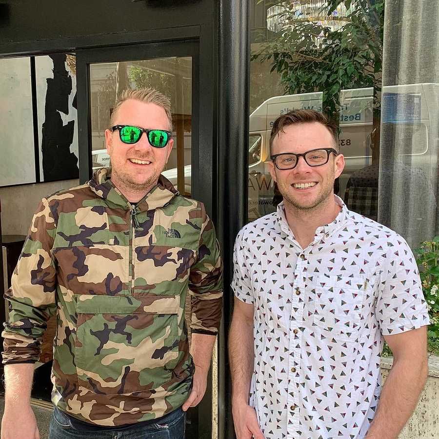

==================================================================================================================

-   [free + premiumCoursesx](../courses/index.html)
-   [The SyntaxPodcast Web Development](https://syntax.fm/)
-   [moreAboutme](index.html)
-   [theBlogx](../blog/index.html)
-   [🔥Tipsreal spicy](../tips/index.html)
-   [BeginnerJavaScriptNotes](../javascript/index.html)
-   [real lifeSpeaking and training](../speaking-and-training/index.html)
-   [what font?!/uses what theme!?](../uses/index.html)
-   [You want toContactme](../contact/index.html)

About
===============================

Hey, I'm Wes Bos.

### The Skinny…

I'm a web developer, teacher and speaker from Hamilton, Ontario 🇨🇦. I'm 33 years old and I've been [making websites](http://web.archive.org/web/20040608163410/http://www.wesbos.com/) for about 21 years - or *exactly* 682575902938 milliseconds!

I use HTML, CSS and JavaScript. Though constantly changing, my focus right now is React.js, Node, Express, Lambda, Gatsby and Next.js

I create [online courses](../courses/index.html) and run a [web development podcast](https://syntax.fm/) called Syntax.

### A little more…

**I've been in love with web development** for over half my life. Seems weird, right? It's a space of constant improvement and new & exciting technology. I consider myself a hacker in that I'm always using technology to solve my life's problems and ambitions.

📻 Listen to [my origin story](https://syntax.fm/show/008/wes-bos-origin-story) if you want a little more info.

**I love to teach.** I got my start teaching with [Ladies Learning Code](https://www.canadalearningcode.ca/) and went on to teach part time and full time bootcamps at HackerYou (Now [Juno College](https://junocollege.com/)). I now spend my time making courses, doing workshops and speaking at conferences around the world.

**I live** in a really cool city called Hamilton in its downtown core in a super old house with my [wife Kaitlin](http://kaitbos.com/), two girls, one boy and a pup named Snickers. We spend our summers at our cottage up in beautiful Northern Ontario.

**I have a few hobbies.** I've rebuilt hundreds of vintage road racing bikes. I like to fancy myself as a good cook, I’m obsessed with cast iron cookware, smoking meat on my Big Green Egg and have been known to make some pretty killer pulled pork. I've recently dipped my toes into fermentation and curing.

### Syntax Podcast

Hold on — I'm grabbin' the last one.

###  [@wesbos](https://twitter.com/wesbos) Tweets

brb getting some good tweets...

###  [@wesbos](https://instagram.com/wesbos) Instant Grams

