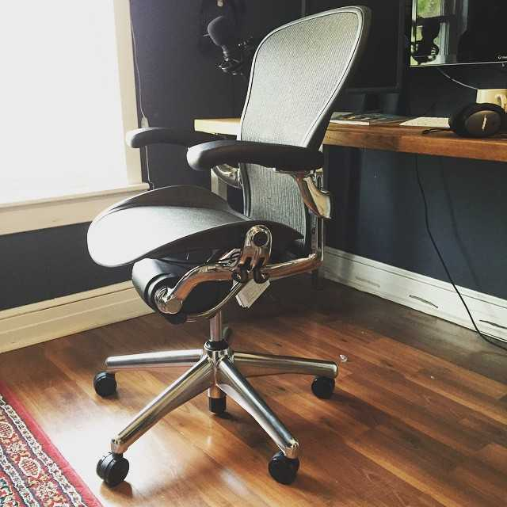

==================================================================================================================

-   [free + premiumCoursesx](../courses/index.html)
-   [The SyntaxPodcast Web Development](https://syntax.fm/)
-   [moreAboutme](../about/index.html)
-   [theBlogx](index.html)
-   [🔥Tipsreal spicy](../tips/index.html)
-   [BeginnerJavaScriptNotes](../javascript/index.html)
-   [real lifeSpeaking and training](../speaking-and-training/index.html)
-   [what font?!/uses what theme!?](../uses/index.html)
-   [You want toContactme](../contact/index.html)

[← Prev 10 please](0.html)

Page 1 of 12

[10 More please →](2/index.html)

![](data:image/png;base64,iVBORw0KGgoAAAANSUhEUgAAABQAAAAbCAYAAAB836/YAAAACXBIWXMAABYlAAAWJQFJUiTwAAACz0lEQVRIx41Vy24TMRTNFgFfwAoh8SEVGwSsEPAViBVlhZAQbNhXiCKh8g1ICCSygLLh0aqVALFIm3TaJJNJMg/bM7ZnxjnIN5mSJpNMLJ04vuN7fK59r13DkmZGI+q3v/+F0x2esS1qNfszmkyy/TQK52+/HXihKJ0z7X9KOGtc1MqmzPrNKczzHFmWwxiDLMuQpinZLKztdDuMmYtsjtA6dTodNJtNtNttQq/Xw8HBARqNBhzHQavVwlGrhcPDA1qwNOTpldIsQ25GpHIaeW4IOk0Jdp4xFQptH8sUPNEQJbB2Hiv6z2IFqdNqQposFDnMwpIxIQmRkKsRxlJDyJSUFsriybgg5ESuoXS2ikKFkMUE62iVRDyhcaGuIF1OaI0AwkjAOeniuN1FEAm43hDNoxO0nDZCJhBb1ZPwpVohZCklIY4TKKUmOWiQG4M0zaB1SrlZ5GdlHnbdHuWe67pEOOuwcqUUH+p/PHQGEfpeD34QnFaFzcUwDCnZi4Seja78UKRN3IzC1lqTzRJYWMVCCAp3nOx5daUIzuF5Hvr9PoUeTFTOhlYsVEmolIZUCkkyPhSlNR1GcRBjTMarEMZxDMY4GGO0h5zzyQ2UzcESVxImiaTNJ0LfB+N8fNma/5duMa5UaJWEjCHiAn4QIWQcYcQQhBH8MMIwCKnvD30M/ODMbVNKaNNDDF2ooIfIPUbiu+D9LsSgC9bvUB8POoCRdvnSN2YuDx+/b2Bt4ydubO7i5uYu7m7t487WPu693cftN3u4/moHt17v4drLHbz75Y0jMwsUZmaEtY0fqD34iPPrdVx8VMfV519x+ekXXHm2jUtPPuPcw0+4sF5H7f4HvKg3x375kkcqyw08rtGNFNqhghNIwpEvcRxIsrlMYRinpeVXKysf2wYiJeJOpHASSlrAElnSJM0X1vjcHk6nxrILwVS9y2XEy7DoLf8HFmgoGpsrwnYAAAAASUVORK5CYII=)

January 8, 2021

-   Business

### [How to Transfer USD out of PayPal without conversion fees](../transfer-usd-out-of-paypal-without-fees/index.html)

Canadian, and many international users, often find themselves with USD in their PayPal account. When it comes time to get that USD out of…

### [Parity Purchasing Power](../parity-purchasing-power/index.html)

For the last ~5 years I've been offering PPP discounts on my web development courses for developers in countries where their purchasing…

![](data:image/png;base64,iVBORw0KGgoAAAANSUhEUgAAABQAAAAaCAYAAAC3g3x9AAAACXBIWXMAABYlAAAWJQFJUiTwAAAC6UlEQVRIx41V224TMRDNB/LEV/DC1yAeED8BqEggkBDiFSG1qgLbJG2SKtns/e61vbYPmmkSkk221NKRnfXO8ZmZ481ISI1zaFq1n1uloZ2Gsr29M3GjIcJDsiJXuPpew/vZnBz4ZEIKaISCchq/vlT4+DrHxascd2PBamnvHOnohOQg1bpRkEbh6keFT29yfH6bY3nT8LO6kUfvHhH2T6LfUhto46CNhdQWs8sWq5lC5yxUZ3mvVd1RLK1H/QYwpMb8foXrsYff3hS/vQmW/j282QTe5Bbe9BaX12MEUcIHH2Y26suWuuOT07zEJowRxinPUZIjiFIm8cMYKz9AXtZopeb3xVbt6LCbSmlUdY1GCEip9lBa8yxEC6kUdsM5B+scWtGgbdvjGrJ0IRCEIbI8R5ZlCKMIQRAyaO1vNrxvjGEyZy0TB6sFijxljn8KpYZzFkII5HnBhK2UODeYbAtSSMM69FImQgBhlOBmMsXdfIEgjNA0AkVZoShKJGmGoiyZqD+stf0aGlhVoKkyNE3LNamqipVqrfdBh+p2GCR0qkAUrnEzvcNkNoM3mWL8x0OcpIMpDxPKBxW6s0iznEEpplnGnTdbdUPjjELNAVQjIiCLlFWNPsf5lN2wQiklsixn65C6JEnYKmEYIU3TfR3tlqwzBl3XwZgBwrpusFgsucvUbSLKi4IPKcuKCa11e2K6DGR28uapbZxjhRRIOOzwY7UjmH7KdIeVUpyevwn4Vmw2AVarNXtxqH6P2EZzXR7q8XC1+GRjGPScMHhjThSqDtp0mC+XmM8XWPs+Y7Fcwvc3WK99rNZrzoLKQDi00aBtsjRDEqdI4oQ/CNRlakgcJ0jTjMsQxTGiKIbeKx5QqIxGqWtG5wz+NwZTrkRLh+Bi9g3P3r3A8w8v8X76FWUDhKXaB/NLuxnHjqf6nyispEBQJQirlNdKWyhttubdzn1sn+tu68OjP3RJ1rEMWvPe7n/mCaAv9l9+/t3TgiANfgAAAABJRU5ErkJggg==)

November 12, 2020

-   JavaScript

### [Get a repo-scoped GitHub Access Token quickly](../scoped-github-access-token/index.html)

Today I need an access token for github so that I could commit show transcripts for Syntax via some automated scripts. Has three options…

April 21, 2020

-   Javascript

### [My New Website! Here are the deets](../new-wesbos-website/index.html)

It's here! My new website. It's funny how being a developer, you neglect your own website until things are dire. Over the past year I've…

December 12, 2019

-   Other

### [Uses](../uses/index.html)

Make sure to check out uses.tech for a list of everyone's /uses pages! Everyday I get a few emails asking about the specifics of some…

December 4, 2019

-   Other

### [Beginner JavaScript](../beginner-javascript/index.html)

It's here! I'm incredibly proud to announce Beginner JavaScript — a fun, exercise heavy approach to learning Modern JavaScript from scratch…

![](data:image/png;base64,iVBORw0KGgoAAAANSUhEUgAAABQAAAALCAIAAADwazoUAAAACXBIWXMAAAsTAAALEwEAmpwYAAACqklEQVQozwGfAmD9AEhti0qGrGSbuVeYv0CMryiApAl2qgFxrABzsQh2th19uyeCwj2Lvuq/Fv/KAP7OAf/NAP/MAP/KAP/IAABZe5ZVjrd3nshdnrorepwNTHAAUIIBXZMBaqgAd74Ge70Nf8dGkKn/zgW5jwCHaQG2jQCifgDMngDtuAAAX32RX57EcKXBfKS+OoauIGGGC053AVKEAT9qAUx/AmegAGeva5B0/8kAqIMBlXQAmHYAsooAwpYA26kAAF+CmU+Dok6NsjeJtwJ6twNflCQlKQ8kOAVCbwBUjwRflgBksY6eVv/FAKF+A557AJd1AKuFAKJ+AMueAABMX25Ui61pmLGTl46tnX9maGIGJDYFWIcGSXwGToEAYaEBT4e1pyr/1AD80QL/0gD/0gD/zgD/zAD/ywAAOzYyPVxtLTxEsYJW/7dz7KtsZnNzB1qOAFqXEzFMB0VzDnGkqI4Tu44Ay58BoHwAvJIAvpMAto0A0qMAACwxNTNLVjZKVEUrHruMXfKzdPisaWxnWwBNfwZcjhUyTTtjYs2kCI1sAJl3AJx5AJ97AKB9AINmAMqdAABcgptPmsJxpb1eMBpTPynipmxbPyVJNiYhKjEUMEIXGzBmXSj/zgC2jgGUcgCgewCbeACshgCWdQDHmgAAZIqjV5Gzd3FuNiAQLiIYSzglLxEHQDk3EmyNGj9QABtGjZQ/w5MAfGECsooAk3IAmXYAnHoAmHYA0aIAAGKLqoR9fG1FKy4bC0EfDyorLYc8I35nYA2MwBWCswyAwbazQPW3ANKkAuayAN+tANqqANioANioAPK8AACGhYmrcE1HMiJNKhRQKBNULyOQQSRUeI8lk8sylMgtlcLbvR3/zAD9zAH/ygH/ygD/0Bf/3lH/2DX/yw4CBxK6T+Em0wAAAABJRU5ErkJggg==)

December 7, 2018

-   JavaScript

### [Flying a DJI Tello Drone with React and Node.js](../drone-javascript/index.html)

Hey Folks! Kind of a fun one here today. I wrote some JavaScript to fly a DJI Drone. IBM is giving away 2,000 DJI Tello drones as part of a…

![](data:image/png;base64,iVBORw0KGgoAAAANSUhEUgAAABQAAAALCAIAAADwazoUAAAACXBIWXMAAAsTAAALEwEAmpwYAAACqklEQVQozwGfAmD9AOpHcOpJcNY+WtE7VOJFa+lJcOpKb+VGbOJDaOZGbt1AZPVKdfhLePFHcPBGb+BGbM5GbKM5VHhBV/Dv8ADsSXPfOl/MMErLMUneOlzwSHXtRG/pQmzhQmbiRWfMQ2e7Q2mcQWN1PFhSOVM6N04jNUoNMEcdPVHq6+4A40Zq8Jit3ouW33+P6IOX7o6l84qo7oql2U9m2j5hSz9SLEU/J0NFFzpNDjNFFDhJHDxNJDlCNUtV8vT2ANlDX++eseyfse6fs+ibrOuHn+h3kOmLn+Nde+E/ZFE7UyA8RTFITyVJWClGWCtKWipJWSQ7Qi1CU5+osADfRmTxkqryrcDpk6jrpbXvT3zlPmbePmHuSnjzSHRtOlMLNEkpSFcxT1MvQUs5SUozSlYsRVQnPFIcMkQA3UVk7ZOn666785Wu6Zmq10Fd5UVu50h06Epz+EhylkFhDjRIIDdGLklOMEVQKj5SIj9RIT1QHDhKHDdLAOZJbPCQqOybrPS2x+2ltuatteudsPOpvuiZquJGYa49Wxk2SiA8UCNAVhUySBczSRw3SyM+Uh86Thk0SADvSnbxepvriKTrlqzpiZ7deovohJvwhqPlbIfgQ2LJPlojNksfPlEsP1csQ1gxT14uS1szUV8lPlEaNEkA5UFq6pGm97rN8K+/1ERe0zJR3z1h5j9o7EZy5URp4kVpPzlQGjpNLkxbIUZTFz5NEz1METlKDTNGFTRHAOlKculyj+d7kudmht1Ma9s/X+FEZd1CY+pJculIb+5Gblg5Ugk6TBQ0RyQ1Szo3T1I5U3I6U5tAYLU/YADdQWHfPGDgPGHsRHHuSHXrSHHpR23pSG/pSG/qSHLwR26oQWCBPla1Q2bHQ2bUQF7pRGfrRWn2Snb2SnaZQDCAbXshqQAAAABJRU5ErkJggg==)

March 13, 2018

-   JavaScript

### [React’s New Context API Explained](../react-context/index.html)

Hey Folks! React 16.3 has a new Context API which makes accessing data and functions anywhere in your application a snap. If you ever find…

February 28, 2018

-   JavaScript

### [React for Beginners Re-Recorded (again!)](../react-for-beginners-re-recorded-again/index.html)

Well well well! Today I am excited to announce that my React for Beginners course has been totally updated and re-recorded. The front end…

January 19, 2018

-   CSS

### [Announcing my CSS Grid Course](../announcing-my-css-grid-course/index.html)

CSS Grid is a brand new layout system in CSS and it will blow your mind! It's not a framework or library - it's part of CSS and is going to…

[← Prev 10 please](0.html)

Page 1 of 12

[10 More please →](2/index.html)

### Syntax Podcast

Hold on — I'm grabbin' the last one.

###  [@wesbos](https://twitter.com/wesbos) Tweets

brb getting some good tweets...

###  [@wesbos](https://instagram.com/wesbos) Instant Grams

