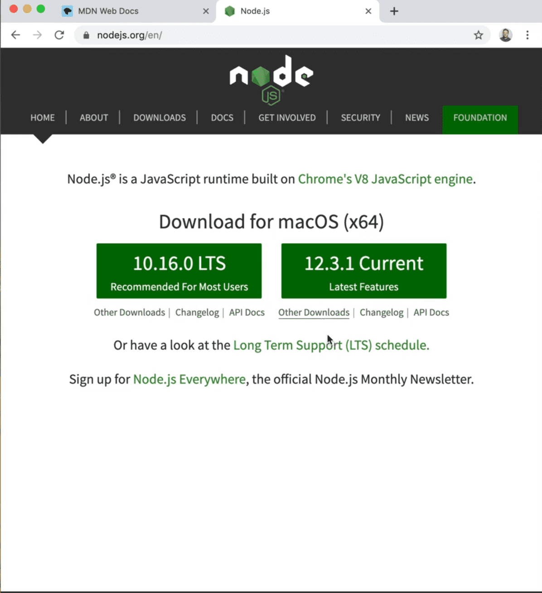
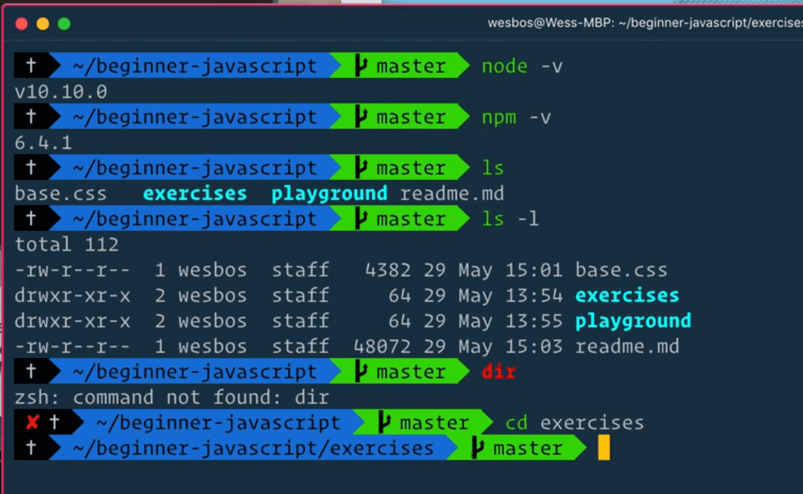

==============================================================================================================================

##### Module 1 - The Basics

-   <a href="../welcome/index.html" class="currentModule">WelcomePart 01</a>
    1.  <a href="../welcome/index.html#house-keeping" class="currentModule">House Keeping</a>
        -   <a href="../welcome/index.html#starter-files" class="currentModule">Starter Files</a>
        -   <a href="../welcome/index.html#how-to-do-the-course" class="currentModule">How to Do the Course</a>
-   <a href="index.html" class="currentModule currentPage currentSection">Browser, Editor and Terminal SetupPart 02</a>
    1.  <a href="index.html#the-browser" class="currentModule currentPage">The browser</a>
        -   <a href="index.html#shortcuts" class="currentModule currentPage">Shortcuts</a>
    2.  <a href="index.html#nodejs" class="currentModule currentPage">Node.js</a>
        -   <a href="index.html#checking-if-nodejs-is-installed" class="currentModule currentPage">Checking if Node.js is installed</a>
        -   <a href="index.html#which-terminal-to-use" class="currentModule currentPage">Which Terminal to Use</a>
        -   <a href="index.html#checking-if-you-have-npm-installed" class="currentModule currentPage">Checking if you have npm installed</a>
    3.  <a href="index.html#command-line-basics" class="currentModule currentPage">Command Line Basics</a>
    4.  <a href="index.html#check-that-nodejs-is-working" class="currentModule currentPage">Check that Node.js is working</a>
    5.  <a href="index.html#code-editor" class="currentModule currentPage">Code Editor</a>
-   <a href="../running-and-loading-js/index.html" class="currentModule">Running and Loading 
    3.  <a href="../types-strings/index.html#concatenation-and-interpolation" class="currentModule">Concatenation and Interpolation</a>
    4.  <a href="../types-strings/index.html#backticks" class="currentModule">Backticks</a>
-   <a href="../types-numbers/index.html" class="currentModule">Types - NumbersPart 08</a>
    1.  <a href="../types-numbers/index.html#numbers-in-javascript" class="currentModule">Numbers in JavaScript</a>
    2.  <a href="../types-numbers/index.html#helper-methods" class="currentModule">Helper Methods</a>
    3.  <a href="../types-numbers/index.html#modulo-and-power-operators" class="currentModule">Modulo and Power Operators</a>
    4.  <a href="../types-numbers/index.html#things-to-know-about-math-in-javascript" class="currentModule">Things to know about Math in JavaScript</a>
        -   <a href="../types-numbers/index.html#infinity-and-negative-infinity" class="currentModule">Infinity and Negative Infinity</a>
        -   <a href="../types-numbers/index.html#not-a-number" class="currentModule">Not a Number</a>
-   <a href="../types-objects/index.html" class="currentModule">Types - ObjectsPart 09</a>
-   <a href="../types-null-and-undefined/index.html" class="currentModule">Types - Null and UndefinedPart 10</a>
    1.  <a href="../types-null-and-undefined/index.html#undefined" class="currentModule">undefined</a>
    2.  <a href="../types-null-and-undefined/index.html#null" class="currentModule">null</a>
-   <a href="../types-booleans-and-equality/index.html" class="currentModule">Types - Booleans and EqualityPart 11</a>
    1.  <a href="../types-booleans-and-equality/index.html#equality-equal-sign-double-equal-sign-triple-equal-sign" class="currentModule">Equality (equal sign, double equal sign, triple equal sign)</a>

Browser, Editor and Terminal Setup
============================================================

Enjoy these notes? Want to Slam Dunk JavaScript?

JavaScript, Browser, TerminalEdit Post

Let's talk real quick about setup and the tools you need.

You can skip this video if you know the three things:

1.  Which browser you would like to use (as well as how to open the dev tools)
2.  You already have Node.js and NPM installed.
3.  You have an editor that you like (such as VSCode).

If you already have those things in place, skip this video and move onto the next one. Wes will just be introducing all three of those and talking about his personal choices behind them.

  The browser
---------------------------------------------------------------------------------------------

Let's get into the browser.

You can use Firefox, Chrome, any browser you like because we are just writing JavaScript.

The important thing here is that we will be using the developer tools. Both Firefox and Chrome have very good web developer tools. Wes will likely be using Chrome throughout the course.

Things you need to know is how to do open the dev tools. You can just right click and select "Inspect Element", which will show you the DOM, and you can click over to the console.

###   Shortcuts

It's worth learning the shortcuts to quickly open up developer tools, inspect element and the console. That way you can really quickly open it.

To find the shortcuts, in Chrome you go to *View* &gt; *Developer* and then you can see the shortcuts.

In Firefox, you click on the hamburger menu and go to *Web Developer* &gt; and then you will see the shortcuts for Inspector and Web Console, which is the two we will be using.

  Node.js
------------------------------------------------------------------------------------

Next up, we need Node.js. In order to install Node.js, go to [https://nodejs.org](https://nodejs.org/) and install the latest version.

   

Don't pay attention to the version numbers, those will change depending on when you take the course. *The stuff that we are covering is not dependent on what version of node you use.*

We aren't writing Node.js websites in this course, instead a lot of tooling, bundling, formatting, etc. uses Node.js under the hood so we need to have it installed.

###   Checking if Node.js is installed

How do you know if you have it installed or not?

You can go ahead and install it again and all that will do is update your Node.js to the current version if you already had it installed.

Another way to check is to open up a terminal window.

###   Which Terminal to Use

You can use the built in terminal application which on a Mac you can find under *Applications* &gt; *Utilities* &gt; *Terminal*.

Wes is using a terminal called Hyper for his terminal. You can also use the terminal in VSCode.

You can use iTerm. They are all the same terminal at the end of the day.

If you want to know what theme Wes is using, you can go to [https://wesbos.com/uses](../../../uses/index.html) and that will give you the links to all of the different themes and things he is using.

On Windows, the terminal is called Command Prompt. You can access this by going to *Start* &gt; *All Programs* &gt; *Accessories* &gt; *Command Prompt*. There is another terminal for Windows called Cmder.

How do you know once you have a terminal open?

You can go ahead and type `node -v` in the terminal and press enter.

That will let you know what version you have installed.

###   Checking if you have npm installed

You need to also check that you have NPM installed. You can do that using `npm -v`, which will tell you what version of NPM you have installed.

As long as you have something greater than 10 for node and 6 for npm, you should be fine.

Wes wants to avoid going down any rabbit holes regarding complex tooling and best ways to do things. You just need to have it installed and it will be working.

  Command Line Basics
-------------------------------------------------------------------------------------------------------------

Now we will do some command line basics in case you are not familiar with working in the command line.

There are a couple of commands you need to know in order to run our JavaScript and bundles.

Basic Commands

-   `cd` - this means change directory
-   `ls -l` (mac), `dir` (windows) - this will list out all of the files and directories under the current directory
-   `pwd` - print working directory will give you something like `/Users/wesbos/beginner-JavaScript/exercises`
-   `cd ..` - go up a level in the current directory

(examples of the above commands visible in image below)👇

   

In this example, Wes is in the `beginner-javascript` directory, and he uses the command `ls -l` to see what other directories he has nested inside his current directory.

He can use the `cd` command to change directories into the `/exercises` directory by typing in `cd exercises`.

*Note: If you want to learn how to customize your terminal, you can go to [https://commandlinepoweruser.com](https://commandlinepoweruser.com/) to take a quick course of Wes' to get you up and running with a cool terminal that shows the prompt and current working directory like Wes' does. That is not part of this course, just for those who are curious.*

Other things to know is how to go up a level in a directory. You can do that using `cd ..`.

That is all we need to know right now.

  Check that Node.js is working
--------------------------------------------------------------------------------------------------------------------------------

If you want to see if your Node.js is working, you can type `node` in ther terminal and that will give you a caret which will load up a *REPL* which is a *read-eval-print loop*. That is essentially the console. You can do `1+1` and press enter and the console will evaluate that to `2`.

Once you have run the `node command`, to get back to the terminal you have to press `CTRL + C` a few times.

Other helpful things are:

`cmd + k` or `cmd + r` (mac) or `ctrl + k` or `ctrl + r` (windows) - *will clear out the console. (this works in Chrome dev tools console as well)*

  Code Editor
---------------------------------------------------------------------------------------------

Finally we are on the topic of the editor.

Wes highly recommends you use VSCode because he thinks it's the best editor for writing JavaScript in.

You may have different opinions.

In terms of tooling, Wes feels that VSCode is the best.

We will be looking at some extensions to use to format JavaScript properly. Again if you want to know what theme Wes is using, refer to [https://wesbos.com/uses](../../../uses/index.html).

Find an issue with this post? Think you could clarify, update or add something?

All my posts are available to edit on Github. Any fix, little or small, is appreciated!

[Edit on Github](https://github.com/wesbos/wesbos/tree/master/src/javascript/01-the-basics/02-browser-editor-and-terminal-setup/02-browser-editor-and-terminal-setup.mdx)

[**← Prev**](../welcome/index.html)

Welcome

[**Next →**](../running-and-loading-js/index.html)

Running and Loading JavaScript

### Syntax Podcast

Hold on — I'm grabbin' the last one.

###  [@wesbos](https://twitter.com/wesbos) Tweets

brb getting some good tweets...

###  [@wesbos](https://instagram.com/wesbos) Instant Grams

