==============================================================================================================================

##### Module 1 - The Basics

-   <a href="../welcome/index.html" class="currentModule">WelcomePart 01</a>
    1.  <a href="../welcome/index.html#house-keeping" class="currentModule">House Keeping</a>
        -   <a href="../welcome/index.html#starter-files" class="currentModule">Starter Files</a>
        -   <a href="../welcome/index.html#how-to-do-the-course" class="currentModule">How to Do the Course</a>
-   <a href="../browser-editor-and-terminal-setup/index.html" class="currentModule">Browser, Editor and Terminal SetupPart 02</a>
    1.  <a href="../browser-editor-and-terminal-setup/index.html#the-browser" class="currentModule">The browser</a>
        -   <a href="../browser-editor-and-terminal-setup/index.html#shortcuts" class="currentModule">Shortcuts</a>
    2.  <a href="../browser-editor-and-terminal-setup/index.html#nodejs" class="currentModule">Node.js</a>
        -   <a href="../browser-editor-and-terminal-setup/index.html#checking-if-nodejs-is-installed" class="currentModule">Checking if Node.js is installed</a>
        -   <a href="../browser-editor-and-terminal-setup/index.html#which-terminal-to-use" class="currentModule">Which Terminal to Use</a>
        -   <a href="../browser-editor-and-terminal-setup/index.html#checking-if-you-have-npm-installed" class="currentModule">Checking if you have npm installed</a>
    3.  <a href="../browser-editor-and-terminal-setup/index.html#command-line-basics" class="currentModule">Command Line Basics</a>
    4.  <a href="../browser-editor-and-terminal-setup/index.html#check-that-nodejs-is-working" class="currentModule">Check that Node.js is working</a>
    5.  <a href="../browser-editor-and-terminal-setup/index.html#code-editor" class="currentModule">Code Editor</a>
-   <a href="../running-and-loading-js/index.html" class="currentModule">Running and Loading         -   <a href="../variables-and-statements/index.html#kebab-case---not-allowed" class="currentModule">Kebab Case - Not Allowed</a>
-   <a href="index.html" class="currentModule currentPage currentSection">Code Quality Tooling with Prettier and ESLintPart 05</a>
    1.  <a href="index.html#eslint--prettier" class="currentModule currentPage">ESLint &amp; Prettier</a>
        -   <a href="index.html#eslint" class="currentModule currentPage">ESLint</a>
        -   <a href="index.html#prettier" class="currentModule currentPage">Prettier</a>
    2.  <a href="index.html#installing-eslint--prettier" class="currentModule currentPage">Installing ESLint &amp; Prettier</a>
    3.  <a href="index.html#installing-npm-packages-locally" class="currentModule currentPage">Installing npm packages locally</a>
    4.  <a href="index.html#creating-the-packagejson-file" class="currentModule currentPage">Creating the package.json file</a>
    5.  <a href="index.html#configuring-eslint-and-prettier-with-vs-code" class="currentModule currentPage">Configuring ESLint and Prettier with VS Code</a>
-   <a href="../types-introduction/index.html" class="currentModule">Types - IntroductionPart 06</a>
-   <a href="../types-strings/index.html" class="currentModule">Types - StringsConcatenation and Interpolation</a>
    4.  <a href="../types-strings/index.html#backticks" class="currentModule">Backticks</a>
-   <a href="../types-numbers/index.html" class="currentModule">Types - NumbersPart 08</a>
    1.  <a href="../types-numbers/index.html#numbers-in-javascript" class="currentModule">Numbers in JavaScript</a>
    2.  <a href="../types-numbers/index.html#helper-methods" class="currentModule">Helper Methods</a>
    3.  <a href="../types-numbers/index.html#modulo-and-power-operators" class="currentModule">Modulo and Power Operators</a>
    4.  <a href="../types-numbers/index.html#things-to-know-about-math-in-javascript" class="currentModule">Things to know about Math in JavaScript</a>
        -   <a href="../types-numbers/index.html#infinity-and-negative-infinity" class="currentModule">Infinity and Negative Infinity</a>
        -   <a href="../types-numbers/index.html#not-a-number" class="currentModule">Not a Number</a>
-   <a href="../types-objects/index.html" class="currentModule">Types - ObjectsPart 09</a>
-   <a href="../types-null-and-undefined/index.html" class="currentModule">Types - Null and UndefinedPart 10</a>
    1.  <a href="../types-null-and-undefined/index.html#undefined" class="currentModule">undefined</a>
    2.  <a href="../types-null-and-undefined/index.html#null" class="currentModule">null</a>
-   <a href="../types-booleans-and-equality/index.html" class="currentModule">Types - Booleans and EqualityPart 11</a>
    1.  <a href="../types-booleans-and-equality/index.html#equality-equal-sign-double-equal-sign-triple-equal-sign" class="currentModule">Equality (equal sign, double equal sign, triple equal sign)</a>

Code Quality Tooling with Prettier and ESLint
=======================================================================

Enjoy these notes? Want to Slam Dunk JavaScript?

Tooling, ESLint, PrettierEdit Post

Whether you are a solo developer looking to follow best practices or catch potential bugs, or you are a member of a team that has a specific way of writing JavaScript, there are many use cases for using code quality tooling.

There are two tools that are extremely helpful in code quality and formatting of your JavaScript:

1.  ESLint
2.  Prettier

Before we jump into those, let's start by looking at some code and opinions people have about formatting in JavaScript.

  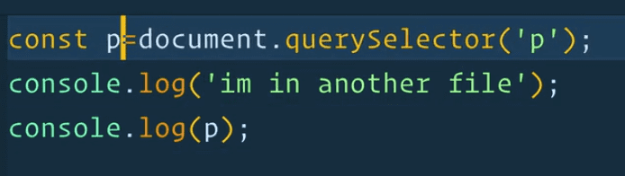 

In the code above 👆, we are using single quotes `''` rather than double quotes `""`, which is an opinion that some people have. Some people prefer one over the other.

The fact that there is a space between the variable name and the equal sign is actually not necessary in `const p = document.querySelector('p');`, that is an opinion that people have in their JavaScript. `const p=document.querySelector('p');` would work the same way.

Those are just two example of things that have the potential to cause issues in your code, or are formatting preferences that people have opinions about.

The tools we mentioned earlier will help you fix those issues by either fixing it for you, or by alerting you if you are doing something that is a bad practice, or causes an accessibility issue, along with a whole lot of other things.

  ESLint & Prettier
--------------------------------------------------------------------------------------------------------

I recommend that you go to [https://eslint.org](https://eslint.org/) and go to the demo in the navigation.

  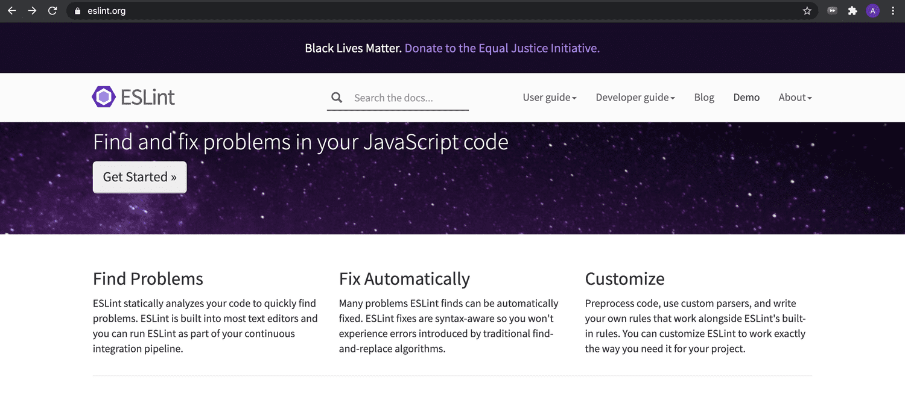 

For Prettier, there is a link on the homepage that says "Try it".

  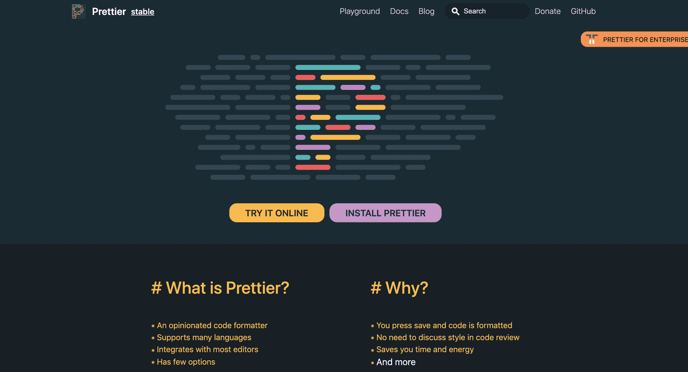 

We will cover the following about these tools:

1.  what they are
2.  how they work
3.  the steps you need to go through to install them

###   ESLint

ESLint, is a JavaScript linter for identifying and reporting potential issues in your JavaScript. Some examples may be bad practices or design patterns, or identifying unused variables in functions.

If you go to the ESLint demo, select the "Rules Configuration" section and choose the latest version of JavaScript.

  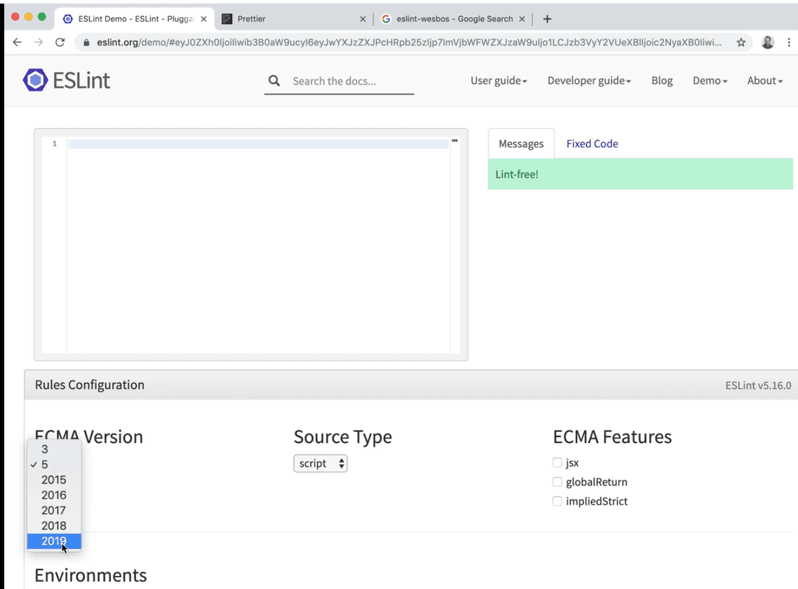 

If you type into the demo `const age = 300;`, you will see the following linting rule 👇

> 'age' is assigned a value but never used.

  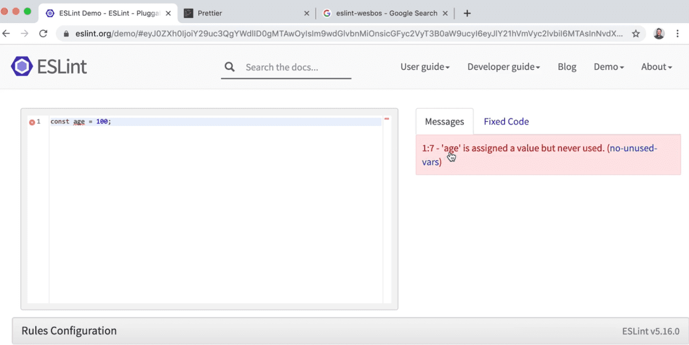 

If we go ahead and use it by adding a line below of `console.log(age);`, we will get the following errors 👇

> 3:1 - Unexpected console statement 3:1 - 'console' is not defined.

One of the rules that are set in the demo version of ESLint is to not use `console.log()`, which is sometimes a production rule that developers use because you don't want to ship code to production that include console logs.

With ESLint, you can turn specific rules on or off. Wes will show us his own config shortly.

If you scroll down on the ESLint site, you will see a list of all of the rules that you can set using ESLint.

Sometimes as you are writing code, ESLint will throw an error and you might not know why it is being thrown. Thankfully, ESLint provides a link to the documentation of the rule so you can read through and understand what it means.

Some other things ESLint helps us with is code that is broken or confusing scoping.

Let's say you add the following code in the ESLint demo page 👇

    function hi() {
      age = 300;
    }

You should get the following errors: 👇

> 1:10 - 'hi' is defined but never used.

> 2:3 - 'age' is not defined.

If we add a `let` before the age variable, it will still complain that `hi` is defined but never used.

If we call `hi();` in our code, it will complain that `age` is assigned but never used.

ESLint is always giving you feedback on your code.

Initially, this can be very frustrating because it tells you that all your code is wrong.

Over time, you will be able to modify your own config that fits your own coding style as well as understand as to why some of those things might be bad practices.

ESLint is also plug-able.

This means you can have many different plugins with it, there are many of them, for different styles of JavaScript, such as a React/Vue/Angular plugin.

That is a high level overview of what ESLint is. We will talk more about configuring it in just a second.

###   Prettier

The next tool that we have is Prettier.

Whereas ESLint will yell at you about things that are causing potential issues in your code, Prettier focuses entirely on just the formatting of your code.

Navigate to <https://prettier.io/> and select the "Try me" link which should open up the playground.

Paste the following code in it 👇

    const age = 100;

    alert("hey");

The output should give you:

    const age = 100;
    alert("hey");

  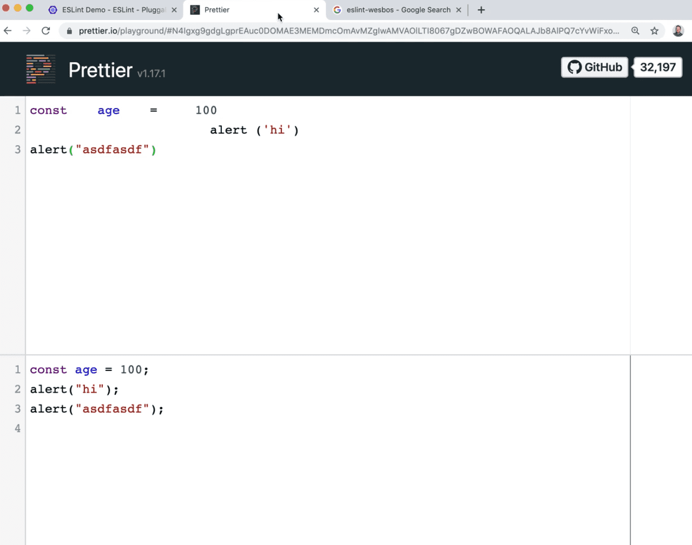 

The input code is technically valid JavaScript, however it is messy and harder to read. Those are annoying things, such as indentation or spaces between lines of code.

Prettier will take in all of your code.

For example if you are mixing your quotes, using single quotes `'` sometimes and `"` double quotes at other times, Prettier will always just format the code to use one or the other, for consistencies sake, depending on the settings you have.

Prettier is pretty opinionated.

There are a few settings that we can toggle here or there, but mostly you just have to let it figure out how you want it to format you code.

You can use ESLint and Prettier separately.

What Wes likes to do is use ESLint and then use the Prettier plugin for ESLint. That way, all of his code goes through ESLint which will tell him what is wrong with his code, as well as any possible issues that ESLint can fix, including Prettier fixes, and then it will go ahead and fix those for us.

One bad thing about ESLint is after you install it, you can spent the rest of your life configuring it based on the hundreds of possible rules.

It is likely that the rules you want have already been chosen well by someone else, so often you just want to pick someone elses settings that you already like.

That is exactly what Wes did for this course.

He made a config that is a set of ESLint rules, as well as the Prettier plugin which will do the formatting for you, all bundled into one so you can hit the ground running with that config.

As you start to develop your own opinions for what you like, you can sort of overwrite those ESLint rules one by one.

  Installing ESLint & Prettier
------------------------------------------------------------------------------------------------------------------------------

Let's get into installing Prettier and ESLint.

Go into the terminal, and use it to navigate to the `beginner-javascript` directory. *(refer to the Welcome page if you don't have that directory).*

*Tip: If you don't know which directory you are currently in, type `pwd` in the terminal and it will return the directory that you are currently in.*

There are a few things we need to do before we can get going.

We are going to follow the instructions located at <https://github.com/wesbos/eslint-config-wesbos>.

The ESLint config can only be installed locally per project due to changes that were made to ESLint v6 that removed global installs.

  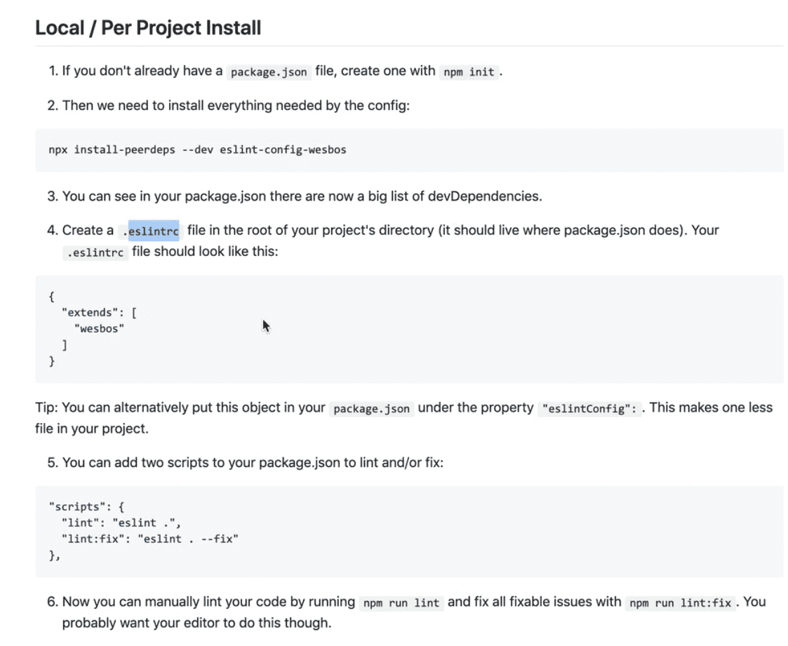 

  Installing npm packages locally
-------------------------------------------------------------------------------------------------------------------------------------

If you don't already have your `package.json`, create one running the command `npm init` by typing it into the terminal *(make sure you are in the beginner-javascript folder)*.

We will be talking about `npm` later in this course, but essentially npm allows us to download what are called dependencies, which is other people's JavaScript packages that allow us to do things. We need other people's JavaScript packages for this lesson, specifically we need ESLint, Prettier, and we need Wes' config.

  Creating the package.json file
----------------------------------------------------------------------------------------------------------------------------------

In order for that to work, we need what is called a `package.json` file which is going to hold a list of all of the other things in JavaScript that we need.

To create the `package.json`, you simply just type `npm init` in the terminal and press `enter`.

You will now be prompted to enter a `package name`, `description`, `keywords`, etc. but you can just press enter to skip setting those values for now.

  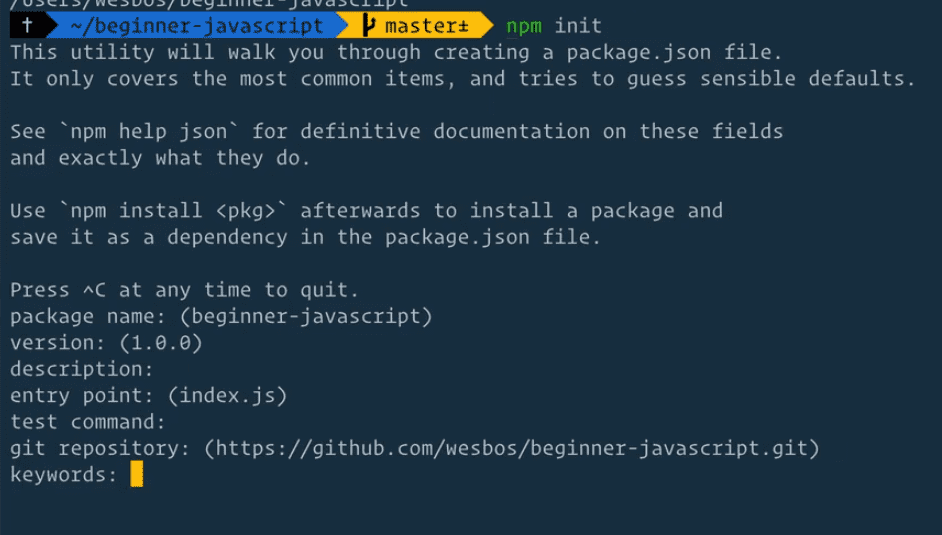 

Then we need to go ahead and install all of our dependencies.

Go ahead and copy this line of code and paste it in your terminal to install the dependencies.

    npx install-peerdeps --dev eslint-config-wesbos

After about a minute or so, it will go ahead and install all of your packages.

  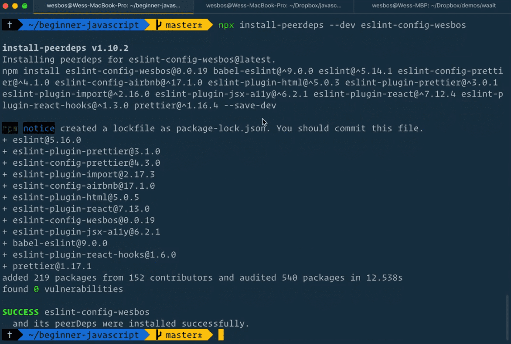 

If you take a look at your filesystem, you will see that there is this new folder called `node_modules` and inside there are a whole bunch of dependencies.

We're not going to get into what that is just yet, that will be coming in our modules lesson. For now, all we need to know is it contains all of the npm packages that makes ESLint and Prettier work.

  Configuring ESLint and Prettier with VS Code
---------------------------------------------------------------------------------------------------------------------------------------------------------------

Next we need to make a new file within the `beginner-javascript` folder called `.eslintrc`. This is what is called a *dot file*.

Sometimes your computer will hide dot files from you because they are typically just files that developers use under the hood. Since we are developers, we do not want to hide those files.

If you have trouble seeing that file in your file system, do a quick google of "Showing hidden files Mac" or "show hidden files Windows" and it will show you how to flip that setting on.

Inside of your `.eslintrc` file, copy the following:

    {
      "extends": ["wesbos"]
    }

  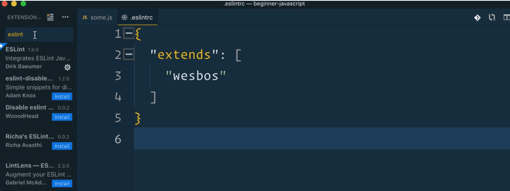 

We are going to extend `"wesbos"`, which means we are going to extend all the settings and plugins that Wes has packed into his own config. That is really all we need right now.

Next, what we need is to get it running with VS Code.

Scroll down in Wes' instructions to the *With VS Code* section.

  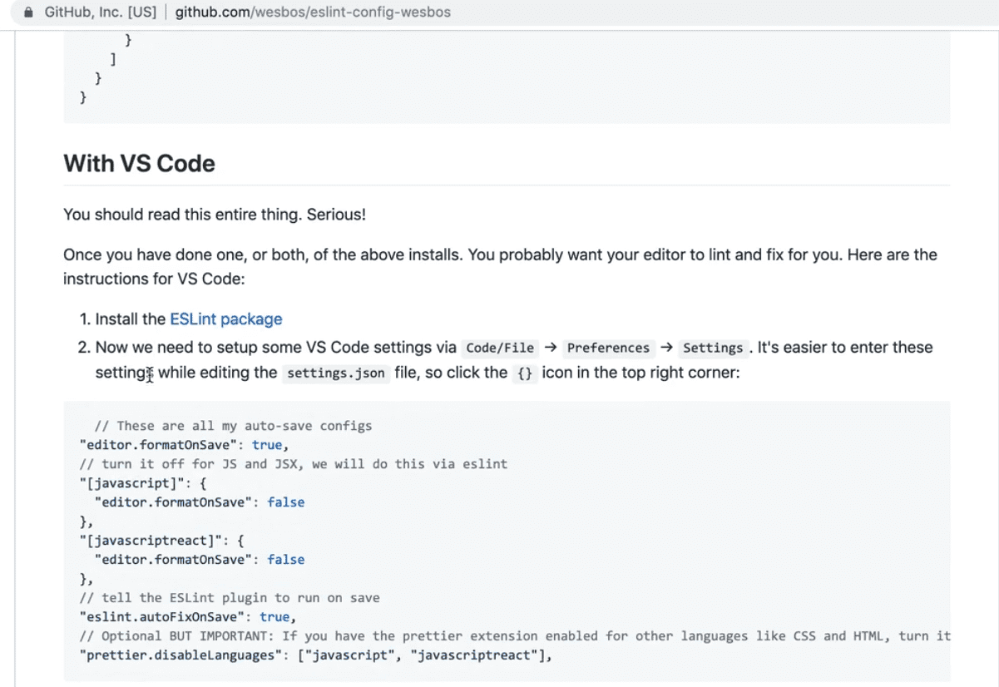 

First thing you need to do is install the ESLint extension for VS Code.

`Ctrl` + `Shift` + `x` (`cmd` + `Shift` + `x` / MacOS ) will get you to the list of extensions in VS Code.

You want to search for ESLint, and you will see a whole bunch of different ones, but the one you want is just called ESLint. You'll know it's the right one because it has billions (just kidding, millions) of installs.

Go ahead and click the `install` button.

Now what we need to do is set up some VS Code settings. Within VS Code, in the right hand corner, navigate to `Code` &gt; `Preferences` &gt; `Settings`.

If you're on Windows, that would be `File` &gt; `Preferences` &gt; `Settings`.

  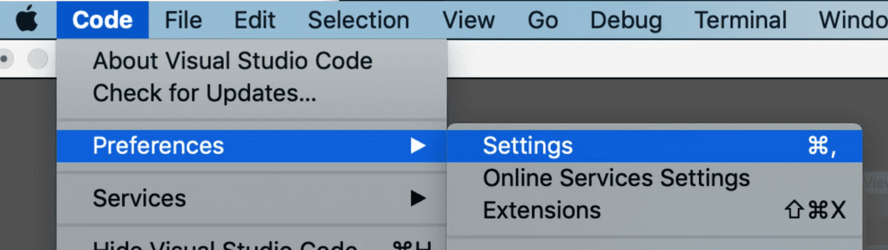 

That should open up the settings section in VS Code like so 👇

  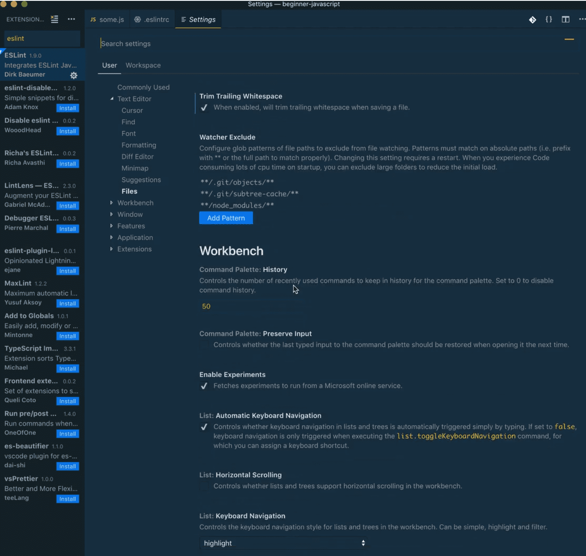 

What you want to do is click on the symbol in the top right hand corner that looks like a page with a curved arrow 👇

  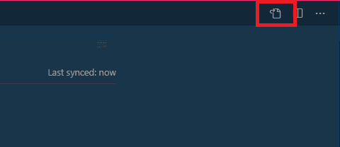 

That will open up the text based version of your settings.

   

Simply just copy all of the settings from Step \#2 of the *"With VS Code"* instructions found here <https://github.com/wesbos/eslint-config-wesbos>.

Go to the very end of your `settings.json` file in VS Code, and after the last value, add a comma and then paste in the settings we just copied. *(If you don't have any previous VS Code custom settings then you will have an empty object).*

  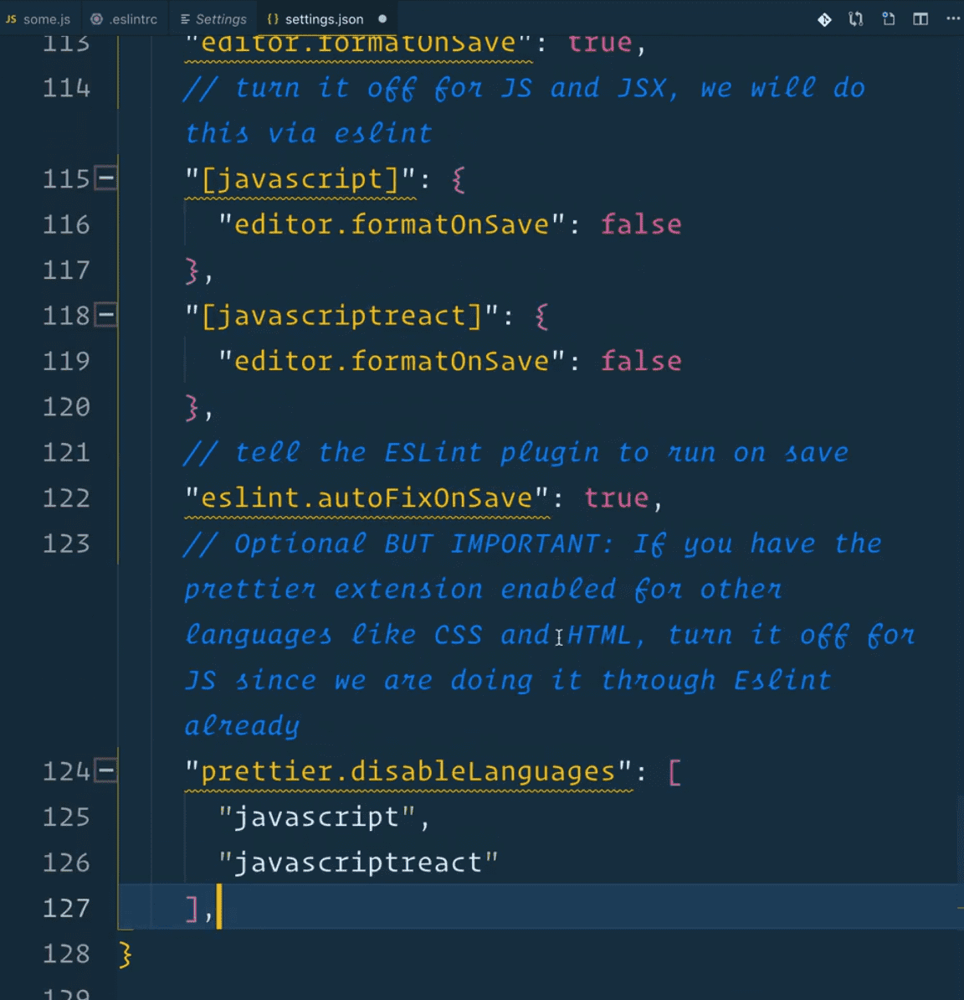 

Let's go through the settings really quickly.

`editor.formatOnSave: true`: turns on formatting on file save.

    "[javascript]": {
      "editor.formatOnSave": false
    }

The setting above 👆 is responsible for turning off formatting on save for JavaScript. We will format JavaScript code using ESLint.

This setting below is responsible for telling the ESLint plugin to run on save. 👇

    "eslint.autoFixOnSave": true

You need to do that to prevent other built-in plugins in VS Code from clashing with our ESLint plugin.

The built-in plugin in VS Code for formatting is called Beautifier and it doesn't do as good of a job as ESLint and Prettier, so what that setting is doing is turning off the editor format on save for JavaScript and for javascriptreact and using the ESLint fix on save instead.

Finally, this is important: if you already have a prettier extension enabled, you want to disable it for JavaScript and javascriptreact using the following setting 👇

    "prettier.disableLanguages": ["JavaScript", "javascriptreact"],

Why? Because we are not using Prettier directly through the Prettier plugin. We are using Prettier through ESLint as a ESLint plugin.

This stuff can get confusing and be a real bummer, so if you get stuck or have trouble, watch the video again and check out the "troubleshooting tips" in the `eslint-config-wesbos` Github repository.

To check if Prettier is working, you can open a JavaScript file in VS Code and some add extra whitespace between variables and equal signs and then save the file.

If it isn't working, you can click on ESLint in the bottom corner and it will often tell you what the issues are and why it isn't workig.

  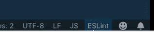 

Another thing you will notice with ESLint is these squiggly underlines in VS Code👇

  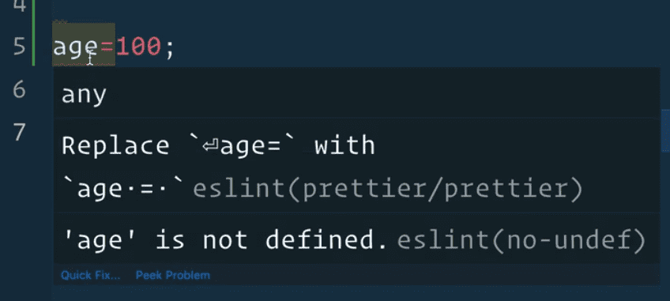 

That is actually ESLint giving you information about a warning or error.

ESLint won't automatically fix these problems for us on save, it just explains what the issue is and then it's up to you to make a decision on how to solve it.

If you modified the code to be `let age = 100;` ESLint will give you a warning saying you used a `let` variable but never modify the value, maybe you want to use a `const` variable instead.

If you modify the code to be `const age = 100;`, the underline under the age variable will be yellow and the warning will say:

> 'age' is assigned a value but never used. eslint(no-unused-vars)

Red squiggles represent an `error` and yellow is just a `warning`.

We will be seeing that a lot during this course.

If throughout the course there is a setting you really don't like, you can go ahead and modify the `.eslintrc` file to disable that rule.

That works by creating a `rules` property like so 👇

    {
      "extends": ["wesbos"],
      "rules": {
        "no-console": 2,
        "prettier/prettier": [
          "error",
          {
            "trailingComma": "es5",
            "singleQuote": true,
            "printWidth": 120,
            "tabWidth": 8
          }
        ]
      }
    }

You can set the values of the rules to:

-   `2` if you want them to error
-   `1` if you want them to warn
-   `0` if you want to ignore that rule entirely

If you get stuck, try fixing it yourself for about 20 minutes and if you are still stuck, jump into the Slack chatroom and join the \#beginner-javascript channel and ask for help.

Find an issue with this post? Think you could clarify, update or add something?

All my posts are available to edit on Github. Any fix, little or small, is appreciated!

[Edit on Github](https://github.com/wesbos/wesbos/tree/master/src/javascript/01-the-basics/05-code-quality-tooling-with-prettier-and-eslint/05-code-quality-tooling-with-prettier-and-eslint.mdx)

[**← Prev**](../variables-and-statements/index.html)

Variables and Statements

[**Next →**](../types-introduction/index.html)

Types - Introduction

### Syntax Podcast

Hold on — I'm grabbin' the last one.

###  [@wesbos](https://twitter.com/wesbos) Tweets

brb getting some good tweets...

###  [@wesbos](https://instagram.com/wesbos) Instant Grams

