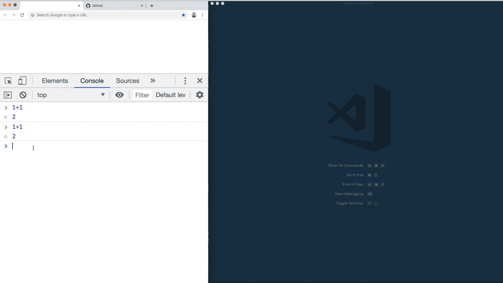
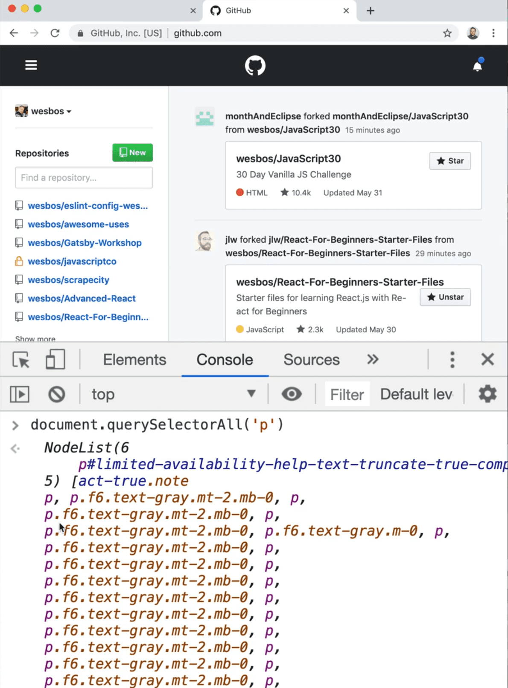
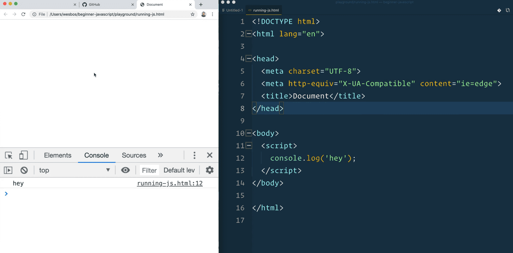
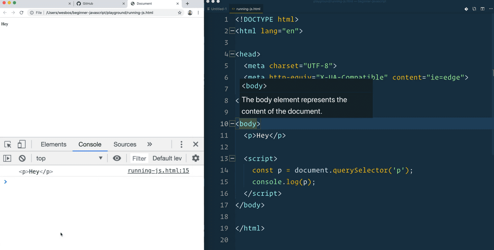
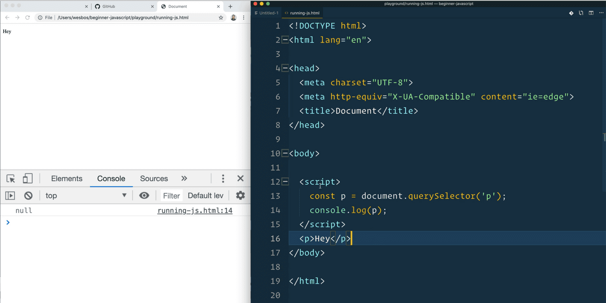
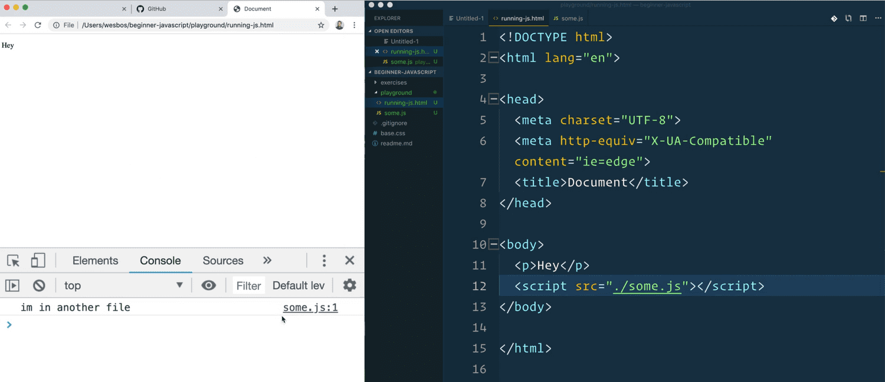
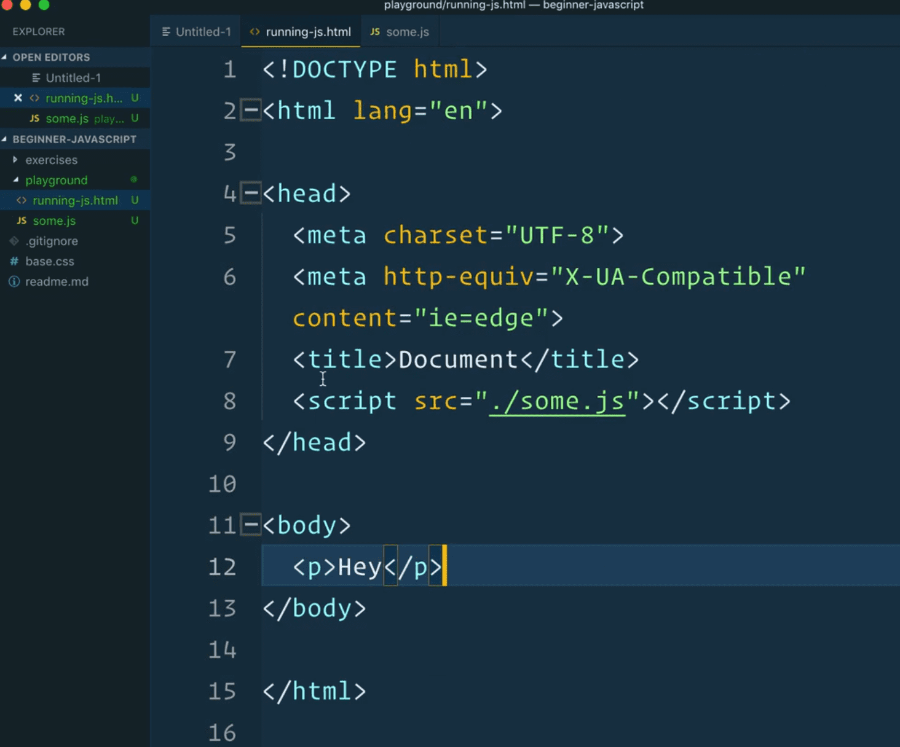
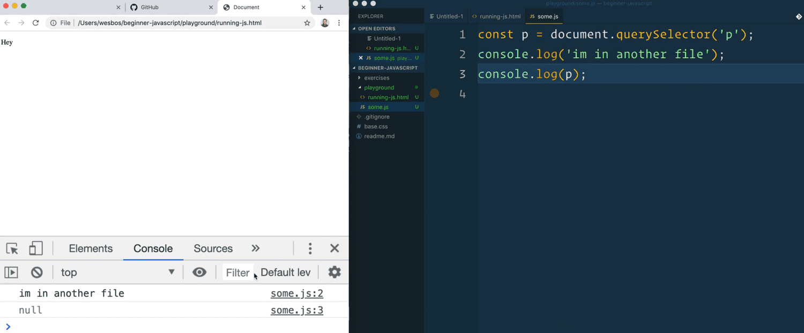
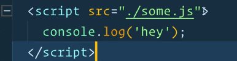
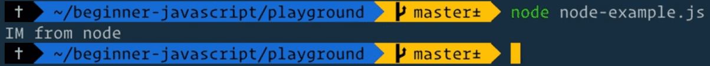

==============================================================================================================================

##### Module 1 - The Basics

-   <a href="../welcome/index.html" class="currentModule">WelcomePart 01</a>
    1.  <a href="../welcome/index.html#house-keeping" class="currentModule">House Keeping</a>
        -   <a href="../welcome/index.html#starter-files" class="currentModule">Starter Files</a>
        -   <a href="../welcome/index.html#how-to-do-the-course" class="currentModule">How to Do the Course</a>
-   <a href="../browser-editor-and-terminal-setup/index.html" class="currentModule">Browser, Editor and Terminal SetupPart 02</a>
    1.  <a href="../browser-editor-and-terminal-setup/index.html#the-browser" class="currentModule">The browser</a>
        -   <a href="../browser-editor-and-terminal-setup/index.html#shortcuts" class="currentModule">Shortcuts</a>
    2.  <a href="../browser-editor-and-terminal-setup/index.html#nodejs" class="currentModule">Node.js</a>
        -   <a href="../browser-editor-and-terminal-setup/index.html#checking-if-nodejs-is-installed" class="currentModule">Checking if Node.js is installed</a>
        -   <a href="../browser-editor-and-terminal-setup/index.html#which-terminal-to-use" class="currentModule">Which Terminal to Use</a>
        -   <a href="../browser-editor-and-terminal-setup/index.html#checking-if-you-have-npm-installed" class="currentModule">Checking if you have npm installed</a>
    3.  <a href="../browser-editor-and-terminal-setup/index.html#command-line-basics" class="currentModule">Command Line Basics</a>
    4.  <a href="../browser-editor-and-terminal-setup/index.html#check-that-nodejs-is-working" class="currentModule">Check that Node.js is working</a>
    5.  <a href="../browser-editor-and-terminal-setup/index.html#code-editor" class="currentModule">Code Editor</a>
-   <a href="index.html" class="currentModule currentPage currentSection">Running and Loading JavaScriptPart 03</a>
    1.  <a href="index.html#run-scripts-before-closing-body-tag" class="currentModule currentPage">Run scripts before closing body tag</a>
    2.  <a href="index.html#external-javascript-files" class="currentModule currentPage">External JavaScript Files</a>
    3.  <a href="index.html#running-it-in-nodejs" class="currentModule currentPage">Running it in Node.js</a>
-   <a href="../variables-and-statements/index.html" class="currentModule">Variables and StatementsPart 04</a>
    1.  <a href="../variables-and-statements/index.html#var" class="currentModule">var</a>
    2.  <a href="../variables-and-statements/index.html#let" class="currentModule">let</a>
    3.  <a href="../variables-and-statements/index.html#const" class="currentModule">const</a>
    4.  <a href="../variables-and-statements/index.html#statements-and-semi-colons-in-javascript" class="currentModule">Statements and Semi-Colons in JavaScript</a>

    3.  <a href="../types-strings/index.html#concatenation-and-interpolation" class="currentModule">Concatenation and Interpolation</a>
    4.  <a href="../types-strings/index.html#backticks" class="currentModule">Backticks</a>
-   <a href="../types-numbers/index.html" class="currentModule">Types - NumbersPart 08</a>
    1.  <a href="../types-numbers/index.html#numbers-in-javascript" class="currentModule">Numbers in JavaScript</a>
    2.  <a href="../types-numbers/index.html#helper-methods" class="currentModule">Helper Methods</a>
    3.  <a href="../types-numbers/index.html#modulo-and-power-operators" class="currentModule">Modulo and Power Operators</a>
    4.  <a href="../types-numbers/index.html#things-to-know-about-math-in-javascript" class="currentModule">Things to know about Math in JavaScript</a>
        -   <a href="../types-numbers/index.html#infinity-and-negative-infinity" class="currentModule">Infinity and Negative Infinity</a>
        -   <a href="../types-numbers/index.html#not-a-number" class="currentModule">Not a Number</a>
-   <a href="../types-objects/index.html" class="currentModule">Types - ObjectsPart 09</a>
-   <a href="../types-null-and-undefined/index.html" class="currentModule">Types - Null and UndefinedPart 10</a>
    1.  <a href="../types-null-and-undefined/index.html#undefined" class="currentModule">undefined</a>
    2.  <a href="../types-null-and-undefined/index.html#null" class="currentModule">null</a>
-   <a href="../types-booleans-and-equality/index.html" class="currentModule">Types - Booleans and EqualityPart 11</a>
    1.  <a href="../types-booleans-and-equality/index.html#equality-equal-sign-double-equal-sign-triple-equal-sign" class="currentModule">Equality (equal sign, double equal sign, triple equal sign)</a>

Running and Loading JavaScript
========================================================

Enjoy these notes? Want to Slam Dunk JavaScript?

JavaScript, Browser, Node.jsEdit Post

Let's talk about how to actually run JavaScript.

There are a couple of ways we can run JavaScript:

-   in the browser console
-   in node
-   via a script tag
-   we can also have an external script.

We will talk about how we can actually run those.

The simplest is to open up your browser dev tools and go to your console.

If you want to run some JavaScript to see how it works, like here Wes has typed `1 + 1` and hit enter and the console returned `2`.

   

This right here is a JavaScript console and it's a nice way to quickly noodle on some JavaScript

To see how it works, just pop open a browser console. The neat thing is if you are on any websites, say [https://github.com](https://github.com/), the JavaScript that you type into your console runs on the actual page that is loaded and existing.

For example You can type the following to grab all the paragraphs from the github page that you are currently on. 👇

    document.querySelectorAll("p");

*(Don't worry about what document.querySelectorAll() does, we will cover that in a future video).*

   

The code that runs in your dev tools console is running in the context of the page that is loaded in your browser tab.

The next way to do it is a script tag.

Go into the `/playground` folder and create a new file `running-js.html`.

Wes has an Emmet extension in VS Code so he is going to hit `!` and `Tab` to scaffold out some HTML for us.

In the body, we can have a script tag in which we will add `console.log('hey')`.

What that will do is when the HTML is loaded, it's going to say "OH! This is a script tag, I am changing languages from HTML over to JavaScript, and it will run any code inside of the opening and closing script tag as JavaScript.

If you go ahead and open the `running-js.html` file in the browser, and open the console, you will see that it says "hey".

    *Don't sweat this too much, we will be explaining what console.log() and everything does shortly.*

  Run scripts before closing body tag
---------------------------------------------------------------------------------------------------------------------------------------------

One thing to keep in mind is that it's almost always worth running scripts just before the closing body tag.

So if we were to modify `running-js.html` to include a paragraph tag that says Hey right after the body tag, and then we wanted to grab that paragraph via JavaScript, we could if our script is right located right before the closing body tag, like below: 👇

    <body>
      
Hey

      
    </body>

   

If you were to move the script tag above the paragraph element (or move the paragraph element below the script tag), and refresh the page, the console will show `null` because that means it found nothing.

   

In order for your script tag to access the elements on the page, the elements must first be on the page before you select them. If we try to select something that doesn't yet exist (because it gets created later), we won't have access to it.

For your own sanity, always put your JavaScript right below the closing body tag. *(We will talk about loading in future videos when we get a little bit more into the DOM).*

  External JavaScript Files
-------------------------------------------------------------------------------------------------------------------------

Another way we can do it is via an external JavaScript file.

Go into the playground and make an external JavaScript file, called `some.js`. In that file, add the following code 👇

    console.log("I am in another file");

In the `running-js.html` file, remove the existing script block and instead add a script tag with a `src` attribute. *(You do not need a `type=` attribute until we hit ECMAScript Modules.)*

Inside of the `src=` attribute, you need to give it a relative path, like so 👇

    <script src="./some.js">

That works because the HTML file is in a folder where the sibling file is `some.js`.

-   `./` means in this folder.
-   `../` would mean go up a folder level.

In our case, it's in the same folder so `./some.js` is the relative path to our file.

Now if you run that, it will say in the console `I'm in another file`, and it will even show you which file and line number of where that JavaScript had been run. 👇

   

Again, if you were to put the script inside the `head` element, it will still work.

   

However, if you were to try to select some things on the page, such as the paragraph tag, you will get `null`.

   

Why? Because of the same reason, the script will run before the actual HTML is finished building on the page. Leave the script tag right before the closing body tag for the best performance and to save yourself future debugging headaches.

*(There are some options like the `async` and `defer` attributes you can add to your script tags that will delay the actual running of the JavaScript, and it will download it asynchronously and then run it once the HTML has been loaded, however that is a more advanced topic which we will get into once we discuss async. But first we will need to understand what does asynchronous mean, etc)*

Another thing you may have noticed is why is there a closing script tag if there is no content in between the opening and closing tag?

That is a quirk with the script tag. It cannot be self closed.

You also cannot add extra JavaScript between the script tag like so: 👇

    *That will not work.*

You can have multiple script tags in an HTML file, if you like.

The only downside to that is that every single time that it hits one of those script tags, it will go off and download the JavaScript file and parse that for you.

When we hit modules, we will look at how we can bundle those multiple files into one. Or you can do something called code splitting, which is split them into multiple, smaller JavaScript files, and have them load on demand.

  Running it in Node.js
----------------------------------------------------------------------------------------------------------------

One more is actually running it in Node.js.

    console.log("I'm from node");

Node.js is JavaScript that can run in the server. Instead of running JavaScript on a website, we run it on an actual machine (like many other programming languages do).

The way we do that is we open our terminal and `cd` into the `playground` directory.

You can run the script in Node by entering the following in the terminal and hitting enter 👇

    node node-example.js

That will run whatever code is in the script file, and once it's done, it will exit out of node and return you to the terminal.

   

That's the short of how to load JavaScript.

We will be using a mixture of running JavaScript in the console, in a script tag and in external JavaScript files.

Find an issue with this post? Think you could clarify, update or add something?

All my posts are available to edit on Github. Any fix, little or small, is appreciated!

[Edit on Github](https://github.com/wesbos/wesbos/tree/master/src/javascript/01-the-basics/03-running-and-loading-js/03-running-and-loading-js.mdx)

[**← Prev**](../browser-editor-and-terminal-setup/index.html)

Browser, Editor and Terminal Setup

[**Next →**](../variables-and-statements/index.html)

Variables and Statements

### Syntax Podcast

Hold on — I'm grabbin' the last one.

###  [@wesbos](https://twitter.com/wesbos) Tweets

brb getting some good tweets...

###  [@wesbos](https://instagram.com/wesbos) Instant Grams

