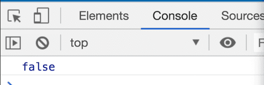
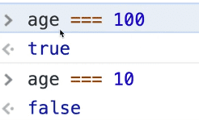
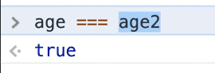
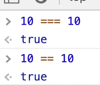
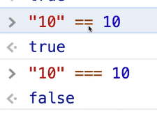

==============================================================================================================================

##### Module 1 - The Basics

-   <a href="../welcome/index.html" class="currentModule">WelcomePart 01</a>
    1.  <a href="../welcome/index.html#house-keeping" class="currentModule">House Keeping</a>
        -   <a href="../welcome/index.html#starter-files" class="currentModule">Starter Files</a>
        -   <a href="../welcome/index.html#how-to-do-the-course" class="currentModule">How to Do the Course</a>
-   <a href="../browser-editor-and-terminal-setup/index.html" class="currentModule">Browser,     3.  <a href="../types-strings/index.html#concatenation-and-interpolation" class="currentModule">Concatenation and Interpolation</a>
    4.  <a href="../types-strings/index.html#backticks" class="currentModule">Backticks</a>
-   <a href="../types-numbers/index.html" class="currentModule">Types - NumbersPart 08</a>
    1.  <a href="../types-numbers/index.html#numbers-in-javascript" class="currentModule">Numbers in JavaScript</a>
    2.  <a href="../types-numbers/index.html#helper-methods" class="currentModule">Helper Methods</a>
    3.  <a href="../types-numbers/index.html#modulo-and-power-operators" class="currentModule">Modulo and Power Operators</a>
    4.  <a href="../types-numbers/index.html#things-to-know-about-math-in-javascript" class="currentModule">Things to know about Math in JavaScript</a>
        -   <a href="../types-numbers/index.html#infinity-and-negative-infinity" class="currentModule">Infinity and Negative Infinity</a>
        -   <a href="../types-numbers/index.html#not-a-number" class="currentModule">Not a Number</a>
-   <a href="../types-objects/index.html" class="currentModule">Types - ObjectsPart 09</a>
-   <a href="../types-null-and-undefined/index.html" class="currentModule">Types - Null and UndefinedPart 10</a>
    1.  <a href="../types-null-and-undefined/index.html#undefined" class="currentModule">undefined</a>
    2.  <a href="../types-null-and-undefined/index.html#null" class="currentModule">null</a>
-   <a href="index.html" class="currentModule currentPage currentSection">Types - Booleans and EqualityPart 11</a>
    1.  <a href="index.html#equality-equal-sign-double-equal-sign-triple-equal-sign" class="currentModule currentPage">Equality (equal sign, double equal sign, triple equal sign)</a>

Types - Booleans and Equality
=======================================================

Enjoy these notes? Want to Slam Dunk JavaScript?

JavaScript, Types, Booleans, Equality CheckingEdit Post

The final type in JavaScript is called a **boolean**. A boolean is either true or false, it's like a light switch, it's on or off and that is it.

We use booleans for logic such as if statements in our JavaScript code.

Booleans can be manually set or calculated.

Let's take a look at some examples.

Comment out all the code you have added to `types.js` so far and add 👇

    let isDrawing = false;

Let's say we want to know if the user is moving their mouse and if they are currently clicking down or up.

To do that, we can use a **flag variable**, which is a variable that is either set to true or false.

When the user clicks down, we set it to true and when they click up, we set it to false. That is what a boolean is -- something that is either true or false.

We can also calculate booleans. For example, if we have an `age` variable that is set to 18, and another variable called `ofAge` that has the value of `age > 19`, if you console log `ofAge`, it will return **false**.

    const age = 18;
    const ofAge = age > 19;
    console.log(ofAge);

   

Sometimes values are calculated, like for `ofAge`.

We will talk later about the `greater than`, `less than` and `equal to` operators.

Equality (equal sign, double equal sign, triple equal sign)
---------------------------------------------------------------------------------------------------------------------------------------------------------------------------------------

For now, we will just focus on equality which is the `equal sign`, `double equal sign` and `triple equal sign`.

One equal sign `=` is used to assign a value to a variable.

    const age = 100;

For double equals `==` and triple equals `===`, know that you should almost always be using triple equals.

There are some edge cases where you can use double equals, but almost all the time it's better to use triple equals.

If you take the age variable in the console and do the following

   

-   `age === 100` will return true
-   `age === 10` will return false

That is what Wes means by booleans can be calculated as well.

You have 1 value, which can be a straight up value `100 === 10` or it can be a value that is stored in a variable `age === 100` or it can be two variables.

Add `let age2 = 100;` in `types.js`, and refresh the HTML page in the browser.

Now you can do `age === age2` which will return true. 👇

   

What is happening there is the browser is checking the value of the first variable and then it checks the value of the second one, to make sure they are exactly the same.

What would happen if instead we did `10 == 10`, with a double equals? It would return true. 👇

   

Why are there two different ways to check for equality?

Triple equal will check that the value of the thing on the left hand side and the right hand side are the same, AND it will check that the types of the thing on the left and on the right are the same.

**Triple equals will always check for both value and type.**

In the examples above, the types were numbers.

What if you were to do `"10" == 10`?

The console would return true. Why?

Because the value is the same, but the types are not.

If you did `"10" === 10`, it would return false. 👇

   

This is one of the examples where you can get into hot water by mixing strings and numbers when doing addition.

You should almost always be working with the same type. The same is true with equality. It's easy to get into hot water if you are checking if a string and a number are the exact same thing.

**=== always checks that the value and type are exactly the same.**

In a future video, we will go over something called *"flow control"*, which is `if`, `ternary`, and `switch` statements. These booleans will be particularly helpful for those videos.

We will also be extending what we learned here a little bit further into things like truthy and falsy values, as well as this thing called **coercion** which is where you have one type of value and you want to force it into another type of value.

Find an issue with this post? Think you could clarify, update or add something?

All my posts are available to edit on Github. Any fix, little or small, is appreciated!

[Edit on Github](https://github.com/wesbos/wesbos/tree/master/src/javascript/01-the-basics/11-types-booleans-and-equality/11-types-booleans-and-equality.mdx)

[**← Prev**](../types-null-and-undefined/index.html)

Types - Null and Undefined

[**Next →**](../../02-functions/functions-built-in/index.html)

Functions - Built-in

### Syntax Podcast

Hold on — I'm grabbin' the last one.

