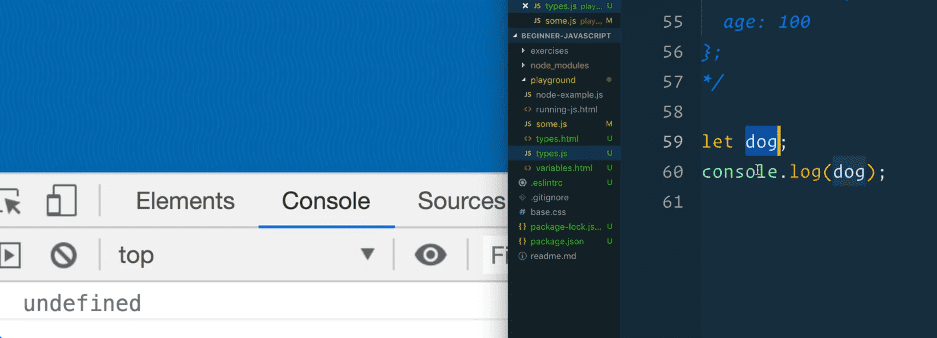

Types - Null and Undefined
====================================================

Enjoy these notes? Want to Slam Dunk JavaScript?

JavaScript, Types, UndefinedEdit Post

There are two ways to sort of express "nothing" in JavaScript, and that is with `undefined` and `null`.

undefined
---------------------------------------------------------------------------------------

If you create a variable and don't set anything to it, it will be `undefined`. 👇

    let dog;
    console.log(dog);

   

**undefined** is something that has been created (a variable), but has not yet been defined (given a value).

The same thing goes for properties on an object. If you type in the console `person.dog` it will return undefined.

Why? Because there is nothing there. That is what undefined is.

It comes about when you try to access a variable that has been created but not given a value.

If you typed in the console `wes`, you would see an error message returned that said *'wes is not defined'* which means that you didn't create a variable called `wes`.

With the dog example we used above, we have created the variable but we have not set a value. That is the difference.

null
-----------------------------------------------------------------------------

Now we will discuss the **null** type.

Null is a value of nothing, whereas undefined is a variable that has not yet had a value set to it.

We will go over some examples to demonstrate.

In `types.js` add the following 👇

    let somethingUndefined;
    const somethingNull = null;

*NOTE: you cannot use a const variable without setting a value.*

`somethingUndefined` is undefined because it does not have a value set, whereas `somethingNull` has the value of null, which is nothing. They are both nothing, but in different ways.

Let's say for example we have Cher and Teller (both of who are real people), who we will represent in objects like so 👇

    const cher = {
      first: "Cher",
    };

    const teller = {
      first: "Raymond",
      last: "Teller",
    };

    teller.first = "Teller";
    teller.last = null;

In this example, Cher never had a last name, so she does not have the last property in her object.

Teller on the other hand, got rid of his last name, so we are explicitly setting it to null.

In the console, if you type `cher.last` you will see the value of undefined returned. When you try `teller.last`, the value of null wil be returned.

Find an issue with this post? Think you could clarify, update or add something?

All my posts are available to edit on Github. Any fix, little or small, is appreciated!

[Edit on Github](https://github.com/wesbos/wesbos/tree/master/src/javascript/01-the-basics/10-types-null-and-undefined/10-types-null-and-undefined.mdx)

[**← Prev**](../types-objects/index.html)

Types - Objects

[**Next →**](../types-booleans-and-equality/index.html)

Types - Booleans and Equality

### Syntax Podcast

Hold on — I'm grabbin' the last one.

