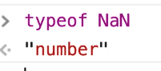

==============================================================================================================================

##### Module 1 - The Basics

-   <a href="../welcome/index.html" class="currentModule">WelcomePart 01</a>
    1.  <a href="../welcome/index.html#house-keeping" class="currentModule">House Keeping</a>
        -   <a href="../welcome/index.html#starter-files" class="currentModule">Starter Files</a>
        -   <a href="../welcome/index.html#how-to-do-the-course" class="currentModule">How to Do the Course</a>
-   <a href="../browser-editor-and-terminal-setup/index.html" class="currentModule">Browser,     3.  <a href="../types-strings/index.html#concatenation-and-interpolation" class="currentModule">Concatenation and Interpolation</a>
    4.  <a href="../types-strings/index.html#backticks" class="currentModule">Backticks</a>
-   <a href="index.html" class="currentModule currentPage currentSection">Types - NumbersPart 08</a>
    1.  <a href="index.html#numbers-in-javascript" class="currentModule currentPage">Numbers in JavaScript</a>
    2.  <a href="index.html#helper-methods" class="currentModule currentPage">Helper Methods</a>
    3.  <a href="index.html#modulo-and-power-operators" class="currentModule currentPage">Modulo and Power Operators</a>
    4.  <a href="index.html#things-to-know-about-math-in-javascript" class="currentModule currentPage">Things to know about Math in JavaScript</a>
        -   <a href="index.html#infinity-and-negative-infinity" class="currentModule currentPage">Infinity and Negative Infinity</a>
        -   <a href="index.html#not-a-number" class="currentModule currentPage">Not a Number</a>
-   <a href="../types-objects/index.html" class="currentModule">Types - ObjectsPart 09</a>
-   <a href="../types-null-and-undefined/index.html" class="currentModule">Types - Null and UndefinedPart 10</a>
    1.  <a href="../types-null-and-undefined/index.html#undefined" class="currentModule">undefined</a>
    2.  <a href="../types-null-and-undefined/index.html#null" class="currentModule">null</a>
-   <a href="../types-booleans-and-equality/index.html" class="currentModule">Types - Booleans and EqualityPart 11</a>
    1.  <a href="../types-booleans-and-equality/index.html#equality-equal-sign-double-equal-sign-triple-equal-sign" class="currentModule">Equality (equal sign, double equal sign, triple equal sign)</a>

Types - Numbers
=========================================

Enjoy these notes? Want to Slam Dunk JavaScript?

JavaScript, Types, NumbersEdit Post

There is only one type of number in JavaScript, which is simply number.

Comment out all the code in `types.js` and add the following 👇

    const age = 100;
    const name = "wes";

Open `types.html` in the browser and then open the console and type `typeof age` and hit enter. The console should return to you "number".

   

**typeof** is a keyword in JavaScript that allows you to check the type of a value.

You use it by writing `typeof` followed by a space and a variable or value. That will tell you whether it's a number, a string, or any of the other types.

Numbers in JavaScript
---------------------------------------------------------------------------------------------------------------

Numbers in JavaScript are pretty simple.

You can create an integer, which is a whole number (100), or you can create a float which is a number that has a decimal (100.5).

Both are used in the same type of number.

There is multiplication, division, addition and subtraction available to us.

Add the following code to `types.js` and refresh the html page in the browser.

    const a = 20;
    const b = 10;

You can perform the following calculations in the browser 👇

   

The only thing to be aware of is when you are mixing types.

If you try to do math with a string type for example, you start getting into **concatenation**.

That is what we refer to in JavaScript as *"the plus sign is loaded"* meaning the plus sign can be used with numbers to add, with strings to concatenate, and then there is a lot of room to run into bugs.

If you try to do math with strings, it will convert them for you if you are doing subtraction, division or multiplication, but not for addition.

Whenever we are doing math, we need to make sure we are dealing with true numbers and not mixing types.

   

Along with numbers we also have what we call helper methods.

If you go into the browser console and type `Math.`, you will see a lot of built in helper methods.

   

Helper Methods
-------------------------------------------------------------------------------------------------

There are four you are most likely to use.

1.  `Math.round()`
2.  `Math.floor()`
3.  `Math.ceil()`
4.  `Math.random()`

Let's go through each one, starting with `Math.round()`.

To use `Math.round()`, you pass a value in between the parenthesis `()` *(that is referred to as passing a value, which we will go over in a future video).* It will return to you the number that was passed in, rounded up or down depending on the number.

   

There is also `Math.floor()` which will give you the lower end of that number.

   

We have `Math.ceil()` and that will give you the upper number.

   

Then there is `Math.random()` which will give you a random number every time between 0 and 1 (in a future video we will go over how to get a random number between 1 and 10).

   

Modulo and Power Operators
-------------------------------------------------------------------------------------------------------------------------

Along with multiplication, division, subtraction and addition, we have two more operators which are called the modulo and the power.

Let's use the example here where you have a box of 20 Smarties (a Canadian candy), that you need to split up between your 3 kids.

    const smarties = 20;
    const kids = 3;
    const eachKidGets = smarties / kids;
    console.log(`Each kid gets ${eachKidGets}`);

In the console, that evaluates to `Each kid gets 6.66666666667` 👇

   

That is obviously not going to work because you aren't going to split a smartie into a 0.6666.

Instead, what we can do is specify that it is a whole number of smarties that we need and we can't round up because we don't have extra smarties so that is one instance in which we can use `Math.floor()`.

Modify the code to use the following instead 👇

    const eachKidGets = Math.floor(smarties / kids);

Now in the console you should see that each kid gets six.

   

Now how many smarties do we have left over?

When you can no longer evenly distribute them, there will be some left over (for dad!). How can you figure that out?

You can use the **Modulo operator** to tell how many are left after they have been evenly split up.

In the console type the following, and you should see the value 2 returned. 👇

    smarties % kids;

and you should see the value 2 returned. 👇

   

After the smarties have been evenly distributed between the kids, there are 2 smarties left over. The modulo operator `%` will tell you how many are left after you evenly divide them.

Add the following to `types.js` 👇

    const dadGets = smarties % kids;

Another example would be there are 10 smarties and 3 kids. If you divide the smarties evenly, there will be one left over.

    10 % 3 = 1;

Things to know about Math in JavaScript
---------------------------------------------------------------------------------------------------------------------------------------------------

Other things you need to know about math in JavaScript is that if you do `0.1 + 0.2` in the console, it will return `0.30000000004`.

When people who are learning JavaScript encounter this, they often think that JavaScript is buggy.

Wes suggests trying the following in the browser console: 👇

    window.location = `https://${0.1 + 0.2}.com`;

That will take you to the following website [https://0.30000000000000004.com](https://0.30000000000000004.com/), that will explain why this occurs in JavaScript.

This happens in almost every programming language, and it's the reality of working with floating point numbers on computers.

One takeaway is that if you are ever working with money, don't store it in dollars and cents.

For example don't do this: 👇

    const price = 10.34;

That is because if someone gives you a 20 dollar bill, you can run into issues with the long rounded number and you have a half cent left over you aren't sure what to do with. That is ripe for bugs.

What Wes does is he stores all of his prices in cents, so he is always working with whole numbers and doesn't have to deal with fractions. When he needs to display the price, just divide it by 100 and round the cents *(we will look at examples of displaying money soon)*.

### Infinity and Negative Infinity

Another thing you should know is JavaScript also has `infinity` and `negative infinity`. At the end of the day, there is a max that computers can calculate with numbers. If you try to calculate something that is too high, it will return to you infinity or negative infinity.

We will go over an example.

If you do `10 **`, the double `**` actually means *"to the power of"*. So `10 ** 2` returns 100 and `1000 ** 2` returns 1000000.

   

Negative infinity is also a number. Wes has never run into this in his programming, unless you have goofed something up.

   

### Not a Number

Another thing to know is `NaN`. NaN means *"not a number"*.

If you try to do something like below, it would return NaN 👇

    10 / "dog"; // Return NaN

   

**NaN** is a type of "number", which is confusing since it means not a number.

   

That is something you will run into if you try to do math with something that is not a number. Instead of erroring out, it will just return NaN.

Find an issue with this post? Think you could clarify, update or add something?

All my posts are available to edit on Github. Any fix, little or small, is appreciated!

[Edit on Github](https://github.com/wesbos/wesbos/tree/master/src/javascript/01-the-basics/08-types-numbers/08-types-numbers.mdx)

[**← Prev**](../types-strings/index.html)

Types - Strings

[**Next →**](../types-objects/index.html)

Types - Objects

### Syntax Podcast

Hold on — I'm grabbin' the last one.

