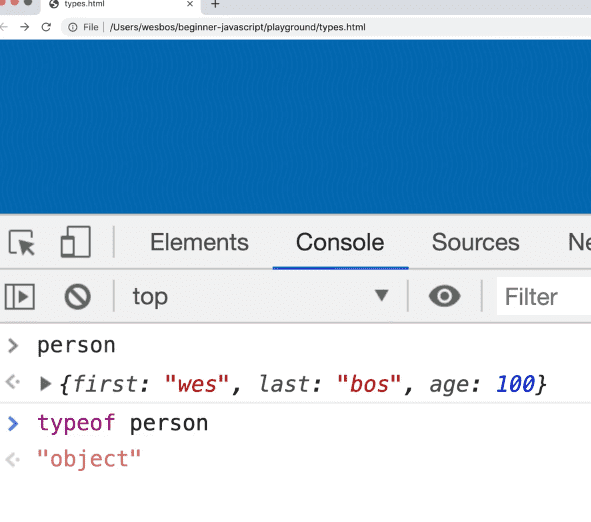
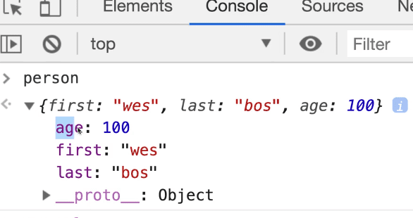
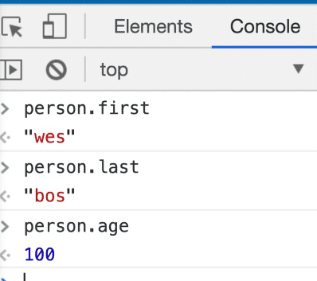

==============================================================================================================================

##### Module 1 - The Basics

-   <a href="../welcome/index.html" class="currentModule">WelcomePart 01</a>
    1.  <a href="../welcome/index.html#house-keeping" class="currentModule">House Keeping</a>
        -   <a href="../welcome/index.html#starter-files" class="currentModule">Starter Files</a>
        -   <a href="../welcome/index.html#how-to-do-the-course" class="currentModule">How to Do the Course</a>
-   <a href="../browser-editor-and-terminal-setup/index.html" class="currentModule">Browser,     3.  <a href="../types-strings/index.html#concatenation-and-interpolation" class="currentModule">Concatenation and Interpolation</a>
    4.  <a href="../types-strings/index.html#backticks" class="currentModule">Backticks</a>
-   <a href="../types-numbers/index.html" class="currentModule">Types - NumbersPart 08</a>
    1.  <a href="../types-numbers/index.html#numbers-in-javascript" class="currentModule">Numbers in JavaScript</a>
    2.  <a href="../types-numbers/index.html#helper-methods" class="currentModule">Helper Methods</a>
    3.  <a href="../types-numbers/index.html#modulo-and-power-operators" class="currentModule">Modulo and Power Operators</a>
    4.  <a href="../types-numbers/index.html#things-to-know-about-math-in-javascript" class="currentModule">Things to know about Math in JavaScript</a>
        -   <a href="../types-numbers/index.html#infinity-and-negative-infinity" class="currentModule">Infinity and Negative Infinity</a>
        -   <a href="../types-numbers/index.html#not-a-number" class="currentModule">Not a Number</a>
-   <a href="index.html" class="currentModule currentPage currentSection">Types - ObjectsPart 09</a>
-   <a href="../types-null-and-undefined/index.html" class="currentModule">Types - Null and UndefinedPart 10</a>
    1.  <a href="../types-null-and-undefined/index.html#undefined" class="currentModule">undefined</a>
    2.  <a href="../types-null-and-undefined/index.html#null" class="currentModule">null</a>
-   <a href="../types-booleans-and-equality/index.html" class="currentModule">Types - Booleans and EqualityPart 11</a>
    1.  <a href="../types-booleans-and-equality/index.html#equality-equal-sign-double-equal-sign-triple-equal-sign" class="currentModule">Equality (equal sign, double equal sign, triple equal sign)</a>

##### Module 8 - Data Types

-   <a href="../../08-data-types/objects/index.html" class="currentPage">ObjectsPart 42</a>
    1.  <a href="../../08-data-types/objects/index.html#creating-an-object" class="currentPage">Creating an Object</a>
        -   <a href="../../08-data-types/objects/index.html#accessing-properties" class="currentPage">Accessing Properties</a>
        -   <a href="../../08-data-types/objects/index.html#deleting-a-property-from-an-object" class="currentPage">Deleting a Property from an Object</a>
        -   <a href="../../08-data-types/objects/index.html#methods" class="currentPage">Methods</a>
-   [Object References vs ValuesPart 43](../../08-data-types/object-references-vs-values/index.html)
    1.  [Spread Operator](../../08-data-types/object-references-vs-values/index.html#spread-operator)
    2.  [Lodash](../../08-data-types/object-references-vs-values/index.html#lodash)
-   [MapsPart 44](../../08-data-types/maps/index.html)
    1.  [Set](../../08-data-types/maps/index.html#set)
        -   [JSON](../../08-data-types/maps/index.html#json)
-   [ArraysPart 45](../../08-data-types/arrays/index.html)
    1.  [Array Methods](../../08-data-types/arrays/index.html#array-methods)
-   [Array Cardio - Static MethodsPart 46](../../08-data-types/46-array-cardio-static-methods/index.html)
    1.  [Object Static Methods](../../08-data-types/46-array-cardio-static-methods/index.html#object-static-methods)
-   [Array Cardio - Instance MethodsPart 47](../../08-data-types/47-array-cardio-instance-methods/index.html)
    1.  [join method](../../08-data-types/47-array-cardio-instance-methods/index.html#join-method)
    2.  [split method](../../08-data-types/47-array-cardio-instance-methods/index.html#split-method)
    3.  [pop method](../../08-data-types/47-array-cardio-instance-methods/index.html#pop-method)
    4.  [shift and unshift methods](../../08-data-types/47-array-cardio-instance-methods/index.html#shift-and-unshift-methods)
-   [Array Cardio - Callback Methods and Function GenerationPart 48](../../08-data-types/48-array-cardio-callback-methods-and-function-generation/index.html)        -   [In the Past - Sharing JavaScript Code between Files](../../14-es-modules-and-structuring-larger-apps/78-modules/index.html#in-the-past---sharing-javascript-code-between-files)
    3.  [Setting up Server](../../14-es-modules-and-structuring-larger-apps/78-modules/index.html#setting-up-server)
    4.  [Importing and Exporting Modules](../../14-es-modules-and-structuring-larger-apps/78-modules/index.html#importing-and-exporting-modules)
    5.  [Things we need to know about Modules](../../14-es-modules-and-structuring-larger-apps/78-modules/index.html#things-we-need-to-know-about-modules)
        -   [Scope](../../14-es-modules-and-structuring-larger-apps/78-modules/index.html#scope)
        -   [Difference between Default and Named Exports](../../14-es-modules-and-structuring-larger-apps/78-modules/index.html#difference-between-default-and-named-exports)
    6.  [Renaming Modules](../../14-es-modules-and-structuring-larger-apps/78-modules/index.html#renaming-modules)
    7.  [More Ways to Import](../../14-es-modules-and-structuring-larger-apps/78-modules/index.html#more-ways-to-import)
    8.  [Loading JavaScript On Demand](../../14-es-modules-and-structuring-larger-apps/78-modules/index.html#loading-javascript-on-demand)
        -   [async](../../14-es-modules-and-structuring-larger-apps/78-modules/index.html#async)
-   [Currency Module RefactorPart 79](../../14-es-modules-and-structuring-larger-apps/79-currency-module-refactor/index.html)
    1.  [Bootstrap / App Init Functions](../../14-es-modules-and-structuring-larger-apps/79-currency-module-refactor/index.html#bootstrap--app-init-functions)
-   [Dad Jokes Modules RefactorPart 80](../../14-es-modules-and-structuring-larger-apps/80-dad-jokes-modules-refactor/index.html)
    1.  [Refactoring into Modules](../../14-es-modules-and-structuring-larger-apps/80-dad-jokes-modules-refactor/index.html#refactoring-into-modules)
    2.  [Fixing Refactoring Errors](../../14-es-modules-and-structuring-larger-apps/80-dad-jokes-modules-refactor/index.html#fixing-refactoring-errors)
    3.  [Recap](../../14-es-modules-and-structuring-larger-apps/80-dad-jokes-modules-refactor/index.html#recap)
-   [Bundling and Building with ParcelPart 81](../../14-es-modules-and-structuring-larger-apps/81-bundling-and-building-with-parcel/index.html)
    1.  [Benefits of Bundlers](../../14-es-modules-and-structuring-larger-apps/81-bundling-and-building-with-parcel/index.html#benefits-of-bundlers)

Types - Objects
=========================================

Enjoy these notes? Want to Slam Dunk JavaScript?

JavaScript, Types, ObjectsEdit Post

Objects in JavaScript are the biggest building block and *almost* everything in JavaScript is an object.

Objects are used for collections of data or collections of functionality.

We will be going through objects in depth in this course, there is an entire section dedicated to them and we will be using objects throughout all of our examples.

For now, you need to know that when something is an object in JavaScript, it's because we want to group things together.

Up to now, we have been using random variables like `const name = 'wes';` or `const age = 100;`. That is not the best way to do things, because the values are not associated.

What we can do instead is create an object called person.

We will create it using two curly brackets and a semi colon. That is the most common way to make an object, but there are other ways that we will go over.

    const person = {};

Inside of the person object, you have what are called properties and values. Add the following to `types.js` 👇

    const person = {
      first: "wes",
      last: "bos",
      age: 100,
    };

What we have done here is created an object that allows us to group together variables. In the example above we have first, last and age variables all contained within an object for a collection that is a "person".

In the console, if you type person it will return the value, which is the object. If you check the type of the person variable, it will return the object type.

   

You can expand the object in the console to see it like so 👇

   

You may notice that the object properties are in a different order then we put them in within `types.js`. We will go over that after. The short and skinny is that **the order doesn't matter in an object**. If you need the order to matter, use an array or Map data structure.

To access the properties, there is a couple of different ways we can do it.

   

We are using the `dot notation` in the examples above.

When we get deeper into objects in the future, we will go over the other ways to do it as well as things like nesting objects and object vs reference and copying objects.

The last type we need to talk is **Symbols**.

What you need to know about it right now is that it is a way to do unique properties (or unique identifiers in general in JavaScript).

There is more to it, but it's complex and typically used by more advanced users (Wes barely ever uses them) so that is all we need to know for now.

Find an issue with this post? Think you could clarify, update or add something?

All my posts are available to edit on Github. Any fix, little or small, is appreciated!

[Edit on Github](https://github.com/wesbos/wesbos/tree/master/src/javascript/01-the-basics/09-types-objects/09-types-objects.mdx)

[**← Prev**](../types-numbers/index.html)

Types - Numbers

[**Next →**](../types-null-and-undefined/index.html)

Types - Null and Undefined

### Syntax Podcast

Hold on — I'm grabbin' the last one.

