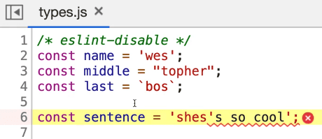
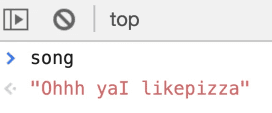
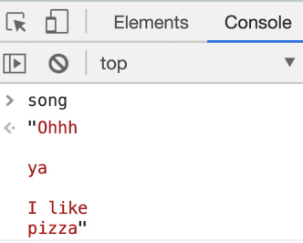
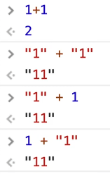
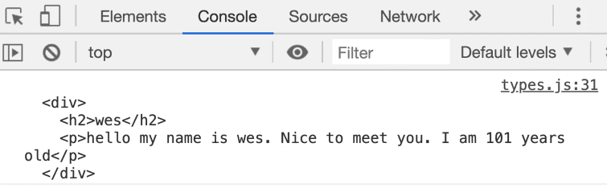
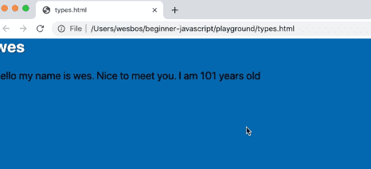

==============================================================================================================================

##### Module 1 - The Basics

-   <a href="../welcome/index.html" class="currentModule">WelcomePart 01</a>
    1.  <a href="../welcome/index.html#house-keeping" class="currentModule">House Keeping</a>
        -   <a href="../welcome/index.html#starter-files" class="currentModule">Starter Files</a>
        -   <a href="../welcome/index.html#how-to-do-the-course" class="currentModule">How to Do the Course</a>
-   <a href="../browser-editor-and-terminal-setup/index.html" class="currentModule">Browser,     4.  <a href="../code-quality-tooling-with-prettier-and-eslint/index.html#creating-the-packagejson-file" class="currentModule">Creating the package.json file</a>
    5.  <a href="../code-quality-tooling-with-prettier-and-eslint/index.html#configuring-eslint-and-prettier-with-vs-code" class="currentModule">Configuring ESLint and Prettier with VS Code</a>
-   <a href="../types-introduction/index.html" class="currentModule">Types - IntroductionPart 06</a>
-   <a href="index.html" class="currentModule currentPage currentSection">Types - StringsPart 07</a>
    1.  <a href="index.html#javascript-comments" class="currentModule currentPage">JavaScript Comments</a>
    2.  <a href="index.html#difference-between-single-quotes-double-quotes-and-backticks" class="currentModule currentPage">Difference between Single Quotes, Double Quotes and Backticks</a>
        -   <a href="index.html#putting-string-on-multiple-lines" class="currentModule currentPage">Putting String on Multiple Lines</a>
    3.  <a href="index.html#concatenation-and-interpolation" class="currentModule currentPage">Concatenation and Interpolation</a>
    4.  <a href="index.html#backticks" class="currentModule currentPage">Backticks</a>
-   <a href="../types-numbers/index.html" class="currentModule">Types - NumbersPart 08</a>
    1.  <a href="../types-numbers/index.html#numbers-in-javascript" class="currentModule">Numbers in JavaScript</a>
    2.  <a href="../types-numbers/index.html#helper-methods" class="currentModule">Helper Methods</a>
    3.  <a href="../types-numbers/index.html#modulo-and-power-operators" class="currentModule">Modulo and Power Operators</a>
    4.  <a href="../types-numbers/index.html#things-to-know-about-math-in-javascript" class="currentModule">Things to know about Math in JavaScript</a>
        -   <a href="../types-numbers/index.html#infinity-and-negative-infinity" class="currentModule">Infinity and Negative Infinity</a>
        -   <a href="../types-numbers/index.html#not-a-number" class="currentModule">Not a Number</a>
-   <a href="../types-objects/index.html" class="currentModule">Types - ObjectsPart 09</a>
-   <a href="../types-null-and-undefined/index.html" class="currentModule">Types - Null and UndefinedPart 10</a>
    1.  <a href="../types-null-and-undefined/index.html#undefined" class="currentModule">undefined</a>
    2.  <a href="../types-null-and-undefined/index.html#null" class="currentModule">null</a>
-   <a href="../types-booleans-and-equality/index.html" class="currentModule">Types - Booleans and EqualityPart 11</a>
    1.  <a href="../types-booleans-and-equality/index.html#equality-equal-sign-double-equal-sign-triple-equal-sign" class="currentModule">Equality (equal sign, double equal sign, triple equal sign)</a>

Types - Strings
=========================================

Enjoy these notes? Want to Slam Dunk JavaScript?

JavaScript, Types, StringsEdit Post

Create a new file called `types.html` and we will use our HTML base snippet.

Add the following code 👇

    <!DOCTYPE html>
    <html lang="en">
      <head>
        <meta charset="UTF-8" />
        <meta name="viewport" content="width=device-width,initial-scale=1.0" />
        <title></title>
        <link rel="stylesheet" href="../base.css" />
      </head>

      <body>
        
      </body>
    </html>

Create a new file `types.js`.

Add a console log such as `console.log('it works');` and save the file.

Once you have done that, open the `types.html` page in a browser and take a look at the console to test if you get a `"it works"` message.

Strings are used for holding text. There are three different ways to create strings in JavaScript:

1.  Single Quotes **'text'**
2.  Double Quotes **"text"**
3.  Backticks **\`text\`**

Add the following to your `types.js` file 👇

    const name = "wes";
    const middle = "topher";
    const last = `bos`;

When you save the file, you might notice that our double quotes were replaced with single quotes because of our ESLint rules.

We want to disable the ESLint change on file save, which you can do by adding a comment.

JavaScript Comments
-----------------------------------------------------------------------------------------------------------

This is a different kind of comment than this style `//comment` which Wes' has already showed us. The two forward slashes comments out the entire line. You can also put a double slash comment at the end of a line.

A `/*` comment will open up what is called a **block comment**. You can close the block comment anywhere you wish to close it *(it can be multiple lines or only a single line)*.

To disable ESLint for the file, we will use a block comment even though the comment only spans one line, because that is what ESLint is looking for.

On the *first* line of `type.js` add the following block comment 👇

    /* eslint-disable */

Next take the value of `'topher'` in the `middle` variable and put the double quotes back around `"topher"` and save the file.

The double quotes should remain because we have disable ESLint for the entire file. *(It is also possible to disable ESLint for just one line.)*

For Wes' Prettier settings, he usually sticks with single quotes or backticks. He has been considering switching to just using backticks entirely.

Difference between Single Quotes, Double Quotes and Backticks
----------------------------------------------------------------------------------------------------------------------------------------------------------------------------------------------

What is the difference between single quotes, double quotes and backticks?

Single quotes and double quotes are exactly the same thing.

The only reason that we have them both is because if you had a sentence like `const sentence = 'she's so cool';`, it would break your JavaScript because the JavaScript interprets the apostrophe as closing the string.

If you were to make that change, save the file and then refresh `type.html`, you will see an error that says

> Unexpected identifier

   

In that case, there are a few things we can do.

First, we can do something called **escaping**. Escaping in JavaScript allows you to tell JavaScript "No, I actually want this character, don't interpret it as JavaScript syntax, interpret it as text."

Escaping is done with a backslash.

For example, change that line of code to be `const sentence = 'she\'s so cool';` and refresh the page. This can get annoying. Another challenge is what if you actually want a back slash in your text? You would have to escape it like so 👇

    const sentence = 'she\'s so cool \\';

The other better option is to just use double quotes instead, so the apostrophe doesn't get interpreted as the end of the string.

Another bummer is sometimes you want to use both, for example let's say you wanted text that said 👇

    const sentence = "she's so "cool""

You would have to escape the double quotes like so 👇

    const sentence = "she's so \"cool\"";

The third option is using backticks. With backticks, you could simply do 👇

    const sentence = `she's so "cool"`;

The only downside to this approach is if you needed a backtick in your string, you would need to escape it like so 👇

    const sentence = "shes's so \"cool\"";
    const sentence2 = `she\`s's so "cool"`;

That is one of the benefits to using backticks.

### Putting String on Multiple Lines

The next thing is putting strings on multiple lines.

Let's say you wanted to add the following song as multiple lines of text 👇

    const song = 'Ohhh

    ya

    I like

    pizza';

You can see that the editor is complaining about the string not being closed properly. How do you do multi-line strings?

If you want to, you have to put a forward slash at the end of every single line, and that will allow you to put a string on multiple lines.

    const song = 'Ohhh\
    \
    ya\
    \
    I like\
    \
    pizza';

   

The benefit to using backticks is you can have multi-line strings and they maintain the line breaks inside of them.

    const song = `Ohhh

    ya

    I like
    pizza`;

   

Sometimes the console will return the value like `"Ohhh↵↵ya↵↵I like↵pizza"`. Those arrows indicate a new line.

Backticks will be extremely helpful when we want to write HTML code in our JavaScript variables.

For example, using backticks allows you to do something like this 👇

    const html = `
      

        <h2></h2>
      

    `;

Concatenation and Interpolation
-----------------------------------------------------------------------------------------------------------------------------------

Before backticks were introduced, the only thing you could use to achieve that is **concatenation**.

Another benefit of backticks is interpolation and concatenation. Let's define those.

-   **Concatenation** *is when two or more strings are combined into one*.
-   **Interpolation** *is when you put a variable inside of a string.*

In `types.js` add 👇

    const hello = "hello my name is. Nice to meet you";

Let's say we wanted to add our name to the end of the "hello my name is." sentence.

Previously, with single and double quotes, what you have to do is close the quote, put a plus symbol *(which is concatenation)*, and then you put your variable, and then another plus like so 👇

    const hello = "hello my name is" + name + ". Nice to meet you.";

That is one way of interpolation (using concatenation). *You could do the same thing with single quotes, like mentioned previously, there is no difference between the two types of quotes.*

Here is yet another way to do this 👇

    let hello2 = "hello my name is ";
    hello2 = hello2 + name;
    hello2 = hello2 + " Nice to meet you";

That is just annoying, because we are just overwriting the variable each time *(we are overwriting it with the value of the variable, plus an addition of more characters).*

Both approaches to interpolation are not the greatest.

The `+` sign does two things in JavaScript.

If you use it with a string, it is used for concatenation. But it is also used to add numbers like so 👇

    1 + 1 = 2;

But if you do `"1" + "1"`, it will evaluate to `"11"`.

If you do `"1"` + `1`, it will also evaluate to `"11"`.

   

That is ripe for bugs, so that is where backticks come in with a much nicer solution.

Backticks
---------------------------------------------------------------------------------------

With backticks, you can interpolate the string like so 👇

    const name = 'Wes';
    const hello = `hello my name is ${name}. Nice to meet you`;

The `${}` syntax can only ever be used in backticks. It is the easiest way to pop a variable into a string.

Almost anything can go between the curly brackets `{}` in that syntax. For example, you can do math. 👇

    const hello = `hello my name is ${name}. Nice to meet you. I am ${1 + 100} years old';

JavaScript will run whatever is inside of the curly brackets in that syntax (whether it is a variable or an actual statement) and it will return the value that's inside of it.

To reiterate: you can do multiple lines with **backticks**, **variable interpolation**, and then there is something a little more advanced that is called a **tagged template literal**, but we are not going to get into that because we haven't got into functions just yet.

Finally, this will be very helpful for creating HTML in our JavaScript code.

We can do something like:

    const html = `
      

        <h2>${name}</h2>
        
${hello}

      

    `;

Now we have all of this html that we have made, and if you add a `console.log(html);` and reload `types.html`, you will see 👇

   

We can actually do something like this with the html we just created *(we will discuss what this code does in future videos)*.

Add the following code below the html variable:

    document.body.innerHTML = html;

When you refresh `types.html` you should see something like the following in your browser 👇

   

We have just made some HTML! If you inspect the html using the browser dev tools, you will see it's regular html.

Find an issue with this post? Think you could clarify, update or add something?

All my posts are available to edit on Github. Any fix, little or small, is appreciated!

[Edit on Github](https://github.com/wesbos/wesbos/tree/master/src/javascript/01-the-basics/07-types-strings/07-types-strings.mdx)

[**← Prev**](../types-introduction/index.html)

Types - Introduction

[**Next →**](../types-numbers/index.html)

Types - Numbers

### Syntax Podcast

Hold on — I'm grabbin' the last one.

