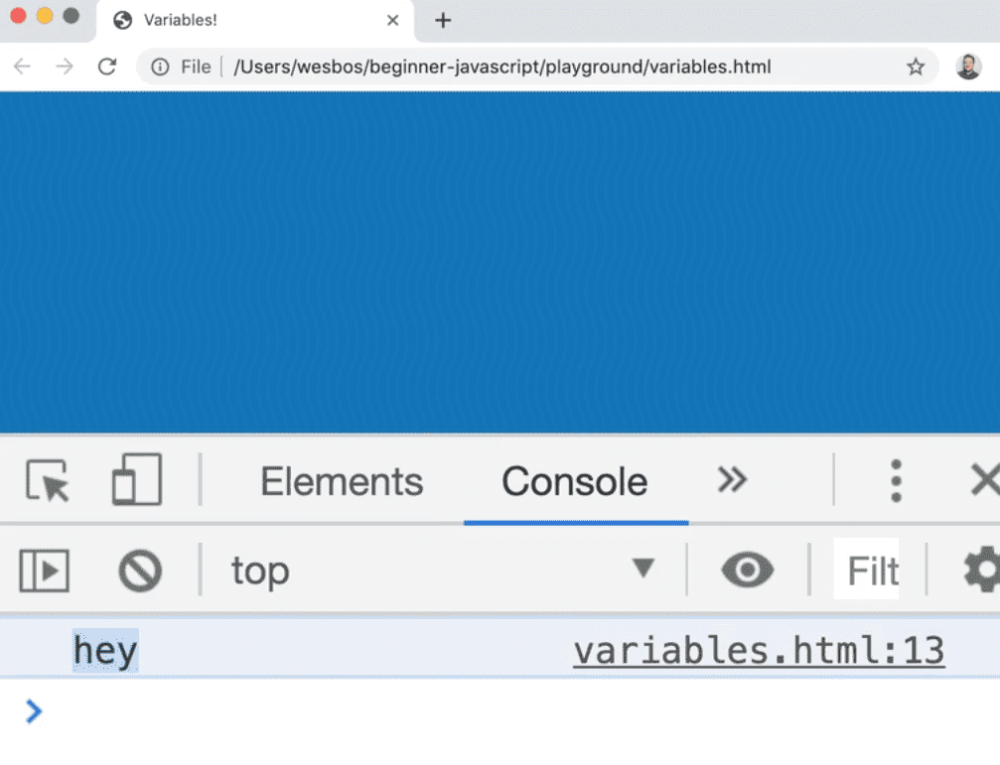
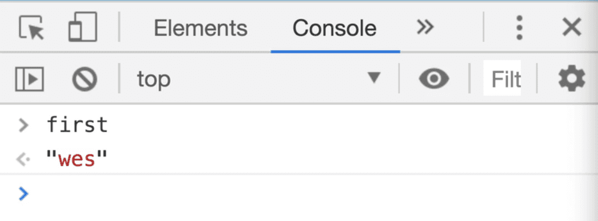
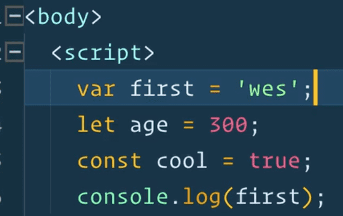
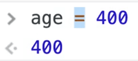
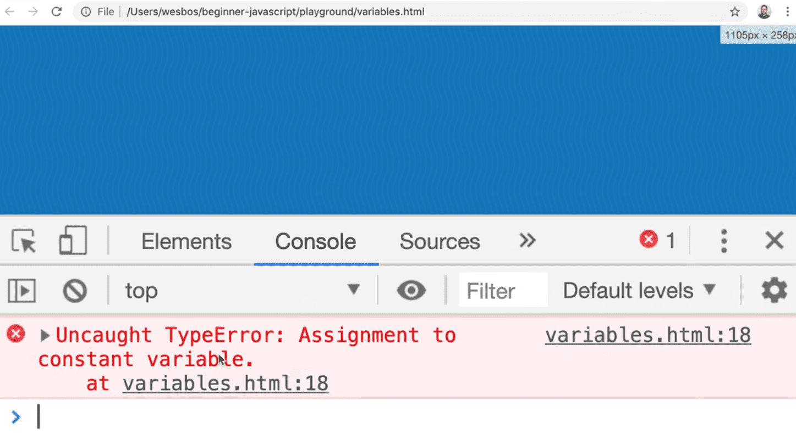
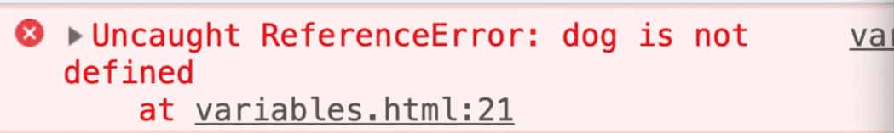
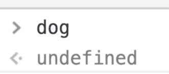

==============================================================================================================================

##### Module 1 - The Basics

-   <a href="../welcome/index.html" class="currentModule">WelcomePart 01</a>
    1.  <a href="../welcome/index.html#house-keeping" class="currentModule">House Keeping</a>
        -   <a href="../welcome/index.html#starter-files" class="currentModule">Starter Files</a>
        -   <a href="../welcome/index.html#how-to-do-the-course" class="currentModule">How to Do the Course</a>
-   <a href="../browser-editor-and-terminal-setup/index.html" class="currentModule">Browser, Editor and Terminal SetupPart 02</a>
    1.  <a href="../browser-editor-and-terminal-setup/index.html#the-browser" class="currentModule">The browser</a>
        -   <a href="../browser-editor-and-terminal-setup/index.html#shortcuts" class="currentModule">Shortcuts</a>
    2.  <a href="../browser-editor-and-terminal-setup/index.html#nodejs" class="currentModule">Node.js</a>
        -   <a href="../browser-editor-and-terminal-setup/index.html#checking-if-nodejs-is-installed" class="currentModule">Checking if Node.js is installed</a>
        -   <a href="../browser-editor-and-terminal-setup/index.html#which-terminal-to-use" class="currentModule">Which Terminal to Use</a>
        -   <a href="../browser-editor-and-terminal-setup/index.html#checking-if-you-have-npm-installed" class="currentModule">Checking if you have npm installed</a>
    3.  <a href="../browser-editor-and-terminal-setup/index.html#command-line-basics" class="currentModule">Command Line Basics</a>
    4.  <a href="../browser-editor-and-terminal-setup/index.html#check-that-nodejs-is-working" class="currentModule">Check that Node.js is working</a>
    5.  <a href="../browser-editor-and-terminal-setup/index.html#code-editor" class="currentModule">Code Editor</a>
-   <a href="../running-and-loading-js/index.html" class="currentModule">Running and Loading JavaScriptPart 03</a>
    1.  <a href="../running-and-loading-js/index.html#run-scripts-before-closing-body-tag" class="currentModule">Run scripts before closing body tag</a>
    2.  <a href="../running-and-loading-js/index.html#external-javascript-files" class="currentModule">External JavaScript Files</a>
    3.  <a href="../running-and-loading-js/index.html#running-it-in-nodejs" class="currentModule">Running it in Node.js</a>
-   <a href="index.html" class="currentModule currentPage currentSection">Variables and StatementsPart 04</a>
    1.  <a href="index.html#var" class="currentModule currentPage">var</a>
    2.  <a href="index.html#let" class="currentModule currentPage">let</a>
    3.  <a href="index.html#const" class="currentModule currentPage">const</a>
    4.  <a href="index.html#statements-and-semi-colons-in-javascript" class="currentModule currentPage">Statements and Semi-Colons in JavaScript</a>
    5.  <a href="index.html#code-blocks" class="currentModule currentPage">Code Blocks</a>
    6.  <a href="index.html#differences-between-var-let--const" class="currentModule currentPage">Differences between var, let &amp; const</a>
        -   <a href="index.html#strict-mode" class="currentModule currentPage">Strict Mode</a>
        -   <a href="index.html#scoping" class="currentModule currentPage">Scoping</a>
    7.  <a href="index.html#naming-conventions" class="currentModule currentPage">Naming Conventions</a>
        -   <a href="index.html#camel-casing" class="currentModule currentPage">Camel Casing</a>
        -   <a href="index.html#snake-case" class="currentModule currentPage">Snake Case</a>
        -   <a href="index.html#kebab-case---not-allowed" class="currentModule currentPage">Kebab Case - Not Allowed</a>
-   <a href="../code-quality-tooling-with-prettier-and-eslint/index.html" class="currentModule">Code Quality Tooling with Prettier and ESLintPart 05</a>
    1.  <a href="../code-quality-tooling-with-prettier-and-eslint/index.html#eslint--prettier" class="currentModule">ESLint &amp; Prettier</a>
        -   <a href="../code-quality-tooling-with-prettier-and-eslint/index.html#eslint" class="currentModule">ESLint</a>
        -   <a href="../code-quality-tooling-with-prettier-and-eslint/index.html#prettier" class="currentModule">Prettier</a>
    2.  <a href="../code-quality-tooling-with-prettier-and-eslint/index.html#installing-eslint--prettier" class="currentModule">Installing ESLint &amp; Prettier</a>
    3.  <a href="../code-quality-tooling-with-prettier-and-eslint/index.html#installing-npm-packages-locally" class="currentModule">Installing npm packages locally</a>
    3.  <a href="../types-strings/index.html#concatenation-and-interpolation" class="currentModule">Concatenation and Interpolation</a>
    4.  <a href="../types-strings/index.html#backticks" class="currentModule">Backticks</a>
-   <a href="../types-numbers/index.html" class="currentModule">Types - NumbersPart 08</a>
    1.  <a href="../types-numbers/index.html#numbers-in-javascript" class="currentModule">Numbers in JavaScript</a>
    2.  <a href="../types-numbers/index.html#helper-methods" class="currentModule">Helper Methods</a>
    3.  <a href="../types-numbers/index.html#modulo-and-power-operators" class="currentModule">Modulo and Power Operators</a>
    4.  <a href="../types-numbers/index.html#things-to-know-about-math-in-javascript" class="currentModule">Things to know about Math in JavaScript</a>
        -   <a href="../types-numbers/index.html#infinity-and-negative-infinity" class="currentModule">Infinity and Negative Infinity</a>
        -   <a href="../types-numbers/index.html#not-a-number" class="currentModule">Not a Number</a>
-   <a href="../types-objects/index.html" class="currentModule">Types - ObjectsPart 09</a>
-   <a href="../types-null-and-undefined/index.html" class="currentModule">Types - Null and UndefinedPart 10</a>
    1.  <a href="../types-null-and-undefined/index.html#undefined" class="currentModule">undefined</a>
    2.  <a href="../types-null-and-undefined/index.html#null" class="currentModule">null</a>
-   <a href="../types-booleans-and-equality/index.html" class="currentModule">Types - Booleans and EqualityPart 11</a>
    1.  <a href="../types-booleans-and-equality/index.html#equality-equal-sign-double-equal-sign-triple-equal-sign" class="currentModule">Equality (equal sign, double equal sign, triple equal sign)</a>

Variables and Statements
==================================================

Enjoy these notes? Want to Slam Dunk JavaScript?

JavaScript, VariablesEdit Post

This video is going to teach you an introduction to variables.

Variables are a building block of JavaScript, and you can't use JavaScript without knowing variables.

We will cover what they are, what the different types of them are, what declaration means as well as what a statement is in JavaScript.

Go into the `/playground` folder and make a new file `variables.html`.

Use the [HTML base snippet](https://github.com/wesbos/beginner-javascript/tree/master/snippets) and add a script tag within the body.

To make sure everything is working, add a `console.log('hey');` within the script tag. Wes will explain the use of the semi colon shortly.

If you open up the `variables.html` file in the browser, you should see 'hey' in the console.

   

There are three different ways to make a variable, which in JavaScript we refer to as declaring a variable. They are:

1.  var
2.  let
3.  const

var
---------------------------------------------------------------------------

Let's start with `var`.

To make a variable you type `var` and then you make a name of the variable. You can use almost anything for a variable name *(we will discuss the restrictions shortly).*

    var first = "wes";

What we have done there is created a new variable called `first` and we set it to a string of `"wes"` *(we will discuss what a string is in a second).*

Now, if you refresh the `variables.html` page, and type into the console `first`, you will see that we actually get the value that is inside of that variable.

   

You can also do it by doing adding a `console.log()` statement like so:

    <body>
      
    </body>

let
---------------------------------------------------------------------------

The second way to declare a variable is with `let`.

Below the declaration of the variable `first`, add 👇

    let age = 300;

If you refresh the `variables.html` page, and type in `age`, you will see 300 returned in the console.

const
-------------------------------------------------------------------------------

The third way is with `const`. Below the `age` variable, add the following: 👇

    const cool = true;

That is what is called a constant variable.

The naming of these things aren't great. Const means constant, but it's still called a variable.

`var`, `let`, `const` are all different types of variables, and there are different ways to declare the variables and we will talk about the pros and cons to all of them in just a second.

Statements and Semi-Colons in JavaScript
-----------------------------------------------------------------------------------------------------------------------------------------------------

Before we do that, let's discuss the *semi-colon* Wes is adding after each JavaScript line.

   

Semi-colons are used to terminate the line of code in JavaScript. Below is an example of what is referred to as a **statement** in JavaScript.

    var first = "wes";

A **statement** is an instruction to the computer, browser, the JavaScript interpreter to do something.

This can usually be summarized as a variable that was declared, a variable that was updated, a function that was called, or something was logged to the console.

Anytime you want to do something in JavaScript, that is referred to as a statement.

When you are done writing your statement, you add a semi-colon to the end of the line.

    var first = "wes"; // variable declaration statement
    let age = 300;
    const cool = true;
    console.log(first); // function call statement

Code Blocks
-------------------------------------------------------------------------------------------

One thing that we will run into in JavaScript is something called a code block.

For example, add the following line of code to `variables.html` and refresh the page.

    if (age > 10) {
      console.log("you are old");
    }

You should see the message "you are old" in the console.

The question is how come we *didn't* put the semi-colons after each line like this 👇

    if (age > 10) {;
      console.log("you are old");
    };

That is because it's something that is referred to as a code block.

Code blocks are things that are bound by these curly brackets `{` and `}`.

Things like function definitions, if statements, loops do not need a semi-colon at the end because you aren't telling the computer to do something. In those instances, you are just running some code and telling the computer to do something inside of the block.

Throughout the course Wes will continue to mention why we do and do not use the semi-colon so you can get the hang of it.

It is possible to get away *without* writing semi-colons in JavaScript because there is something in JavaScript called *ASI*, which is **automatic semi-colon insertion**, but we are not going to cover that because it's a much more advanced topic.

Differences between var, let & const
-------------------------------------------------------------------------------------------------------------------------------------------

Let's talk about the difference between the three types of variables.

Remove all the extra JavaScript code within `variables.html` except for:

    

*The values of the `var` and `let` variables can be updated.*

If you ever wanted to change what the value is of one of those variables, you can simply just change it.

For example, if you add the following line of JavaScript, refresh `variables.html` in the browser and type `first` in the console, you should see the value *'westerhoff'* returned.

    first = 'westerhoff';

The same can be done with the `age` variable.

For example type in the console `age = 400`. That updates the value of the `age` variable.

   

You can either run the JavaScript from the `variables.html` page, or you can run it from the console. Because the variables in `variables.html` are **global variables** *(which we will cover in a future video)*, we can modify them either in the script tag within `variables.html` or directly from the console.

Notice that we do not have to redeclare the variable. We did *not* have to do something like this:

    var first = "wes";
    let age = 300;
    const cool = true;

    var first = "westernhoff";

That is actually a bad practice and in most cases, won't even work.

You only need to declare the variable with `var`, `let`, or `const`, and then whenever you want to update the value, you don't need to put the variable keyword in front of it, you can just go ahead and set it to it's new value.

You **cannot** set a `const` variable to be something else *(there are instances where you can change a const variable, that will be handled later)*. If you were to go `cool = false`, you will see the following error: 👇

   

Errors in JavaScript will tell you what went wrong and where it went wrong. Here it says 👇

> Uncaught TypeError: Assignment to constant variable on Line 18.

That error is describing exactly what we did, which was that we tried to change a boolean value that was set to a `constant` variable.

Constant variables cannot be changed, so think of them like an API key or something that you never want changed. You set those to a constant, and the value of that variable can never be changed.

It is not completely true that it can never be changed, which we will follow up on when we get to arrays and objects *(meaning that there is a difference between the array or object that it is bound to and the values that live inside of it).*

What we need to know right now is just that `var` and `let` variables can be changed or updated, and `const` variables cannot.

### Strict Mode

The next thing you need to know about variables is this thing called **Strict Mode**.

*🔥 Tip: While in your code editor, you can select a block of text and on your keyboard press Command + / (Ctrl + /, Windows and Linux) to comment out your code. Commenting out code makes your browser skip that code. It'll still be there, but the browser will not run it.*

If you put this code in the script tag, refresh `variables.html` and write `dog` in the console, the console will return the value of `"snickers"`.

    

We made a variable even though we did not use `var`, `let`, or `const`.

What is going on? How can that happen?

Now if we go to the top of our opening script tag, and add `"use strict";` and then refresh the page, we will see this error:

> dog is not defined

   

In the early days of JavaScript, it was possible to create a variable without first declaring it, and the browser would just add the `var` on behalf of the user.

That leads to bad code down the road, it's pretty sloppy and it's not something that you want to do. So what happened?

JavaScript still supports the old method of not declaring a variable because it has to be backwards compatible with early JavaScript code.

But they introduced a new mode into browsers named **strict mode**, which will throw an error if you try to do something like not declaring a variable properly.

    dog = "hugo"; // will throw an error in strict mode

Another thing you can do is to declare a variable and then update it on the next line like so 👇

    var dog;
    dog = "snickers";

That will work because what happens here is if you comment out the second line so it's just `var dog`; and refresh `variables.html`, when you type `dog` into the console you will have the value of `"undefined"` returned to you.

   

Strict mode is useful but we won't be typing it every time in this course because we are going to be following best practices and it is enforced by default when you are using **ECMAScript Modules**, and modules are probably how you are going to be writing all of your modern JavaScript.

### Scoping

Now let's talk about the second difference between `var`, `let`, and `const`, which is scoping.

Clear your JavaScript code until it's back to the three variables we had at the beginning.

    var first = "wes";
    let age = 300;
    const cool = true;

Scoping in JavaScript answers the question *"Where are my variables available to me?"*

We are going to have an entire section of this course focused on scoping because it's such a fundamental part of JavaScript, but for now we need to know that:

-   `var` variables are scoped differently than `let` and `const` variables.
-   `var` variables are what we refer to as **function scoped variables** *(they are only available within the parent function).*
-   `let` and `const` variables are what we refer to as **block scoped variables**.

What does this mean?!

We are going to learn what blocks and functions are in the future. Since we haven't covered that yet, just put that on pause temporarily until the functions and blocks video. We will continue on in the functions and block video about this.

The question is, what are we going to be using in this course?

They are all valid.

`let` and `const` were introduced as part of what is called `es6`, which is only a couple of years old. `var` has been around since JavaScript was invented.

You may sometimes see people say `var` variables are old or deprecated, but they are not.

It's just that some developers (Wes included) prefer to use `let` and `const` because the block scoping makes more sense as well the benefit of assigning a constant value to these variables and not accidentally overwriting a variable which can lead to bugs.

Here is how Wes approaches deciding which of the three to use:

-   *He uses `const` by default.* Anytime he is assigning a new variable, he just defaults it to `const` because he doesn't know if he'll need to update that value or not.
-   *If he needs to change a value of a variable, he will use a `let`.* Sometimes he will make a variable `const` and then realize he needs to update it so he will make it a `let` variable.
-   *Wes almost never uses a var variable.* There are some exceptions like when declaring a variable outside of a block but we will go into more detail about that shortly.

Naming Conventions
---------------------------------------------------------------------------------------------------------

Last thing we need to talk about is **naming conventions**.

What can you call your variables?

As a convention, variables should *not* start with a capital.

For example, this code below will work in the browser. It is not wrong or broken JavaScript, but it's a convention that variables should not start with a capital unless they are a class *(we will get into what classes are in the future)*.

    const Dog = "bowser";

-   Variables must start with either a letter *(a,b,c,D,X, etc)*.
-   They can also start with or contain an underscore `_` or dollar sign `$`.
-   They can also contain but may not start with a number.

For example you could create the variable below and it would work. A variable like `$_$` would also work.

    const $$$$$$$$ = 100;

`$` and `_` are the only non a-Z characters that can be used at the start of a variable name.

Tip: the `_` symbol is sort of synonymous with a library called `lodash`, and the `$` symbol is sort of synonymous with a library called `jQuery` so you don't normally make your variables called `$` or `_` because they have sort of been taken as a convention. You can however certainly include them if you want.

### Camel Casing

Sometimes a variable is made up of two words, for example 👇

    const iLovePizza;

This is referred to as **camel case**. With camel case, every word inside of your variable will contain an uppercase letter except for the first one, for the reasons we just talked about.

Upper camel case is where you do start it with a capital *(ILovePizza)*, however that is almost never used in JavaScript unless you are defining a class.

### Snake Case

There is also something called **snake case**.

Instead of using capitals between words, you use *underscores*. For example `const this_is_snake_case = 'cool';`.

    // camel case
    const iLovePizza = true;
    // UpperCamelCase
    const ILoveToEatHotDogs = false;
    // snake case
    const this_is_snake_case = "cool";

### Kebab Case - Not Allowed

There is also something called **kebab case**, for example `const this-is-kebab-case;` but this is not allowed in JavaScript.

Most developers will always use camel case, UpperCamelCase if you are building a class, some people like using underscores and kebab case is not allowed.

Find an issue with this post? Think you could clarify, update or add something?

All my posts are available to edit on Github. Any fix, little or small, is appreciated!

[Edit on Github](https://github.com/wesbos/wesbos/tree/master/src/javascript/01-the-basics/04-variables-and-statements/04-variables-and-statements.mdx)

[**← Prev**](../running-and-loading-js/index.html)

Running and Loading JavaScript

[**Next →**](../code-quality-tooling-with-prettier-and-eslint/index.html)

Code Quality Tooling with Prettier and ESLint

### Syntax Podcast

Hold on — I'm grabbin' the last one.

