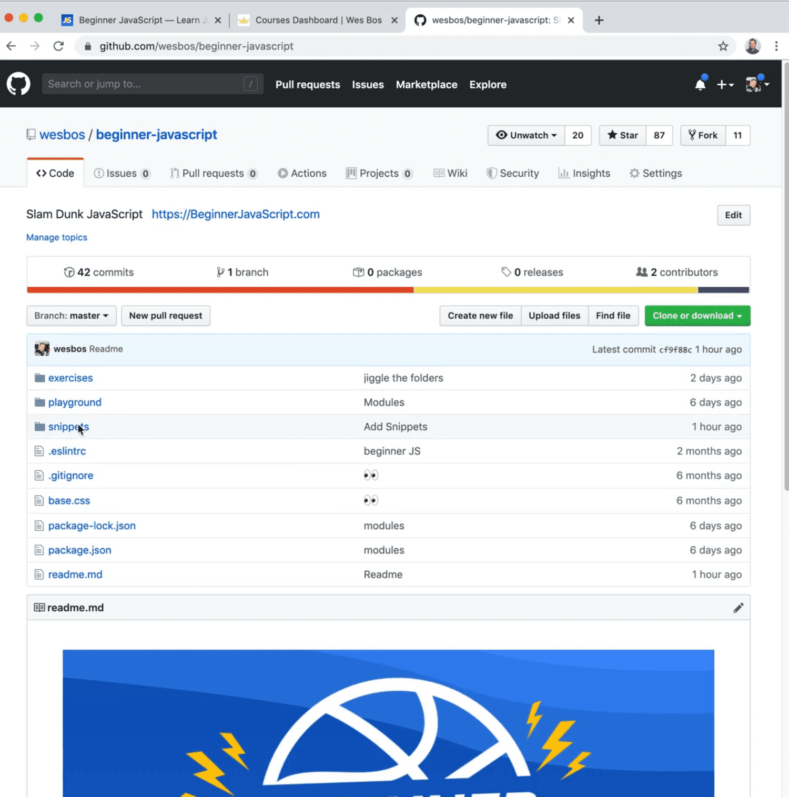

==============================================================================================================================

##### Module 1 - The Basics

-   <a href="index.html" class="currentModule currentPage currentSection">WelcomePart 01</a>
    1.  <a href="index.html#house-keeping" class="currentModule currentPage">House Keeping</a>
        -   <a href="index.html#starter-files" class="currentModule currentPage">Starter Files</a>
        -   <a href="index.html#how-to-do-the-course" class="currentModule currentPage">How to Do the Course</a>
-   <a href="../browser-editor-and-terminal-setup/index.html" class="currentModule">Browser,     3.  <a href="../types-strings/index.html#concatenation-and-interpolation" class="currentModule">Concatenation and Interpolation</a>
    4.  <a href="../types-strings/index.html#backticks" class="currentModule">Backticks</a>
-   <a href="../types-numbers/index.html" class="currentModule">Types - NumbersPart 08</a>
    1.  <a href="../types-numbers/index.html#numbers-in-javascript" class="currentModule">Numbers in JavaScript</a>
    2.  <a href="../types-numbers/index.html#helper-methods" class="currentModule">Helper Methods</a>
    3.  <a href="../types-numbers/index.html#modulo-and-power-operators" class="currentModule">Modulo and Power Operators</a>
    4.  <a href="../types-numbers/index.html#things-to-know-about-math-in-javascript" class="currentModule">Things to know about Math in JavaScript</a>
        -   <a href="../types-numbers/index.html#infinity-and-negative-infinity" class="currentModule">Infinity and Negative Infinity</a>
        -   <a href="../types-numbers/index.html#not-a-number" class="currentModule">Not a Number</a>
-   <a href="../types-objects/index.html" class="currentModule">Types - ObjectsPart 09</a>
-   <a href="../types-null-and-undefined/index.html" class="currentModule">Types - Null and UndefinedPart 10</a>
    1.  <a href="../types-null-and-undefined/index.html#undefined" class="currentModule">undefined</a>
    2.  <a href="../types-null-and-undefined/index.html#null" class="currentModule">null</a>
-   <a href="../types-booleans-and-equality/index.html" class="currentModule">Types - Booleans and EqualityPart 11</a>
    1.  <a href="../types-booleans-and-equality/index.html#equality-equal-sign-double-equal-sign-triple-equal-sign" class="currentModule">Equality (equal sign, double equal sign, triple equal sign)</a>

Welcome
=================================

Enjoy these notes? Want to Slam Dunk JavaScript?

JavaScriptEdit Post

This course is all the stuff Wes wishes he had known over the last 10 years of him doing JavaScript. It is a big course but it does a good job of distilling the information down into the things you need to know, and making it easy and fun!

House Keeping
-----------------------------------------------------------------------------------------------

This video is for housekeeping items that need to be addressed before we can get into writing code.

### Starter Files

First one is the starter files for this course can be found at <http://courses.wesbos.com/>. Click through to `My Account` and there will be a link to the starter files.

The starter files link will bring you over to Github which has all of the starter files as well as all of the solutions for this course.

Please star the [Beginner JavaScript Github repo](https://github.com/wesbos/beginner-javascript/) to help Wes up!

#### Slack Channel

If you are also taking the [video version of this course](https://beginnerjavascript.com/). On the course platform there is also a link to the Slack channel, where you can jump in and get help, maybe join up with a buddy and do a course together with someone.

#### Structure of Starter files

There are 3 folders in the `Beginner-JavaScript` repo.

1.  snippets
2.  exercises
3.  playground

   

The `snippets` folder that has some base HTML snippets in there with instructions on how to get them into your HTML editor (we will talk about the editor in the next video).

There is also a `/playground` folder, which has some HTML files Wes uses to explain concepts throughout the course. He will often provide a `-FINISHED.html` file, which will include what Wes has written in the video, whereas the starter file itself, Wes will either ask you to create it yourself or he will provide an empty state.

The `/exercises` folder contains all the proper, full blown exercises that we will be doing throughout the course.

*Note: Sometimes the numbers of the exercise folders are going to be a little off from the video number is, so just make sure to line up the file with the name of the video, not necessarily the number.*

### How to Do the Course

Another thing is how should you do this course? Should you watch it, should you code, should you code while you watch?

About half the people prefer to watch it and then do it after, and the other half prefer to do it as they watch.

Try both methods and see what best works for you! You'll fall into whatever feels best for you pretty quickly.

Last thing is grab a buddy if you can.

Jump into the Slack chatroom and see if there is anyone willing to do it with you, you can team up, or team up with someone in person. It's always better if there is someone to hold you accountable.

It's a long course, 28 hours long, you can jump around.

If you understand certain concepts, such as what functions or parameters are, feel free to skip those videos.

The whole idea is that it is reference-able.

We are not building a huge app here that be build on in every video, instead, every video pretty much stands on it's own and if we reference something from a previous video, Wes will mention it.

Find an issue with this post? Think you could clarify, update or add something?

All my posts are available to edit on Github. Any fix, little or small, is appreciated!

[Edit on Github](https://github.com/wesbos/wesbos/tree/master/src/javascript/01-the-basics/01-welcome/01-welcome.mdx)

[**Next →**](../browser-editor-and-terminal-setup/index.html)

Browser, Editor and Terminal Setup

### Syntax Podcast

Hold on — I'm grabbin' the last one.

