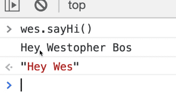

==============================================================================================================================

##### Module 1 - The Basics

-   [WelcomePart 01](../../01-the-basics/welcome/index.html)
    1.  [House Keeping](../../01-the-basics/welcome/index.html#house-keeping)
        -   [Starter Files](../../01-the-basics/welcome/index.html#starter-files)
        -   [How to Do the Course](../../01-the-basics/welcome/index.html#how-to-do-the-course)
-   [Browser, Editor and Terminal SetupPart 02](../../01-the-basics/browser-editor-and-terminal-setup/index.html)
    1.  [The browser](../../01-the-basics/browser-editor-and-terminal-setup/index.html#the-browser)
        -   [Shortcuts](../../01-the-basics/browser-editor-and-terminal-setup/index.html#shortcuts)
    2.  [Node.js](../../01-the-basics/browser-editor-and-terminal-setup/index.html#nodejs)
        -   [Checking if Node.js is installed](../../01-the-basics/browser-editor-and-terminal-setup/index.html#checking-if-nodejs-is-installed)
        -   [Which Terminal to Use](../../01-the-basics/browser-editor-and-terminal-setup/index.html#which-terminal-to-use)
        -   [Checking if you have npm installed](../../01-the-basics/browser-editor-and-terminal-setup/index.html#checking-if-you-have-npm-installed)
    3.  [Command Line Basics](../../01-the-basics/browser-editor-and-terminal-setup/index.html#command-line-basics)
    4.  [Check that Node.js is working](../../01-the-basics/browser-editor-and-terminal-setup/index.html#check-that-nodejs-is-working)
    5.  [Code Editor](../../01-the-basics/browser-editor-and-terminal-setup/index.html#code-editor)
-   [Running and Loading JavaScriptPart 03](../../01-the-basics/running-and-loading-js/index.html)
    1.  [Run scripts before closing body tag](../../01-the-basics/running-and-loading-js/index.html#run-scripts-before-closing-body-tag)
    2.  [External JavaScript Files](../../01-the-basics/running-and-loading-js/index.html#external-javascript-files)
    3.  [Running it in Node.js](../../01-the-basics/running-and-loading-js/index.html#running-it-in-nodejs)
-   [Variables and StatementsPart 04](../../01-the-basics/variables-and-statements/index.html)
    1.  [var](../../01-the-basics/variables-and-statements/index.html#var)
    2.  [let](../../01-the-basics/variables-and-statements/index.html#let)
    3.  [const](../../01-the-basics/variables-and-statements/index.html#const)
    4.  [Statements and Semi-Colons in JavaScript](../../01-the-basics/variables-and-statements/index.html#statements-and-semi-colons-in-javascript)
    5.  [Code Blocks](../../01-the-basics/variables-and-statements/index.html#code-blocks)
    6.  [Differences between var, let & const](../../01-the-basics/variables-and-statements/index.html#differences-between-var-let--const)
        -   [Strict Mode](../../01-the-basics/variables-and-statements/index.html#strict-mode)
        -   [Scoping](../../01-the-basics/variables-and-statements/index.html#scoping)
    7.  [Naming Conventions](../../01-the-basics/variables-and-statements/index.html#naming-conventions)
        -   [Camel Casing](../../01-the-basics/variables-and-statements/index.html#camel-casing)
        -   [Snake Case](../../01-the-basics/variables-and-statements/index.html#snake-case)
        -   [Kebab Case - Not Allowed](../../01-the-basics/variables-and-statements/index.html#kebab-case---not-allowed)
-   [Code Quality Tooling with Prettier and ESLintPart 05](../../01-the-basics/code-quality-tooling-with-prettier-and-eslint/index.html)
    1.  [ESLint & Prettier](../../01-the-basics/code-quality-tooling-with-prettier-and-eslint/index.html#eslint--prettier)
        -   [ESLint](../../01-the-basics/code-quality-tooling-with-prettier-and-eslint/index.html#eslint)
        -   [Prettier](../../01-the-basics/code-quality-tooling-with-prettier-and-eslint/index.html#prettier)
    2.  [Installing ESLint & Prettier](../../01-the-basics/code-quality-tooling-with-prettier-and-eslint/index.html#installing-eslint--prettier)
    3.  [Installing npm packages locally](../../01-the-basics/code-quality-tooling-with-prettier-and-eslint/index.html#installing-npm-packages-locally)
    4.  [Creating the package.json file](../../01-the-basics/code-quality-tooling-with-prettier-and-eslint/index.html#creating-the-packagejson-file)
    5.  [Configuring ESLint and Prettier with VS Code](../../01-the-basics/code-quality-tooling-with-prettier-and-eslint/index.html#configuring-eslint-and-prettier-with-vs-code)
-   [Types - IntroductionPart 06](../../01-the-basics/types-introduction/index.html)
-   [Types - StringsPart 07](../../01-the-basics/types-strings/index.html)
    1.  [JavaScript Comments](../../01-the-basics/types-strings/index.html#javascript-comments)
    2.  [Difference between Single Quotes, Double Quotes and Backticks](../../01-the-basics/types-strings/index.html#difference-between-single-quotes-double-quotes-and-backticks)
        -   [Putting String on Multiple Lines](../../01-the-basics/types-strings/index.html#putting-string-on-multiple-lines)
    3.  [Concatenation and Interpolation](../../01-the-basics/types-strings/index.html#concatenation-and-interpolation)
    4.  [Backticks](../../01-the-basics/types-strings/index.html#backticks)
-   [Types - NumbersPart 08](../../01-the-basics/types-numbers/index.html)
    1.  [Numbers in JavaScript](../../01-the-basics/types-numbers/index.html#numbers-in-javascript)
    2.  [Helper Methods](../../01-the-basics/types-numbers/index.html#helper-methods)
    3.  [Modulo and Power Operators](../../01-the-basics/types-numbers/index.html#modulo-and-power-operators)
    4.  [Things to know about Math in JavaScript](../../01-the-basics/types-numbers/index.html#things-to-know-about-math-in-javascript)
        -   [Infinity and Negative Infinity](../../01-the-basics/types-numbers/index.html#infinity-and-negative-infinity)
        -   [Not a Number](../../01-the-basics/types-numbers/index.html#not-a-number)
-   [Types - ObjectsPart 09](../../01-the-basics/types-objects/index.html)
-   [Types - Null and UndefinedPart 10](../../01-the-basics/types-null-and-undefined/index.html)
    1.  [undefined](../../01-the-basics/types-null-and-undefined/index.html#undefined)
    2.  [null](../../01-the-basics/types-null-and-undefined/index.html#null)
-   [Types - Booleans and EqualityPart 11](../../01-the-basics/types-booleans-and-equality/index.html)
    1.  [Equality (equal sign, double equal sign, triple equal sign)](../../01-the-basics/types-booleans-and-equality/index.html#equality-equal-sign-double-equal-sign-triple-equal-sign)

##### Module 2 - Functions

-   <a href="../functions-built-in/index.html" class="currentModule">Functions - Built-inPart 12</a>
    1.  <a href="../functions-built-in/index.html#built-in-functions" class="currentModule">Built-in Functions</a>
        -   <a href="../functions-built-in/index.html#example-1-" class="currentModule">Example #1 👇</a>
        -   <a href="../functions-built-in/index.html#example-2-" class="currentModule">Example #2 👇</a>
-   <a href="../functions-custom/index.html" class="currentModule">Functions - CustomPart 13</a>
    1.  <a href="../functions-custom/index.html#defining-a-function" class="currentModule">Defining a Function</a>
    2.  <a href="../functions-custom/index.html#returning-values" class="currentModule">Returning Values</a>
    3.  <a href="../functions-custom/index.html#storing-a-value-returned-from-a-function" class="currentModule">Storing a Value Returned from A Function</a>
-   <a href="../functions-parameters-and-arguments/index.html" class="currentModule">Functions - Parameters and ArgumentsPart 14</a>
    1.  <a href="../functions-parameters-and-arguments/index.html#another-example" class="currentModule">Another Example</a>
    2.  <a href="../functions-parameters-and-arguments/index.html#even-more-examples" class="currentModule">Even More Examples</a>
    3.  <a href="../functions-parameters-and-arguments/index.html#how-to-fall-back-on-default-for-only-one-parameter" class="currentModule">How to Fall Back on Default for Only One Parameter</a>
-   <a href="index.html" class="currentModule currentPage currentSection">Different Ways to Declare FunctionsPart 15</a>
    1.  <a href="index.html#anonymous-functions" class="currentModule currentPage">Anonymous Functions</a>
    2.  <a href="index.html#function-expressions" class="currentModule currentPage">Function Expressions</a>
        -   <a href="index.html#what-is-the-difference-between-a-function-declaration-and-a-function-expression" class="currentModule currentPage">What is the difference between a function declaration and a function expression?</a>
    3.  <a href="index.html#hoisting" class="currentModule currentPage">Hoisting</a>
    4.  <a href="index.html#arrow-functions" class="currentModule currentPage">Arrow Functions</a>
        -   <a href="index.html#different-ways-to-write-arrow-functions" class="currentModule currentPage">Different Ways to Write Arrow Functions</a>
        -   <a href="index.html#implicit-and-explicit-returns" class="currentModule currentPage">Implicit and Explicit Returns</a>
        -   <a href="index.html#arrow-function-gotchas" class="currentModule currentPage">Arrow Function Gotcha's</a>
    5.  <a href="index.html#iife" class="currentModule currentPage">IIFE</a>
    6.  <a href="index.html#methods" class="currentModule currentPage">Methods</a>
    7.  <a href="index.html#preview-of-this" class="currentModule currentPage">Preview of this</a>
    8.  <a href="index.html#callback-functions" class="currentModule currentPage">Callback Functions</a>
        -   <a href="index.html#click-callback" class="currentModule currentPage">Click Callback</a>
        -   <a href="index.html#timer-callback" class="currentModule currentPage">Timer Callback</a>
-   <a href="../debugging-tools/index.html" class="currentModule">Debugging ToolsPart 16</a>
    1.  <a href="../debugging-tools/index.html#console-debugging" class="currentModule">Console Debugging</a>
    2.  <a href="../debugging-tools/index.html#the-call-stack-and-stack-trace" class="currentModule">The Call Stack and Stack Trace</a>
    3.  <a href="../debugging-tools/index.html#grabbing-elements" class="currentModule">Grabbing Elements</a>
    4.  <a href="../debugging-tools/index.html#breakpoints" class="currentModule">Breakpoints</a>

Different Ways to Declare Functions
=============================================================

Enjoy these notes? Want to Slam Dunk JavaScript?

JavaScript, FunctionsEdit Post

One thing you will hear often when getting into JavaScript is that functions are *"first-class citizens"*.

JavaScript functions are values in themselves, and they can be stored in variables and passed into other functions.

What *is* a **value** in JavaScript?

We know that in the examples below 👇 that `true` and `100` are values.

    const age = 100;
    const cool = true;

Those are values that are numbers, or strings or booleans.

What is cool about JavaScript is that functions can be:

-   passed into other functions.
-   stored in variables,
-   moved around like any other piece of data in JavaScript

That is not true for every other programming language.

Let's start by looking at how you can put a function into a variable, and then look at the different ways to declare functions.

Create a new file `ways-to-make-a-function.js` in the `/custom-functions` directory.

    

Add a log of "it works!" and go back to the `index.html` file and change the path in the script source attribute as shown above 👆 and refresh the browser to ensure it works.

We already know one way to declare a function and that is using the function keyword, like so 👇

    function doctorize(firstName) {
      return `Dr. ${firstName}`;
    }

Anonymous Functions
-----------------------------------------------------------------------------------------------------------

Let's look at some other options we have when declaring functions, starting with an **anonymous function**, which is a function without a name.

To make `doctorize` an anonymous function, you would modify it like this 👇

    function(firstName) {
      return `Dr. ${firstName}`;
    }

However, that is not valid JavaScript. If you try running it in the console you will see an error that says 👇

> SyntaxError: Function statements require a function name

   

Anonymous functions are only valid in some use cases, such as using them in **callbacks** (we will learn more about that later) as well as in an **IIFE (immediately invoked function expression)**. This example was not a valid use case.

Why would you ever want an anonymous function?

Function Expressions
-------------------------------------------------------------------------------------------------------------

The next way we will cover to declare a function will help explain that, which is as a **function expression**.

Add a comment above that function specifying that it is an anonymous function, then copy the function and comment it out.

Paste the copied code below the commented-out function.

The next way to declare a function is a **function expression**. A function expression is when you store a function as a value in a variable. 👇

    // function expression
    const doctorize = function (firstName) {
      return `Dr. ${firstName}`;
    };

In the code above 👆, we have taken the anonymous function and stuck it in a variable.

If you refresh the page, you will see that in the console, we have `doctorize()` available to us, and we can call it like we did in previous videos.

   

Having the ability to store a function in a variable is what leads people to say functions are *"first-class citizens"*.

You may come across developers who say to not use function expressions because they used to give unhelpful errors.

Previously, anonymous function errors would just tell you that they occurred in an anonymous function, without giving you any clue where the error is happening. However, now the dev tool errors are better.

Here is an example that demonstrates what they mean by that 👇

    // function expression
    const doctorize = function (firstName) {
      doesntExist();
      return `Dr. ${firstName}`;
    };

   

In our case, it does now tell you it happens inside of doctorize on line 12.

Although the function is technically an anonymous function without a name, the browsers will now infer the name of the function from the variable name and use that in the errors.

### What is the difference between a function declaration and a function expression?

What is the difference between doing a function declaration and a function expression? Why would you want to use one over the other?

Hoisting
-------------------------------------------------------------------------------------

There is only one real difference which is how they operate in something called **hoisting**. We will go over this in detail in a future video but for now we will just quickly cover the concept.

Duplicate the `doctorize` function and name it `doctorize2`, like 👇

    const doctorize = function (firstName) {
      return `Dr. ${firstName}`;
    };

    function doctorize2 (firstName) {
      return `Dr. ${firstName}`;
    }

Let's say right before the first `doctorize` function, we called `doctorize` and passed it the value of "wes", as shown below 👇, do you think the code will run?

If you run a function before you define it, does it work? Refresh the page and look at the console to test it

    doctorize("wes");

    const doctorize = function (firstName) {
      return `Dr. ${firstName}`;
    };

    function doctorize2 (firstName) {
      return `Dr. ${firstName}`;
    }

Did it work?

Nope! You get an error like:

> Uncaught ReferenceError: Cannot access 'doctorize' before initialization at ways-to-make-a-function.js:78 (anonymous) @ ways-to-make-a-function.js:78

What about `doctorize2`?

    console.log(doctorize2("wes"));

    const doctorize = function (firstName) {
      return `Dr. ${firstName}`;
    };

    function doctorize2 (firstName) {
      return `Dr. ${firstName}`;
    }

It does work!

Why does a function declaration work if you call it before you define it, but a function expression does not, especially when we created the exact same function in both cases?

Functions that are declared with the **function** keyword are called **hoisted**.

JavaScript will take all functions with the function keyword and hoist them up, up, up and says "you're a function, you belong at the top of the file". That means anywhere you call the function, it will be available to you.

JavaScript does **not** hoist variable functions.

Why is that useful?

Very rarely, Wes has never used that in his entire career except for tiny use cases.

**Hoisting** is more of an interview question that you may be asked.

Essentially it means that JavaScript will take functions and bring them up to the top of the code before they are called. This gives us the ability to run a function before it is defined.

Remove the `doctorize2` function from the JavaScript file which should leave just the function expression.

Arrow Functions
---------------------------------------------------------------------------------------------------

The next way to make a function is using an **arrow function**.

Arrow functions themselves have a few different ways of being declared. They are a newer addition to JavaScript, and were added in the last couple of years.

They have a few benefits:

-   concise syntax and tend to be shorter. allow for writing one line functions
-   do not have their own scope in reference to the `this` keyword *(we will cover the `this` keyword in a future video)*

Arrow functions are also **anonymous functions**, which means there is no way to declare an arrow function the way we do a function declaration `function doctorize() {..}`. You always have to stick it into a variable.

To illustrate this, we will begin by writing a regular function. 👇

    function inchToCM(inches) {
      const cm = inches * 2.54;
      return cm;
    }

This function will take in inches and return centimeters.

Let's try it out in the browser.

   

This is a pretty simple function, but it still takes up 4 lines of code.

We can make it a bit shorter by instead of creating a variable and then returning a variable, we can just return the calculation directly.

    function inchToCM(inches) {
      return inches * 2.54;
    }

   

*Note: You may notice in the above 👆 screenshot that the line of code with `return cm;` is now greyed out. That is because that code will never be reached, since we are returning in the line of code above it. When you return from a function, the function stops running.*

Now we can convert it to an anonymous function as a step on the way to making it an arrow function.

    const inchToCM = function (inches) {
      return inches * 2.54;
    };

Refresh the page to check that it still works, which it should. All we have done is turned it into an anonymous function and stored it in a variable.

### Different Ways to Write Arrow Functions

Let's convert it to an arrow function now, which we can do a few different ways.

Instead of writing the word function, we will delete it like so 👇

    const inchToCM = (inches) {
      return inches * 2.54;
    }

Now we will go to the right of the parenthesis and add what is called a **fat arrow** `=>`.

In programming, `->` is referred to as a **skinny arrow** and `=>` is referred to as a **fat arrow**.

    const inchToCM = (inches) => {
      return inches * 2.54;
    };

When you save, you might notice that Prettier modified the function for you and removes the parenthesis, which is not what we want because we are trying to change it to an arrow function in steps.To disable that, add `/* eslint-disable */` right above the function.

*The spaces between the parenthesis and the arrow in the following code 👉 `(inches) => {` does not have to be there, this is the same code with different whitespace and 👉 `(inches)=>{` still works, but it's more readable with spaces.*

If you refresh the page and run it in the console, you will see that it still works.

### Implicit and Explicit Returns

The next thing we will do is what is called an **implicit return**.

An **explicit return** is when you type the `return` keyword before returning a value such as 👇

    return inches * 2.54;

That is an explicit return meaning that *we explicitly return the value there*.

An **implicit return** is returning it without actually having to type the keyword `return`. Arrow functions allow us to use implicit returns.

Let's start by putting the function on one line, like so 👇

    const inchToCM = (inches) => {
      return inches * 2.54;
    };

To get rid of the **explicit** return:

-   first put the function on one line
-   then delete the curly brackets`{` `}`
-   finally, delete the `return` keyword

<!-- -->

    const inchToCM = (inches) => inches * 2.54;

Your code should look like the above 👆

What we did there is:

-   we made an arrow function `inchToCM` which takes in one argument, `inches`
-   modified the function to implicitly return the value.

The way we can tell this is an implicit return is that:

1.  it's all on one line
2.  there is no return keyword
3.  there are no curly brackets

If you refresh the browser, you will see that it still works.

*To recap: what we did there is we removed the function block, modified the code to be on one line, and removed the explicit return.*

Finally, and this is more of a stylistic choice, if there is only ever one parameter for your function, you can actually get rid of the parenthesis around the parameter as well, like so👇

    const inchToCM = inches => inches * 2.54;

If there is only one parameter in your arrow function, you can remove them no problem. It is still a valid arrow function.

Let's do another example!

Make a function called `add`, that takes in two parameters `a` and `b`, with the default value of `b` being 3. We will then make a temporary variable called total which we return.

    function add(a, b = 3) {
      const total = a + b;
      return total;
    }

Pause here, try to convert it to an arrow function yourself and then come back once you have tried it.

Let's first see if it works as it originally was.

Save the code from above 👆 and refresh `index.html` in the browser.

Open the console and test the function.

   

You might notice that dev tools is giving us an annotation `?b` in `ƒ(a,?b)` as shown above.

That little question mark in front of `b` is telling us that the argument is optional. `b` is optional because there is a default value to fall back on.

Stick the function in a variable `add` and remove the function name, like so 👇

    const add => function (a, b = 3) {}

Next, convert it to an arrow function. Get rid of the keyword function and add a fat arrow to the right of the parenthesis, as shown below.

    const add = (a, b = 3) => {
      const total = a + b;
      return total;
    };

Modify the code to return `a + b` and get rid of the total variable. 👇

    const add = (a, b = 3) => {
      return a + b;
    };

Put the function on one line.

    const add = (a,b = 3) => { return a + b; }

Get rid of the function block and the `return` keyword like so 👇

    const add = (a, b = 3) => a + b;

Now we have a short arrow function!

You may have noticed that we did not get rid of the parentheses, and that is because there is more than one parameter.

### Arrow Function Gotcha's

There are a couple of other gotchas with arrow functions that we need to know about.

Let's go over them now.

#### Returning an object

Let's make a function `makeABaby()`, which will accept a first and last name for the baby.

Inside of the function, create an object `baby` with a `name` and `age` property. 👇

    function makeABaby(first, last) {
      const baby = {
        name: `${first} ${last}`,
        age: 0,
      };

      return baby;
    }

It works!

   

How could you convert this to an arrow function?

Stick it in a variable and convert it to an arrow function like so 👇

    const makeABaby = (first, last) => {
      const baby = {
        name: `${first} ${last}`,
        age: 0,
      };

      return baby;
    };

If your function needs to do some stuff inside of the block, you can leave it as is. This is a perfectly valid arrow function.

If the only thing you're using the arrow for is the ability to type less as well as some of the benefits of not scoping this, this is totally valid.

However, we can take it a bit further.

Instead of declaring the `baby` variable, we will just return the object directly. 👇

    const makeABaby = (first, last) => {
      return {
        name: `${first} ${last}`,
        age: 0,
      };
    };

Now the question is... how would we do the implicit return?

We can put it on one line, no problem *(objects can be put on one line)*.

But how would we return it?

Let's try it the way we know.

Put it on one line.

    const makeABaby = (first, last) => {
      return { name: `${first} ${last}`, age: 0 };
    };

To make it an implicit return, get rid of the curly brackets and the `return` keyword. 👇

    const makeABaby = (first, last) => { name: `${first} ${last}`, age: 0};

   

However, you will see the above 👆 error if you try to run the code like that.

What's happening there is it thinks that the curly bracket from the baby object is actually the curly bracket from the block of the function.

Curly brackets in JavaScript can be the creation of an object, or a block of code.

What are your options to implicitly return an object then?

If you want to implicitly return an object in JavaScript, you just pop a set of parentheses around the thing that you are returning and then the code will know that it's not the block to the function.

Try it by modifying your code like so 👇

    const makeABaby = (first, last) => ({ name: `${first} ${last}`, age: 0 });

If you try it in the code, it still works.

Now... is there a benefit of having the function this way or how we did it originally? Wes doesn't think so.

You're not really getting much benefit, in fact the way we had it originally was a bit more readable.

There is nothing wrong with doing a regular function, because you want to think about your future self.

Let's say you come back to the code in 6 months, what will be easier for you to read?

Don't always go to making an arrow function by default, and hopefully throughout this course it will become more clear when you should reach for an arrow function (specifically with arrays and doing maps, reduce and filters).

IIFE
-----------------------------------------------------------------------------

The next way to create a function is using an **IIFE** (pronounced **iffy**).

That is an **immediately invoked function expression**.

We will do an example to demonstrate what an IIFE is.

Comment out all the other JavaScript code, add the code below and then refresh `index.html`. 👇

    function(){
      console.log('Running the Anon function');
      return `You are cool`;
    }

Nothing happens when you refresh `index.html` because it's not allowed to run. We talked about how you can stick a function in a variable and that is okay.

Another way to run this function is what is called an **immediately invoked functional expression.**

What you can do is wrap that function in a parentheses, *(parentheses always run first in JavaScript)*, and what that will do is return a function value and you can immediately run that function by putting parentheses on the end like so 👇

    (function () {
      console.log("Running the Anon function");
      return `Your are cool`;
    })();

Now, if you refresh the page, you will see the log in the console which means our function expression was immediately invoked. It was immediately run.

What is the benefit of doing something like that?

It used to be very popular before we had modules and block scope.

When we get into scoping, you will learn that a function declares its own scope, and it's often handy to even declare functions of them, and it will provide us a sheltered space where the variables can't leak inside. We will go over that later in the course.

For now, just know that it's an immediately invoked function.

One last thing is what if the function took an age? You would pass it like so 👇

    (function (age) {
      console.log("Running the Anon function");
      return `Your are cool and ${age}`;
    })(age);

That isn't something you will be using that often, but it does come up when you need to create something like a **closure** *(which will be explained in future video).*

Methods
-----------------------------------------------------------------------------------

The next type of functions we will learn about are referred to as **methods**.

A method is simply a function that lives inside of an object.

*(Wes has so far sort of been saying that methods and functions are the same thing and we have a video coming up that focused entirely on creating your own methods that will make that clearer).*

So far Wes has been telling us that `console.log()` is a function.

If we take a look at the function `console.log` in the browser, we will see that he has been lying to us.

`log()` is actually the function that lives inside of `console`, and `console` is actually an object.

If you type `console` into the console and expand it, you will see that there are all kinds of things within it. 👇

   

Scroll down to log, and the little ƒ you see means that it's actually a function 👉

So `console` is the object and `log()`, `count()` or any of the other functions listed under the console object are the functions.

We have a special word to describe functions that live inside of an object and we call those **methods**.

So you can actually do something like this.. 👇

    const wes = {
      name: "Wes Bos",
      sayHi: function () {
        console.log("Hey wes!");
        return "Hey Wes!";
      },
    };

Try it in the browser.

First, type `wes` and hit enter. Next, type `wes.sayHi()` and hit Enter.

You should see the following 👇

   

`wes.sayHi()` is a **method**. You make it a property on your object and you set it to a function.

Those functions can also have names, for example sometimes you will see something like this 👇

    const wes = {
      name: "Wes Bos",
      sayHi: function sayHi() {
        console.log("Hey wes!");
        return "Hey Wes!";
      },
    };

Wes doesn't see the point of doing that, but it is technically allowed.

There is also a new shorthand method. 👇

    const wes = {
      name: "Wes Bos",
      // Method!
      sayHi: function sayHi() {
        console.log("Hey Wes!");
        return "Hey Wes!";
      },
      //Short hand Method
      yellHi() {
        console.log("HEY WESSSSS");
      },
    };

If you refresh the browser and type `wes.yellHi()`, it will work.

What we did here is instead of writing `sayHi: function()` *(which does work)*, we can get rid of the `function` keyword and the `:`. That makes it into a property, `yellHi()`, which is set to the function `yellHi`.

It's just a shorthand way to write methods inside of an object.

There is another way, which is an arrow function. 👇

    const wes = {
      name: 'Wes Bos',
      // Method!
      sayHi: function sayHi() {
        console.log('Hey Wes!');
        return 'Hey Wes!';
      },
      // Short hand Method
      yellHi() {
        console.log('HEY WESSSSS');
      },
      // Arrow function
      whisperHi: () => {
         console.log('hiii wess im a mouse');
      }
    };

`whisperHi()` is an arrow function that doesn't take any arguments, but it could take in arguments if you wanted.

Those are 3 different ways to do methods and the shorthand is the most common way.

Preview of this
---------------------------------------------------------------------------------------------------

The only reason you would do an arrow function is because you don't want to access `this`.

We will go over that in detail when we get to objects but really quickly Wes will show us.

Modify the `sayHi()` method to add `console.log(this);` and run it in the browser 👇

     sayHi: function sayHi() {
        console.log(this);

You will see that on the line in our code that we logged, like `50`, the value of `this` has been returned.

   

((`this`)) is equal to the object that it was called against.

That is cool because you could actually do something like this 👇

    const wes = {
      name: 'Westopher Bos',
      // Method!
      sayHi: function sayHi() {
        console.log(`Hey ${this.name}`);
        console.log('Hey Wes!');
        return 'Hey Wes!';
      }

You would see it immediately fills the value of the name property. 👇

   

That will not work in an arrow function because they take the parent scope of `this`. We will explain that in the future.

Callback Functions
---------------------------------------------------------------------------------------------------------

The final thing Wes wants to talk to us about is something called **callback functions**.

So a callback function is just a regular function, but we use that name for something that will happen after something is done.

The easiest way to define a callback function is either when someone clicks something, run this. Or when this amount of time has passed, run this.

Let's look at both of those examples.

### Click Callback

We will do a click callback.

Go into `index.html` and add a button with a class of `clickMe` and text of "Click Me!" 👇

    <!DOCTYPE html>
    <html lang="en">
      <head>
        <meta charset="UTF-8" />
        <meta name="viewport" content="width=device-width,initial-scale=1.0" />
        <title></title>
        <link rel="stylesheet" href="../../base.css" />
      </head>

      <body>
        <button class="clickMe">Click Me!</button>
        
      </body>
    </html>

Back in the JavaScript file, let's select the element like so 👇 *(we will cover the DOM in more depth later)*

    const button = document.querySelector(".clickMe");
    console.log(button);

Refresh the page and open the console to see that it works.

   

Next, listen for a click on that button as shown below

    const button = document.querySelector(".clickMe");
    button.addEventListener("click", wes.sayHi);

When that click happens, we can pass it to any function that we want. in this case, we chose `sayHi()` from our `wes` object from a previous example.

Now, every time you click it, it will say "HEY WESSSS" 👇

   

What is happening there is that `.addEventListener()` is an **event listener** that we are listening for a click on, and the callback function is `wes.sayHi()`.

It's a function that we give it access to.

Notice that we are not running it there, we are just saying here is the function, when someone clicks the button, please call it.

That is what is referred to as a callback function.

Callback functions can be declared outside of the handler, like so 👇

    function handleClick() {
      console.log("Great clicking!!");
    }
    button.addEventListener("click", handleClick);

That tells the browser that when the element with a class of `.clickMe` is pressed, run the `handleClick` function. The other option, which is half as common, is to define the function outside and then pass in the reference to the function.

Another thing you can do is just pass it an anonymous function, as shown below.

    button.addEventListener("click", function () {
      console.log("nice Job!");
    });

   

And it works just fine when you press it.

What we have done there is we have passed it an anonymous function as a value directly, and the browser will know to call this function itself. *(There are upsides and downsides of doing it that way which we will get into another time.)*

What you need to know is that a **callback function is a function that gets passed into another function and then it is called by the browser at a later point in time.**

### Timer Callback

The other example we have is a timer callback.

There are a couple of ways to do timers *(we will go over all of them in the future)* but the simplest is `setTimeout()`.

    setTimeout();

It takes two things:

1.  a function to call after a certain amount of time
2.  a duration in milliseconds (after how long should I run this)

So let's do `1000` milliseconds which is one second later.

    setTimeout(wes.yellHi, 1000);

If we refresh the page, after one second, it will log HEY WES.

You can also pass it an anonymous function.

    setTimeout(function () {
      console.log("DONE TIME TO EAT");
    }, 1000);

After a second that will log "DONE TIME TO EAT".

You can pass those as arrow functions as well.

    setTimeout(() => {
      console.log("DONE TIME TO EAT");
    }, 1000);

That will work the same!

Find an issue with this post? Think you could clarify, update or add something?

All my posts are available to edit on Github. Any fix, little or small, is appreciated!

[Edit on Github](https://github.com/wesbos/wesbos/tree/master/src/javascript/02-functions/15-different-ways-to-declare-functions/15-different-ways-to-declare-functions.mdx)

[**← Prev**](../functions-parameters-and-arguments/index.html)

Functions - Parameters and Arguments

[**Next →**](../debugging-tools/index.html)

Debugging Tools

### Syntax Podcast

Hold on — I'm grabbin' the last one.

