==============================================================================================================================

##### Module 1 - The Basics

-   [WelcomePart 01](../../01-the-basics/welcome/index.html)
    1.  [House Keeping](../../01-the-basics/welcome/index.html#house-keeping)
        -   [Starter Files](../../01-the-basics/welcome/index.html#starter-files)
        -   [How to Do the Course](../../01-the-basics/welcome/index.html#how-to-do-the-course)
-   [Browser, Editor and Terminal SetupPart 02](../../01-the-basics/browser-editor-and-terminal-setup/index.html)
    1.  [The browser](../../01-the-basics/browser-editor-and-terminal-setup/index.html#the-browser)
        -   [Shortcuts](../../01-the-basics/browser-editor-and-terminal-setup/index.html#shortcuts)
    2.  [Node.js](../../01-the-basics/browser-editor-and-terminal-setup/index.html#nodejs)
        -   [Checking if Node.js is installed](../../01-the-basics/browser-editor-and-terminal-setup/index.html#checking-if-nodejs-is-installed)
        -   [Which Terminal to Use](../../01-the-basics/browser-editor-and-terminal-setup/index.html#which-terminal-to-use)
        -   [Checking if you have npm installed](../../01-the-basics/browser-editor-and-terminal-setup/index.html#checking-if-you-have-npm-installed)
    3.  [Command Line Basics](../../01-the-basics/browser-editor-and-terminal-setup/index.html#command-line-basics)
    4.  [Check that Node.js is working](../../01-the-basics/browser-editor-and-terminal-setup/index.html#check-that-nodejs-is-working)
    5.  [Code Editor](../../01-the-basics/browser-editor-and-terminal-setup/index.html#code-editor)
-   [Running and Loading JavaScriptPart 03](../../01-the-basics/running-and-loading-js/index.html)
    1.  [Run scripts before closing body tag](../../01-the-basics/running-and-loading-js/index.html#run-scripts-before-closing-body-tag)
    2.  [External JavaScript Files](../../01-the-basics/running-and-loading-js/index.html#external-javascript-files)
    3.  [Running it in Node.js](../../01-the-basics/running-and-loading-js/index.html#running-it-in-nodejs)
-   [Variables and StatementsPart 04](../../01-the-basics/variables-and-statements/index.html)
    1.  [var](../../01-the-basics/variables-and-statements/index.html#var)
    2.  [let](../../01-the-basics/variables-and-statements/index.html#let)
    3.  [const](../../01-the-basics/variables-and-statements/index.html#const)
    4.  [Statements and Semi-Colons in JavaScript](../../01-the-basics/variables-and-statements/index.html#statements-and-semi-colons-in-javascript)
    5.  [Code Blocks](../../01-the-basics/variables-and-statements/index.html#code-blocks)
    6.  [Differences between var, let & const](../../01-the-basics/variables-and-statements/index.html#differences-between-var-let--const)
        -   [Strict Mode](../../01-the-basics/variables-and-statements/index.html#strict-mode)
        -   [Scoping](../../01-the-basics/variables-and-statements/index.html#scoping)
    7.  [Naming Conventions](../../01-the-basics/variables-and-statements/index.html#naming-conventions)
        -   [Camel Casing](../../01-the-basics/variables-and-statements/index.html#camel-casing)
        -   [Snake Case](../../01-the-basics/variables-and-statements/index.html#snake-case)
        -   [Kebab Case - Not Allowed](../../01-the-basics/variables-and-statements/index.html#kebab-case---not-allowed)
-   [Code Quality Tooling with Prettier and ESLintPart 05](../../01-the-basics/code-quality-tooling-with-prettier-and-eslint/index.html)
    1.  [ESLint & Prettier](../../01-the-basics/code-quality-tooling-with-prettier-and-eslint/index.html#eslint--prettier)
        -   [ESLint](../../01-the-basics/code-quality-tooling-with-prettier-and-eslint/index.html#eslint)
        -   [Prettier](../../01-the-basics/code-quality-tooling-with-prettier-and-eslint/index.html#prettier)
    2.  [Installing ESLint & Prettier](../../01-the-basics/code-quality-tooling-with-prettier-and-eslint/index.html#installing-eslint--prettier)
    3.  [Installing npm packages locally](../../01-the-basics/code-quality-tooling-with-prettier-and-eslint/index.html#installing-npm-packages-locally)
    4.  [Creating the package.json file](../../01-the-basics/code-quality-tooling-with-prettier-and-eslint/index.html#creating-the-packagejson-file)
    5.  [Configuring ESLint and Prettier with VS Code](../../01-the-basics/code-quality-tooling-with-prettier-and-eslint/index.html#configuring-eslint-and-prettier-with-vs-code)
-   [Types - IntroductionPart 06](../../01-the-basics/types-introduction/index.html)
-   [Types - StringsPart 07](../../01-the-basics/types-strings/index.html)
    1.  [JavaScript Comments](../../01-the-basics/types-strings/index.html#javascript-comments)
    2.  [Difference between Single Quotes, Double Quotes and Backticks](../../01-the-basics/types-strings/index.html#difference-between-single-quotes-double-quotes-and-backticks)
        -   [Putting String on Multiple Lines](../../01-the-basics/types-strings/index.html#putting-string-on-multiple-lines)
    3.  [Concatenation and Interpolation](../../01-the-basics/types-strings/index.html#concatenation-and-interpolation)
    4.  [Backticks](../../01-the-basics/types-strings/index.html#backticks)
-   [Types - NumbersPart 08](../../01-the-basics/types-numbers/index.html)
    1.  [Numbers in JavaScript](../../01-the-basics/types-numbers/index.html#numbers-in-javascript)
    2.  [Helper Methods](../../01-the-basics/types-numbers/index.html#helper-methods)
    3.  [Modulo and Power Operators](../../01-the-basics/types-numbers/index.html#modulo-and-power-operators)
    4.  [Things to know about Math in JavaScript](../../01-the-basics/types-numbers/index.html#things-to-know-about-math-in-javascript)
        -   [Infinity and Negative Infinity](../../01-the-basics/types-numbers/index.html#infinity-and-negative-infinity)
        -   [Not a Number](../../01-the-basics/types-numbers/index.html#not-a-number)
-   [Types - ObjectsPart 09](../../01-the-basics/types-objects/index.html)
-   [Types - Null and UndefinedPart 10](../../01-the-basics/types-null-and-undefined/index.html)
    1.  [undefined](../../01-the-basics/types-null-and-undefined/index.html#undefined)
    2.  [null](../../01-the-basics/types-null-and-undefined/index.html#null)
-   [Types - Booleans and EqualityPart 11](../../01-the-basics/types-booleans-and-equality/index.html)
    1.  [Equality (equal sign, double equal sign, triple equal sign)](../../01-the-basics/types-booleans-and-equality/index.html#equality-equal-sign-double-equal-sign-triple-equal-sign)

##### Module 2 - Functions

-   <a href="index.html" class="currentModule currentPage currentSection">Functions - Built-inPart 12</a>
    1.  <a href="index.html#built-in-functions" class="currentModule currentPage">Built-in Functions</a>
        -   <a href="index.html#example-1-" class="currentModule currentPage">Example #1 👇</a>
        -   <a href="index.html#example-2-" class="currentModule currentPage">Example #2 👇</a>
-   <a href="../functions-custom/index.html" class="currentModule">Functions - CustomPart 13</a>
    1.  <a href="../functions-custom/index.html#defining-a-function" class="currentModule">Defining a Function</a>
    2.  <a href="../functions-custom/index.html#returning-values" class="currentModule">Returning Values</a>
    3.  <a href="../functions-custom/index.html#storing-a-value-returned-from-a-function" class="currentModule">Storing a Value Returned from A Function</a>
-   <a href="../functions-parameters-and-arguments/index.html" class="currentModule">Functions - Parameters and ArgumentsPart 14</a>
    1.  <a href="../functions-parameters-and-arguments/index.html#another-example" class="currentModule">Another Example</a>
    2.  <a href="../functions-parameters-and-arguments/index.html#even-more-examples" class="currentModule">Even More Examples</a>
    3.  <a href="../functions-parameters-and-arguments/index.html#how-to-fall-back-on-default-for-only-one-parameter" class="currentModule">How to Fall Back on Default for Only One Parameter</a>
-   <a href="../different-ways-to-declare-functions/index.html" class="currentModule">Different Ways to Declare FunctionsPart 15</a>
    1.  <a href="../different-ways-to-declare-functions/index.html#anonymous-functions" class="currentModule">Anonymous Functions</a>
    2.  <a href="../different-ways-to-declare-functions/index.html#function-expressions" class="currentModule">Function Expressions</a>
        -   <a href="../different-ways-to-declare-functions/index.html#what-is-the-difference-between-a-function-declaration-and-a-function-expression" class="currentModule">What is the difference between a function declaration and a function expression?</a>
    3.  <a href="../different-ways-to-declare-functions/index.html#hoisting" class="currentModule">Hoisting</a>
    4.  <a href="../different-ways-to-declare-functions/index.html#arrow-functions" class="currentModule">Arrow Functions</a>
        -   <a href="../different-ways-to-declare-functions/index.html#different-ways-to-write-arrow-functions" class="currentModule">Different Ways to Write Arrow Functions</a>
        -   <a href="../different-ways-to-declare-functions/index.html#implicit-and-explicit-returns" class="currentModule">Implicit and Explicit Returns</a>
        -   <a href="../different-ways-to-declare-functions/index.html#arrow-function-gotchas" class="currentModule">Arrow Function Gotcha's</a>
    5.  <a href="../different-ways-to-declare-functions/index.html#iife" class="currentModule">IIFE</a>
    6.  <a href="../different-ways-to-declare-functions/index.html#methods" class="currentModule">Methods</a>
    7.  <a href="../different-ways-to-declare-functions/index.html#preview-of-this" class="currentModule">Preview of this</a>
    8.  <a href="../different-ways-to-declare-functions/index.html#callback-functions" class="currentModule">Callback Functions</a>
        -   <a href="../different-ways-to-declare-functions/index.html#click-callback" class="currentModule">Click Callback</a>
        -   <a href="../different-ways-to-declare-functions/index.html#timer-callback" class="currentModule">Timer Callback</a>
-   <a href="../debugging-tools/index.html" class="currentModule">Debugging ToolsPart 16</a>
    1.  <a href="../debugging-tools/index.html#console-debugging" class="currentModule">Console Debugging</a>
    2.  <a href="../debugging-tools/index.html#the-call-stack-and-stack-trace" class="currentModule">The Call Stack and Stack Trace</a>
    3.  <a href="../debugging-tools/index.html#grabbing-elements" class="currentModule">Grabbing Elements</a>
    4.  <a href="../debugging-tools/index.html#breakpoints" class="currentModule">Breakpoints</a>

Functions - Built-in
==============================================

Enjoy these notes? Want to Slam Dunk JavaScript?

JavaScript, FunctionsEdit Post

These videos are going to be about functions. We will get a good primer on what functions are, the core concepts, and an overview of the types of functions that you can write.

It will not be exhaustive, because there is so much more we need to learn in order to take advantage of functions. The rest of the course is going to be using functions, since they are like types, a fundamental building block of JavaScript and we will get good at functions because we will be writing them throughout this entire course.

So, functions, what are they?

They allow us to group together sets of statements.

As a refresher from previous videos, these are all statements 👇

  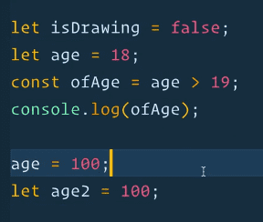 

If you wanted to group all those statements together *(generally they are related to each other and generally they produce some sort of output)*, you could group them together inside of a function.

Functions can take in data, those are known as arguments *(we will discuss the difference between arguments and parameters shortly)*. When you pass data to a function, it is known as an argument.

Functions perform some work (a statement), and sometimes they also return a value.

Let's look at an example in the console using `Math.max()` *(this is actually a method, and we will explain the difference between a function and a method shortly, it is not much)*.

If you run it in the console, it returns negative infinity.

  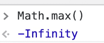 

What we want to do is pass it some data, and it should return to us the maximum value.

For example, let's pass two numbers, 10 and 12. It will return to us the highest number (which is 12).

  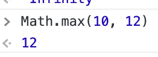 

Now what is going on there?

`Math.max(10, 12)` is a JavaScript statement. The values 10 and 12 that we are passing into the function are called arguments.

If you are passing multiple values to a function, you need to separate each value with a comma and it's best practice to include a space between each.

To repeat, the data that you pass to a function, the data that you give to a function in order for it to run is called an argument.

Sometimes, functions will return to you some data that is generally the answer or the computed output based on what you passed in.

For example, `Math.floor(2.4444)` will return `2`.

Here we are passing one argument of `2.4444` and it returns to us the floor of that value which is `2`.

  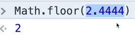 

Built-in Functions
---------------------------------------------------------------------------------------------------------

There are a whole bunch of built-in functions in JavaScript, whether you are using it in the browser or with Node.js.

JavaScript comes with all of these built in functions, and we have already been using them because there is no way around it. The one that we have used the most so far is `console.log()`.

For example if you `console.log('hey')`, it will return `hey`.

Interestingly enough, it also returns undefined.

  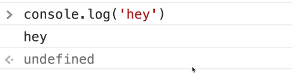 

That is because the console.log function logs to the console, it does not return a value. Not all functions are meant to return a value, sometimes they just go off and do things without returning a value.

*Tip: You can tell in the console if something is a return or a statement by the &gt; and &lt;. arrows next to the line in the console. &gt; indicates that it's a statement and &lt;. indicates that it's the response to the statement.*

  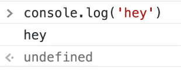 

Some other built in functions we can use are 👇

`parseFloat()` which takes in a string and returns a number, it switches the type. For example 👇

    parseFloat("20.34543543");

  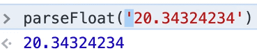 

`parseInt()` takes in a string and returns a number without a decimal. For example 👇

    parseInt("20.3243423");

  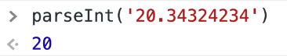 

We looked at `Math.round()`, `Math.floor()`, `Math.ceil()` already in previous lesson.

If you type `Date.now()` in the console it will return something like the following 👇

  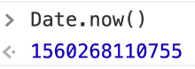 

`Date.now()` is a function that does not take in any arguments. What it returns to us is the number of milliseconds since January 1, 1970.

If you go to [https://epoch.now.sh](https://epoch.now.sh/), it's a tool that you can use to convert the millisecond value to a datetime. You can also do the opposite -- pick some date and time in the future and then it will return the millisecond value.

  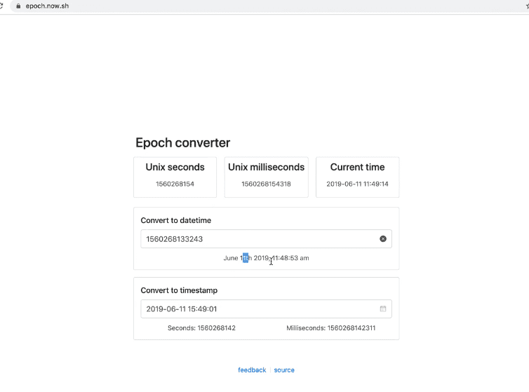 

We will go deeper into dates in future videos.

We also have functions that will work with something called the **DOM**, which are the HTML elements that are on the page.

Create a new file called `functions.html`, and use the **html base snippet**.

Add a `paragraph` tag inside of the body that says `"hey, how ya doin?"` and then add an `empty script tag` below.

Open that up in the browser. 👇

    <!DOCTYPE html>
    <html lang="en">
      <head>
        <meta charset="UTF-8" />
        <meta name="viewport" content="width=device-width,initial-scale=1.0" />
        <title>Functions!!</title>
        <link rel="stylesheet" href="../base.css" />
      </head>

      <body>
        
Hey How ya doin?

        
      </body>
    </html>

In the script section of `functions.html`, add the following code. that will run a function called `document.querySelector()`, to which we are passing a selector `p`. This built in function will find something that matches that selector and puts it into a variable, and we will log that variable.

    

  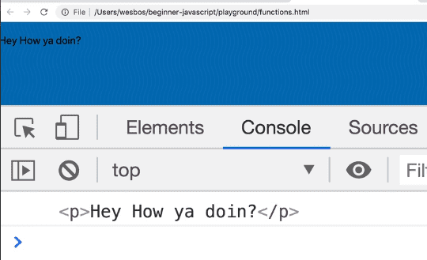 

There are a lot of other functions built in, some are mobile specific like `navigator.vibrate()`.

  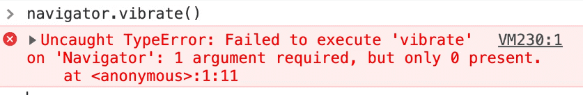 

Another useful thing is if you are not sure what arguments a function should take, you can refer to the Mozilla developer docs, in order to see what is going on.

In google, type "Navigator.vibrate()". Usually you will need to look for the Mozilla Developer website *(a tip is to include mdn at the end of your search so the Mozilla docs float to the top)*.

The docs should explain what the method is, how it can be used, and what it returns.

  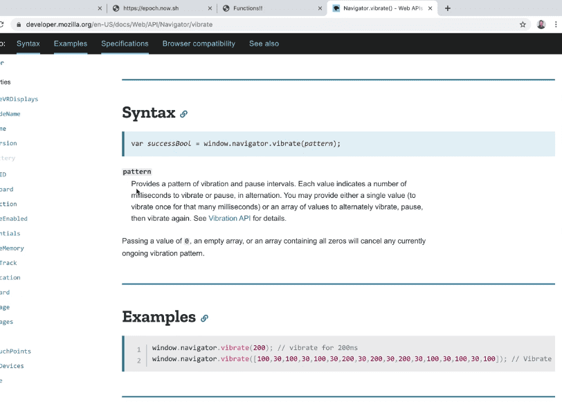 

Let's look at a couple of more.

Clear the console.

In `functions.html`, add a lot of text, such as a few paragraphs of Lorem Ipsum.

*(Wes is using the Emmet extension for VS Code which allows him to type lorem500 and hit tab to expand 500 words of lorem ipsum. You can manually search for a Lorem Ipsum generator online if do not have the Emmet extension.)*

Now if you refresh `functions.html` you will see a lot of text on the page.

  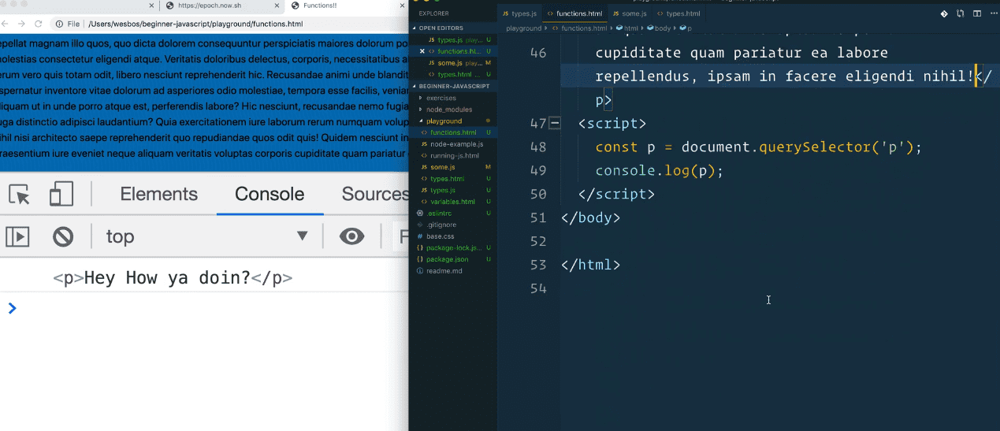 

Add enough text so you can scroll on `functions.html`.

Now you should be able to type in the console `window.scrollTo(0, 600)`, and that should cause your window to scroll down 600 pixels.

If we search for `scrollTo` on Mozilla docs, it says it accepts arguments of a x and y coordinate, or you can pass it an options object.

The docs say that

> options is a ScrollToOptions dictionary

**Dictionary** is a word we use in JavaScript to represent an object, it's an object that has a number of set properties on it.

  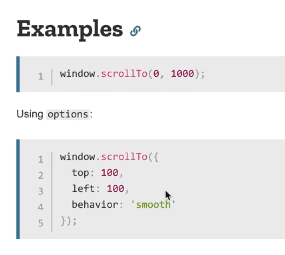 

### Example \#1 👇

    window.scrollTo(0, 1000);

### Example \#2 👇

    window.scrollTo({
      top: 100,
      left: 100,
      behavior: "smooth",
    });

In the first example, we are passing two numbers but it's also an option to pass an object which has properties inside of it like `top`, `left`, and `behavior`.

Try typing into the console the following 👇

    scrollTo({ top: 500, left: 0, behavior: 'smooth' })

That page should cause the page to scroll down 500 pixels.

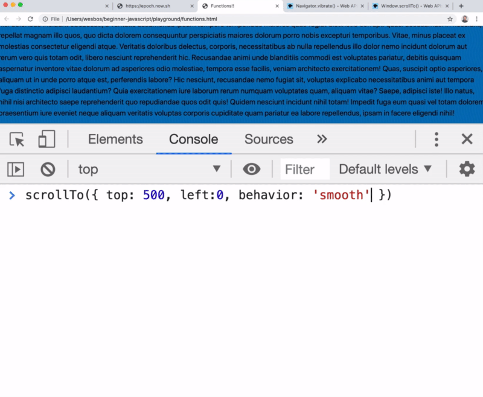

`scrollTo` is an example of a function that does not return anything, instead it just goes off and does some work for us.

Find an issue with this post? Think you could clarify, update or add something?

All my posts are available to edit on Github. Any fix, little or small, is appreciated!

[Edit on Github](https://github.com/wesbos/wesbos/tree/master/src/javascript/02-functions/12-functions-built-in/12-functions-built-in.mdx)

[**← Prev**](../../01-the-basics/types-booleans-and-equality/index.html)

Types - Booleans and Equality

[**Next →**](../functions-custom/index.html)

Functions - Custom

### Syntax Podcast

Hold on — I'm grabbin' the last one.

