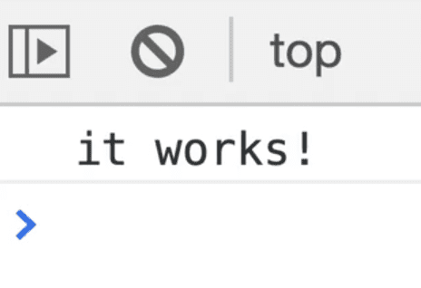
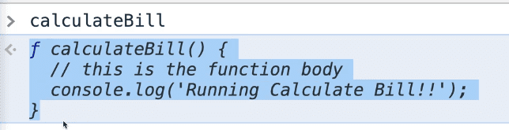

==============================================================================================================================

##### Module 1 - The Basics

-   [WelcomePart 01](../../01-the-basics/welcome/index.html)
    1.  [House Keeping](../../01-the-basics/welcome/index.html#house-keeping)
        -   [Starter Files](../../01-the-basics/welcome/index.html#starter-files)
        -   [How to Do the Course](../../01-the-basics/welcome/index.html#how-to-do-the-course)
-   [Browser, Editor and Terminal SetupPart 02](../../01-the-basics/browser-editor-and-terminal-setup/index.html)
    1.  [The browser](../../01-the-basics/browser-editor-and-terminal-setup/index.html#the-browser)
        -   [Shortcuts](../../01-the-basics/browser-editor-and-terminal-setup/index.html#shortcuts)
    2.  [Node.js](../../01-the-basics/browser-editor-and-terminal-setup/index.html#nodejs)
        -   [Checking if Node.js is installed](../../01-the-basics/browser-editor-and-terminal-setup/index.html#checking-if-nodejs-is-installed)
        -   [Which Terminal to Use](../../01-the-basics/browser-editor-and-terminal-setup/index.html#which-terminal-to-use)
        -   [Checking if you have npm installed](../../01-the-basics/browser-editor-and-terminal-setup/index.html#checking-if-you-have-npm-installed)
    3.  [Command Line Basics](../../01-the-basics/browser-editor-and-terminal-setup/index.html#command-line-basics)
    4.  [Check that Node.js is working](../../01-the-basics/browser-editor-and-terminal-setup/index.html#check-that-nodejs-is-working)
    5.  [Code Editor](../../01-the-basics/browser-editor-and-terminal-setup/index.html#code-editor)
-   [Running and Loading JavaScriptPart 03](../../01-the-basics/running-and-loading-js/index.html)
    1.  [Run scripts before closing body tag](../../01-the-basics/running-and-loading-js/index.html#run-scripts-before-closing-body-tag)
    2.  [External JavaScript Files](../../01-the-basics/running-and-loading-js/index.html#external-javascript-files)
    3.  [Running it in Node.js](../../01-the-basics/running-and-loading-js/index.html#running-it-in-nodejs)
-   [Variables and StatementsPart 04](../../01-the-basics/variables-and-statements/index.html)
    1.  [var](../../01-the-basics/variables-and-statements/index.html#var)
    2.  [let](../../01-the-basics/variables-and-statements/index.html#let)
    3.  [const](../../01-the-basics/variables-and-statements/index.html#const)
    4.  [Statements and Semi-Colons in JavaScript](../../01-the-basics/variables-and-statements/index.html#statements-and-semi-colons-in-javascript)
    5.  [Code Blocks](../../01-the-basics/variables-and-statements/index.html#code-blocks)
    6.  [Differences between var, let & const](../../01-the-basics/variables-and-statements/index.html#differences-between-var-let--const)
        -   [Strict Mode](../../01-the-basics/variables-and-statements/index.html#strict-mode)
        -   [Scoping](../../01-the-basics/variables-and-statements/index.html#scoping)
    7.  [Naming Conventions](../../01-the-basics/variables-and-statements/index.html#naming-conventions)
        -   [Camel Casing](../../01-the-basics/variables-and-statements/index.html#camel-casing)
        -   [Snake Case](../../01-the-basics/variables-and-statements/index.html#snake-case)
        -   [Kebab Case - Not Allowed](../../01-the-basics/variables-and-statements/index.html#kebab-case---not-allowed)
-   [Code Quality Tooling with Prettier and ESLintPart 05](../../01-the-basics/code-quality-tooling-with-prettier-and-eslint/index.html)
    1.  [ESLint & Prettier](../../01-the-basics/code-quality-tooling-with-prettier-and-eslint/index.html#eslint--prettier)
        -   [ESLint](../../01-the-basics/code-quality-tooling-with-prettier-and-eslint/index.html#eslint)
        -   [Prettier](../../01-the-basics/code-quality-tooling-with-prettier-and-eslint/index.html#prettier)
    2.  [Installing ESLint & Prettier](../../01-the-basics/code-quality-tooling-with-prettier-and-eslint/index.html#installing-eslint--prettier)
    3.  [Installing npm packages locally](../../01-the-basics/code-quality-tooling-with-prettier-and-eslint/index.html#installing-npm-packages-locally)
    4.  [Creating the package.json file](../../01-the-basics/code-quality-tooling-with-prettier-and-eslint/index.html#creating-the-packagejson-file)
    5.  [Configuring ESLint and Prettier with VS Code](../../01-the-basics/code-quality-tooling-with-prettier-and-eslint/index.html#configuring-eslint-and-prettier-with-vs-code)
-   [Types - IntroductionPart 06](../../01-the-basics/types-introduction/index.html)
-   [Types - StringsPart 07](../../01-the-basics/types-strings/index.html)
    1.  [JavaScript Comments](../../01-the-basics/types-strings/index.html#javascript-comments)
    2.  [Difference between Single Quotes, Double Quotes and Backticks](../../01-the-basics/types-strings/index.html#difference-between-single-quotes-double-quotes-and-backticks)
        -   [Putting String on Multiple Lines](../../01-the-basics/types-strings/index.html#putting-string-on-multiple-lines)
    3.  [Concatenation and Interpolation](../../01-the-basics/types-strings/index.html#concatenation-and-interpolation)
    4.  [Backticks](../../01-the-basics/types-strings/index.html#backticks)
-   [Types - NumbersPart 08](../../01-the-basics/types-numbers/index.html)
    1.  [Numbers in JavaScript](../../01-the-basics/types-numbers/index.html#numbers-in-javascript)
    2.  [Helper Methods](../../01-the-basics/types-numbers/index.html#helper-methods)
    3.  [Modulo and Power Operators](../../01-the-basics/types-numbers/index.html#modulo-and-power-operators)
    4.  [Things to know about Math in JavaScript](../../01-the-basics/types-numbers/index.html#things-to-know-about-math-in-javascript)
        -   [Infinity and Negative Infinity](../../01-the-basics/types-numbers/index.html#infinity-and-negative-infinity)
        -   [Not a Number](../../01-the-basics/types-numbers/index.html#not-a-number)
-   [Types - ObjectsPart 09](../../01-the-basics/types-objects/index.html)
-   [Types - Null and UndefinedPart 10](../../01-the-basics/types-null-and-undefined/index.html)
    1.  [undefined](../../01-the-basics/types-null-and-undefined/index.html#undefined)
    2.  [null](../../01-the-basics/types-null-and-undefined/index.html#null)
-   [Types - Booleans and EqualityPart 11](../../01-the-basics/types-booleans-and-equality/index.html)
    1.  [Equality (equal sign, double equal sign, triple equal sign)](../../01-the-basics/types-booleans-and-equality/index.html#equality-equal-sign-double-equal-sign-triple-equal-sign)

##### Module 2 - Functions

-   <a href="../functions-built-in/index.html" class="currentModule">Functions - Built-inPart 12</a>
    1.  <a href="../functions-built-in/index.html#built-in-functions" class="currentModule">Built-in Functions</a>
        -   <a href="../functions-built-in/index.html#example-1-" class="currentModule">Example #1 👇</a>
        -   <a href="../functions-built-in/index.html#example-2-" class="currentModule">Example #2 👇</a>
-   <a href="index.html" class="currentModule currentPage currentSection">Functions - CustomPart 13</a>
    1.  <a href="index.html#defining-a-function" class="currentModule currentPage">Defining a Function</a>
    2.  <a href="index.html#returning-values" class="currentModule currentPage">Returning Values</a>
    3.  <a href="index.html#storing-a-value-returned-from-a-function" class="currentModule currentPage">Storing a Value Returned from A Function</a>
-   <a href="../functions-parameters-and-arguments/index.html" class="currentModule">Functions - Parameters and ArgumentsPart 14</a>
    1.  <a href="../functions-parameters-and-arguments/index.html#another-example" class="currentModule">Another Example</a>
    2.  <a href="../functions-parameters-and-arguments/index.html#even-more-examples" class="currentModule">Even More Examples</a>
    3.  <a href="../functions-parameters-and-arguments/index.html#how-to-fall-back-on-default-for-only-one-parameter" class="currentModule">How to Fall Back on Default for Only One Parameter</a>
-   <a href="../different-ways-to-declare-functions/index.html" class="currentModule">Different Ways to Declare FunctionsPart 15</a>
    1.  <a href="../different-ways-to-declare-functions/index.html#anonymous-functions" class="currentModule">Anonymous Functions</a>
    2.  <a href="../different-ways-to-declare-functions/index.html#function-expressions" class="currentModule">Function Expressions</a>
        -   <a href="../different-ways-to-declare-functions/index.html#what-is-the-difference-between-a-function-declaration-and-a-function-expression" class="currentModule">What is the difference between a function declaration and a function expression?</a>
    3.  <a href="../different-ways-to-declare-functions/index.html#hoisting" class="currentModule">Hoisting</a>
    4.  <a href="../different-ways-to-declare-functions/index.html#arrow-functions" class="currentModule">Arrow Functions</a>
        -   <a href="../different-ways-to-declare-functions/index.html#different-ways-to-write-arrow-functions" class="currentModule">Different Ways to Write Arrow Functions</a>
        -   <a href="../different-ways-to-declare-functions/index.html#implicit-and-explicit-returns" class="currentModule">Implicit and Explicit Returns</a>
        -   <a href="../different-ways-to-declare-functions/index.html#arrow-function-gotchas" class="currentModule">Arrow Function Gotcha's</a>
    5.  <a href="../different-ways-to-declare-functions/index.html#iife" class="currentModule">IIFE</a>
    6.  <a href="../different-ways-to-declare-functions/index.html#methods" class="currentModule">Methods</a>
    7.  <a href="../different-ways-to-declare-functions/index.html#preview-of-this" class="currentModule">Preview of this</a>
    8.  <a href="../different-ways-to-declare-functions/index.html#callback-functions" class="currentModule">Callback Functions</a>
        -   <a href="../different-ways-to-declare-functions/index.html#click-callback" class="currentModule">Click Callback</a>
        -   <a href="../different-ways-to-declare-functions/index.html#timer-callback" class="currentModule">Timer Callback</a>
-   <a href="../debugging-tools/index.html" class="currentModule">Debugging ToolsPart 16</a>
    1.  <a href="../debugging-tools/index.html#console-debugging" class="currentModule">Console Debugging</a>
    2.  <a href="../debugging-tools/index.html#the-call-stack-and-stack-trace" class="currentModule">The Call Stack and Stack Trace</a>
    3.  <a href="../debugging-tools/index.html#grabbing-elements" class="currentModule">Grabbing Elements</a>
    4.  <a href="../debugging-tools/index.html#breakpoints" class="currentModule">Breakpoints</a>

Functions - Custom
============================================

Enjoy these notes? Want to Slam Dunk JavaScript?

JavaScript, FunctionsEdit Post

In this video we will get into making our own custom functions.

A function can do anything, and the real power of JavaScript comes when you define your own functions.

Functions group together a set of instructions, often taking in values (we talked about **arguments** earlier), doing some work and then returning value or set of values back to what requested it.

For this lesson, you need to make a new folder `/custom-functions` inside of `/playground`. Within that folder, create two files `index.html` and `cf.js`. Add a log of "it works!" in the js file, and add the HTML base snippet to the HTML page.

We will need to modify the `base.css` path because we made a folder so the path should now be `../../base.css` *(because we have to go up two levels to get to it)*.

Right before the closing body tag, add a script source tag like so 👇 and you should see "It works!" in the console.

    <script src="./cf.js">

   

In this lesson, we are going to create a function called "Calculate Bill".

You can think of "Calculate Bill" (said in southern american accent) as a western gentlemen who is very good at going to restaurants and calculating what the bill would be regarding what the bill was, how much tip was, how much tax is. That is what our function will be responsible for doing.

There are going to be a few buzzwords as we go through, which we will explain as we go, starting .

The first one is that **functions are created or defined**, and they are later **called**.

When you make a function, when you author what it does, that is called a **function definition**.

Later on, when you want to **run** that function, that is called **calling** or **running** of a function.

### Defining a Function

There are a few ways to define a function. We are going to go over all the different approaches in the next videos but for now, we will go over the basic.

First you type `function` and then the name of the function. Function naming follows the exact same rules as variable naming which we went over in a previous video.

We are going to call it `calculateBill` 👇

    function calculateBill() {
      // this is a function body
    }

What we have done is defined it, given it parenthesis and then you open and close a function block. Anything that goes inside the function block is called the **function body**, and is part of the function.

In the function body, add 👇

    console.log("Running Calculate Bill!!!");

Open `index.html` and in the browser and open the console. Try typing `calculateBill` in the console and hitting enter.

   

A function works just like a variable in that you can call them by the name of it. However, when you put just the name of the function, you see the entire code, as shown 👆 above.

Now if we want to run the function we would have to enter into the console `calculateBill()`, which will log `Running Calculate Bill!!!!` in the console.

Add the following to `cf.js` to run the function right from our JavaScript. 👇

    // function definition
    function calculateBill() {
      // this is the function body
      console.log("Running Calculate Bill!!");
    }

    // function call or function invocation
    calculateBill();

### Returning Values

When we called `calculateBill()` in the console, it returned undefined.

  <embed src="../../../static/0dbd74ae0be9f174b2ed2c9d58210c4b/d4635/calculate-bill-function-returning-undefined-in-console.html" title="calculateBill function returned undefined as we did not returned anything from it" class="gatsby-resp-image-image" /> 

It does the work we asked it to do, and then it returns undefined. Often, functions will do a bunch of work and then return to you the result.

What we are going to do in our function is we will take in the following arguments, and it will return to us the total value:

-   how much the dinner was
-   the tax rate
-   how much you want to tip

The way that works is we will assume the meal is 100 dollars, and we will multiply it by 1.13 because in Ontario the tax rate is 13%.

Now we can log the total value to the console.

    // function definition
    function calculateBill() {
      // this is the function body
      console.log("Running Calculate Bill!!");
      const total = 100 * 1.13;
      console.log(total);
    }

    // function call or function invocation
    calculateBill();

   

*(👆 This is a perfect example of the issue with floating point numbers mentioned in a previous video)*

You might be thinking "oh, now I have this nice total variable which I can just quickly access". However, if you type `total` in the console, it will return undefined.

Try that by adding the following code to `cf.js` below the `calculateBill` function definition, refresh the page and look at the error in the console.

    console.log(total);

You should see an error

> total is not defined

   

In VSCode, you may notice that ESLint is yelling at us as well that total is not defined.

This is something that we will get into called **scope**.

Variables that are created inside of a function are only available within that function, which is called block scoping *(we will cover block in more detail in the future)*. It is not available outside of it.

So how do we store the result of the calculation so we can access it using a variable? With returning!

When we called `calculateBill()` earlier, we got undefined returned in the console. To fix that, we need to return total.

`return` is a keyword in JavaScript.

      const total = 100 * 1.13;
      console.log(total);
      return total;
    }

    // function call or function invocation
    calculateBill();

Now when you call it in the console, you will see it returns the value.

   

### Storing a Value Returned from A Function

How can we store that value?

The total variable is still not available to us. That is because we need to **capture** (another buzz word) the result of the function or capture the returned value of the function into a variable.

Modify the line of JavaScript with `calculateBill()` like so 👇

    const myTotal = calculateBill();
    console.log(myTotal);

In the console, you can now access the variable `myTotal`. Modify the log like so 👇

    console.log(`Your total is $${myTotal}`);

That will print out the value and message in the console.

You may be wondering why we have two variables to hold the same value, `total` within `calculateBill()` and `myTotal` below the function.

The reason is that `total` variable is a **temporary variable**.

Since `total` is created inside of the function, it is only ever available inside of `calculateBill` and when the function is done running, that variable is **cleaned up** (or what is called **garbage collected** in JavaScript and it's no longer needed).

If you ever want to capture the value returned from `calculateBill()`, you have to stick it into a variable before you can go ahead and display it.

Another cool thing you can do with **interpolation** strings is you can actually run the function from within the log statement.

JavaScript is going to run the function first, and then whatever the return result is it will immediately be interpolated into that string.

    console.log(`Your total is $${calculateBill()}`);

Find an issue with this post? Think you could clarify, update or add something?

All my posts are available to edit on Github. Any fix, little or small, is appreciated!

[Edit on Github](https://github.com/wesbos/wesbos/tree/master/src/javascript/02-functions/13-functions-custom/13-functions-custom.mdx)

[**← Prev**](https://wesbos.com/javascript/02-functions/functions-built-in/)

Functions - Built-in

[**Next →**](https://wesbos.com/javascript/02-functions/functions-parameters-and-arguments/)

Functions - Parameters and Arguments

### Syntax Podcast

Hold on — I'm grabbin' the last one.
