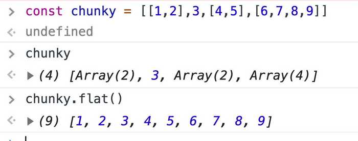
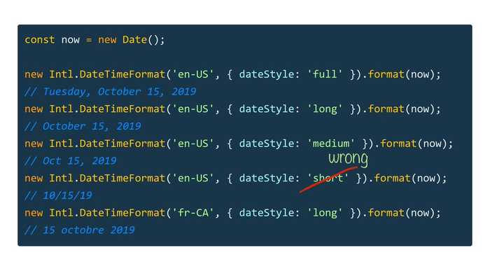
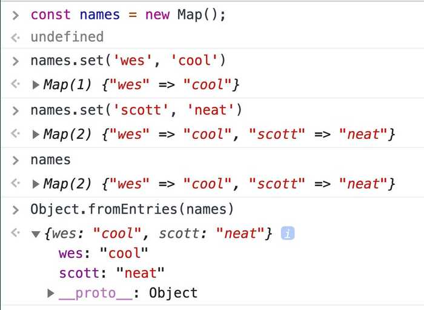

==================================================================================================================

-   [free + premiumCoursesx](../courses/index.html)
-   [The SyntaxPodcast Web Development](https://syntax.fm/)
-   [moreAboutme](../about/index.html)
-   [theBlogx](../blog/index.html)
-   [🔥Tipsreal spicy](index.html)
-   [BeginnerJavaScriptNotes](../javascript/index.html)
-   [real lifeSpeaking and training](../speaking-and-training/index.html)
-   [what font?!/uses what theme!?](../uses/index.html)
-   [You want toContactme](../contact/index.html)

🔥 There are 254 Hot Tips
==================================================

Hot tips are spicy lil' nuggets related to web development and tooling that I share on [my twitter account](https://twitter.com/wesbos). I've logged them here to make them easier to find.

[← Prev 10 please](0.html)

Page 1 of 26

[10 More please →](2/index.html)

Deets[over 1 year ago](../tip/destructure-indexes-for-last-array-item/index.html "View Tip Details")

Tweet

🔥 Here is a neat one! Since arrays are objects, we can destructure their indexes to easily grab the first and last items.

Deets[over 1 year ago](../tip/intl-collator-sort-and-group/index.html "View Tip Details")

Tweet

🔥 Use Intl.Collator() to easily sort or group strings regardless of their case or accent

Deets[over 1 year ago](../tip/flatmap/index.html "View Tip Details")

Tweet

🔥 New in ES2019, we have a .flat() method to flatten these types of chunked arrays.

Deets[over 1 year ago](../tip/chunkify-array/index.html "View Tip Details")

Tweet

🔥 When working with an API, I often need to chunk up a list of users and send them in batches.

Array.from() is a great way to chunk up arrays because of the secondary argument being a map function.

Deets[over 1 year ago](../tip/intl-pluralrules-ordinal/index.html "View Tip Details")

Tweet

🔥 Use Intl.PluralRules() to easily find the ordinal for numbers - 1st, 2nd, 3rd, 4th...

Deets[over 1 year ago](../tip/intl-datetimeformat-date-formatting/index.html "View Tip Details")

Tweet

🔥 Use Intl.DateTimeFormat() to create nicely formatted date and time strings

Deets[over 1 year ago](../tip/intl-relativetimeformat-format-dates/index.html "View Tip Details")

Tweet

🔥 Use Intl.RelativeTimeFormat() to get nicely formatted relative time strings.

Deets[over 1 year ago](../tip/object-fromentries/index.html "View Tip Details")

Tweet

🔥 Object.fromEntries() is a new method for converting Arrays, maps or other iterables into objects

Deets[over 1 year ago](../tip/css-variables-partial-property-update/index.html "View Tip Details")

Tweet

🔥 Use CSS Variables to do partial property overwrites. Handy for CSS properties that only accept multiple values.

Deets[over 1 year ago](../tip/clear-301-redirect/index.html "View Tip Details")

Tweet

🔥 If you have a pesky 301 redirect that won't clear, open dev tools and load the page with the "disable cache"

Log this in your head for later, you'll need it like I just did 😃

### Syntax Podcast

Hold on — I'm grabbin' the last one.

